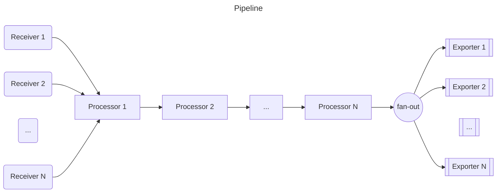
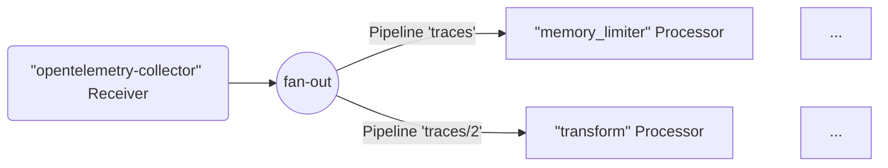
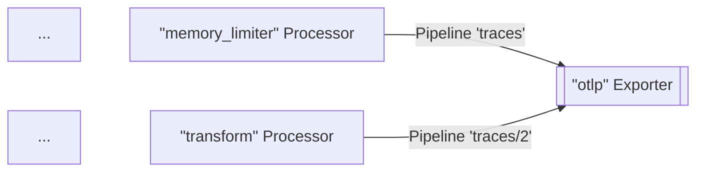
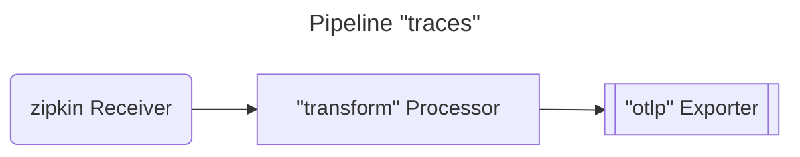
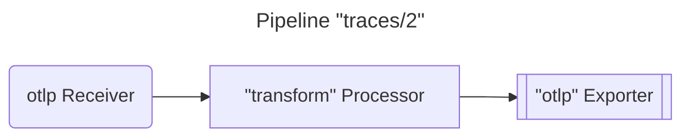
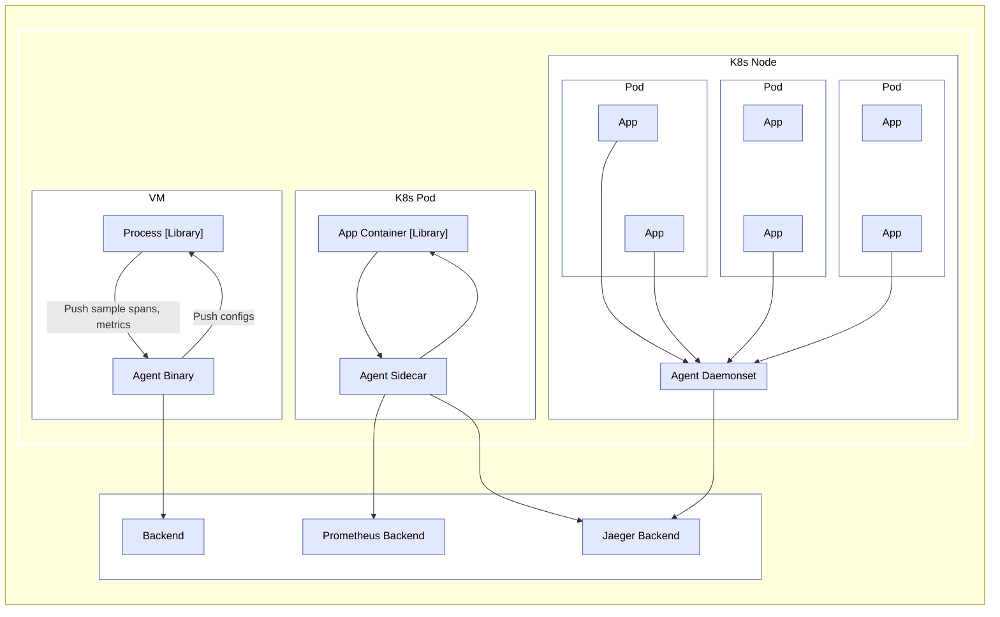
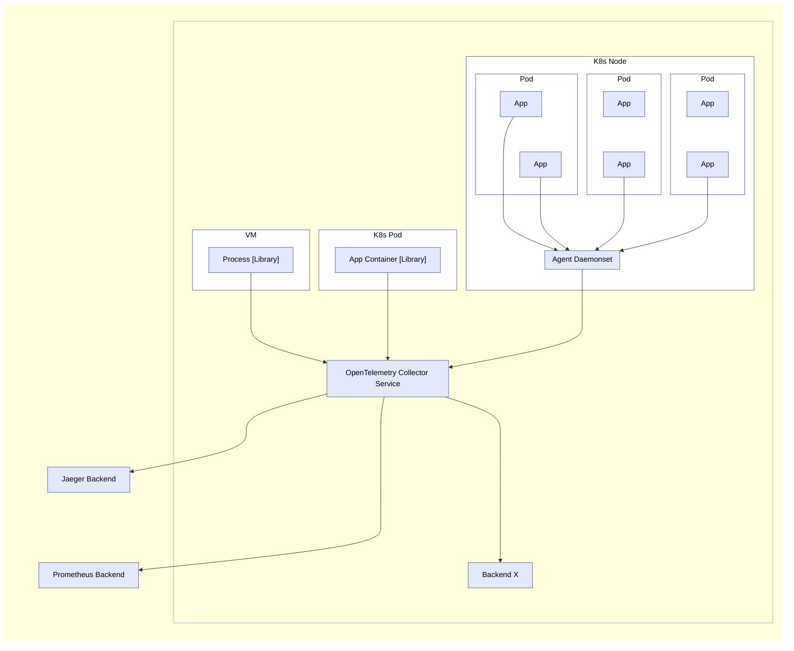

오픈텔레메트리(OpenTelemetry) 컬렉터는 텔레메트리를 수신하고 처리한 후,
옵저버빌리티(observability) 백엔드와 같은 여러 대상으로 내보낼 수 있는 실행
파일이다.

컬렉터는 텔레메트리 데이터를 수신하고 전송하기 위한 여러 인기 있는 오픈 소스
프로토콜을 지원하며, 더 많은 프로토콜을 추가할 수 있는 확장 가능한 아키텍처를
제공한다.

데이터 수신, 처리, 내보내기는 [파이프라인](#pipelines)을 사용하여 이루어진다.
컬렉터가 하나 이상의 파이프라인을 갖도록 구성할 수 있다.

각 파이프라인은 다음을 포함한다.

- 데이터를 수집하는 [리시버](#receivers) 집합.
- 리시버로부터 데이터를 가져와 처리하는 일련의 선택적 [프로세서](#processors).
- 프로세서로부터 데이터를 가져와 컬렉터 외부로 전송하는 [익스포터](#exporters)
  집합.

동일한 리시버가 여러 파이프라인에 포함될 수 있으며, 여러 파이프라인이 동일한
익스포터를 포함할 수도 있다.

## 파이프라인 {#pipelines}

파이프라인은 컬렉터 내에서 데이터가 따르는 경로, 즉 수신에서 처리(또는 수정)를
거쳐 최종적으로 내보내기에 이르는 경로를 정의한다.

파이프라인은 트레이스, 메트릭, 로그라는 세 가지 텔레메트리 데이터 유형에서
동작할 수 있다. 데이터 유형은 설정에 의해 정의되는 파이프라인의 속성이다.
파이프라인에서 사용되는 리시버, 프로세서, 익스포터는 반드시 해당 데이터 유형을
지원해야 하며, 그렇지 않으면 설정을 로드할 때 `pipeline.ErrSignalNotSupported`
예외가 보고된다.

다음 다이어그램은 일반적인 파이프라인을 나타낸다.



파이프라인은 하나 이상의 리시버를 가질 수 있다. 모든 리시버로부터 온 데이터는 첫
번째 프로세서로 푸시되며, 이 프로세서는 데이터를 처리한 후 다음 프로세서로
푸시한다. 프로세서는 샘플링 또는 필터링을 수행하는 경우 데이터를 삭제할 수도
있다. 이 과정은 파이프라인의 마지막 프로세서가 데이터를 익스포터로 푸시할 때까지
계속된다. 각 익스포터는 각 데이터 요소의 사본을 받는다. 마지막 프로세서는
`fanoutconsumer`를 사용하여 데이터를 여러 익스포터로 전송한다.

파이프라인은 설정에 정의된 파이프라인 정의를 기반으로 컬렉터 시작 시 구성된다.

일반적인 파이프라인 설정은 다음과 같은 모습이다.

```yaml
service:
  pipelines: # section that can contain multiple subsections, one per pipeline
    traces: # type of the pipeline
      receivers: [otlp, zipkin]
      processors: [memory_limiter]
      exporters: [otlp, zipkin]
```

이전 예제는 두 개의 리시버, 하나의 프로세서, 두 개의 익스포터를 가진 트레이스
유형의 텔레메트리 데이터에 대한 파이프라인을 정의한다.

### 리시버 {#receivers}

리시버는 일반적으로 네트워크 포트를 리슨(listen)하며 텔레메트리 데이터를
수신한다. 스크레이퍼(scraper)처럼 능동적으로 데이터를 가져올 수도 있다. 보통
하나의 리시버는 수신한 데이터를 하나의 파이프라인으로 전송하도록 구성된다.
하지만 동일한 리시버가 수신한 동일한 데이터를 여러 파이프라인으로 전송하도록
구성하는 것도 가능하다. 이는 여러 파이프라인의 `receivers` 키에 동일한 리시버를
나열하면 된다.

```yaml
receivers:
  otlp:
    protocols:
      grpc:
        endpoint: localhost:4317

service:
  pipelines:
    traces: # a pipeline of “traces” type
      receivers: [otlp]
      processors: [memory_limiter]
      exporters: [otlp]
    traces/2: # another pipeline of “traces” type
      receivers: [otlp]
      processors: [transform]
      exporters: [otlp]
```

위 예제에서 `otlp` 리시버는 동일한 데이터를 `traces` 파이프라인과 `traces/2`
파이프라인으로 전송한다.

> 설정은 `type[/name]` 형태의 복합 키 이름을 사용한다.

컬렉터가 이 설정을 로드하면, 결과는 다음 다이어그램과 같다(간결함을 위해 일부
프로세서와 익스포터는 생략함).



> [!WARNING]
>
> 동일한 리시버가 두 개 이상의 파이프라인에서 참조되는 경우, 컬렉터는 런타임에
> 팬아웃(fan-out) 컨슈머로 데이터를 전송하는 리시버 인스턴스를 단 하나만
> 생성한다. 팬아웃 컨슈머는 이어서 각 파이프라인의 첫 번째 프로세서로 데이터를
> 전송한다. 리시버에서 팬아웃 컨슈머로, 그리고 다시 프로세서로 이어지는 데이터
> 전파는 동기 함수 호출을 사용하여 이루어진다. 즉, 하나의 프로세서가 호출을
> 차단하면 이 리시버에 연결된 다른 파이프라인들도 동일한 데이터를 수신하지
> 못하게 되며, 리시버 자체도 새로 수신된 데이터의 처리와 전달을 멈춘다.

### 익스포터 {#exporters}

익스포터는 일반적으로 받은 데이터를 네트워크상의 목적지로 전달하지만, 다른
곳으로 데이터를 보낼 수도 있다. 예를 들어 `debug` 익스포터는 텔레메트리 데이터를
로깅 대상에 기록한다.

설정은 동일한 파이프라인 내에서도 동일한 유형의 익스포터를 여러 개 사용할 수
있도록 허용한다. 예를 들어, 서로 다른 OTLP 엔드포인트로 전송하는 두 개의 `otlp`
익스포터를 정의할 수 있다.

```yaml
exporters:
  otlp/1:
    endpoint: example.com:4317
  otlp/2:
    endpoint: localhost:14317
```

익스포터는 보통 하나의 파이프라인으로부터 데이터를 받는다. 하지만 여러
파이프라인이 동일한 익스포터로 데이터를 전송하도록 구성할 수도 있다.

```yaml
exporters:
  otlp:
    protocols:
      grpc:
        endpoint: localhost:14250

service:
  pipelines:
    traces: # a pipeline of “traces” type
      receivers: [zipkin]
      processors: [memory_limiter]
      exporters: [otlp]
    traces/2: # another pipeline of “traces” type
      receivers: [otlp]
      processors: [transform]
      exporters: [otlp]
```

위 예제에서 `otlp` 익스포터는 `traces` 파이프라인과 `traces/2`
파이프라인으로부터 데이터를 받는다. 컬렉터가 이 설정을 로드하면, 결과는 다음
다이어그램과 같다(간결함을 위해 일부 프로세서와 리시버는 생략함).



### 프로세서 {#processors}

파이프라인은 순차적으로 연결된 프로세서들을 포함할 수 있다. 첫 번째 프로세서는
파이프라인에 구성된 하나 이상의 리시버로부터 데이터를 받고, 마지막 프로세서는
파이프라인에 구성된 하나 이상의 익스포터로 데이터를 전송한다. 첫 번째와 마지막
사이의 모든 프로세서는 오직 하나의 앞선 프로세서로부터만 데이터를 받고, 오직
하나의 뒤따르는 프로세서로만 데이터를 전송한다.

프로세서는 데이터를 전달하기 전에 스팬에서 속성을 추가하거나 제거하는 등
데이터를 변환할 수 있다. 또한 데이터를 전달하지 않기로 결정하여 삭제할 수도
있다(예: `probabilisticsampler` 프로세서). 아니면 새로운 데이터를 생성할 수도
있다.

동일한 이름의 프로세서를 여러 파이프라인의 `processors` 키에서 참조할 수 있다.
이 경우 각 프로세서에 동일한 설정이 사용되지만, 각 파이프라인은 항상 자신만의
프로세서 인스턴스를 갖는다. 이러한 각 프로세서는 자신만의 상태를 가지며,
프로세서는 파이프라인 간에 절대 공유되지 않는다. 예를 들어 `transform`
프로세서가 여러 파이프라인에서 사용되는 경우, 각 파이프라인은 자신만의 transform
프로세서를 가지지만, 설정에서 동일한 키를 참조한다면 각 transform 프로세서는
정확히 동일한 방식으로 설정된다. 다음 설정을 참고한다.

```yaml
processors:
  transform:
    error_mode: ignore
    trace_statements:
      - set(resource.attributes["namespace"],
        resource.attributes["k8s.namespace.name"])
      - delete_key(resource.attributes, "k8s.namespace.name")

service:
  pipelines:
    traces: # a pipeline of “traces” type
      receivers: [zipkin]
      processors: [transform]
      exporters: [otlp]
    traces/2: # another pipeline of “traces” type
      receivers: [otlp]
      processors: [transform]
      exporters: [otlp]
```

컬렉터가 이 설정을 로드하면, 결과는 다음 다이어그램과 같다.





각 `transform` 프로세서는 `send_batch_size`가 `10000`으로 동일하게 설정되어
있지만, 서로 독립적인 인스턴스라는 점에 유의한다.

> 동일한 이름의 프로세서를 하나의 파이프라인 내 `processors` 키에서 여러 번
> 참조해서는 안 된다.

## 에이전트로 실행하기 {#running-as-an-agent}

일반적인 VM/컨테이너에서 사용자 애플리케이션은 오픈텔레메트리 라이브러리와 함께
일부 프로세스/파드에서 실행된다. 이전에는 라이브러리가 트레이스, 메트릭, 로그의
기록, 수집, 샘플링, 집계를 모두 수행한 다음, 라이브러리 익스포터를 통해 데이터를
다른 영구 저장소 백엔드로 내보내거나 로컬 zpages에 표시했다. 이 패턴에는 다음과
같은 몇 가지 단점이 있다.

1. 각 오픈텔레메트리 라이브러리마다 익스포터와 zpages를 네이티브 언어로 다시
   구현해야 한다.
2. 일부 프로그래밍 언어(예: Ruby 또는 PHP)에서는 프로세스 내에서 통계 집계를
   수행하기가 어렵다.
3. 오픈텔레메트리 스팬, 통계, 또는 메트릭을 내보내려면 애플리케이션 사용자가
   수동으로 라이브러리 익스포터를 추가하고 바이너리를 다시 배포해야 한다. 이는
   특히 장애(incident)가 발생해 사용자가 즉시 오픈텔레메트리로 문제를 조사하려
   할 때 더욱 어렵다.
4. 애플리케이션 사용자는 익스포터를 설정하고 초기화하는 책임을 직접 져야 한다.
   이러한 작업은 오류가 발생하기 쉬우며(예: 잘못된 자격 증명이나 모니터링 대상
   리소스를 설정하는 경우), 사용자는 오픈텔레메트리로 코드를 "오염"시키는 것을
   꺼릴 수 있다.

위와 같은 문제를 해결하기 위해, 오픈텔레메트리 컬렉터를 에이전트(agent)로 실행할
수 있다. 에이전트는 VM/컨테이너에서 데몬(daemon)으로 실행되며 라이브러리와
독립적으로 배포될 수 있다. 에이전트가 배포되어 실행되면, 라이브러리로부터
트레이스, 메트릭, 로그를 가져와 다른 백엔드로 내보낼 수 있어야 한다. 또한
에이전트에게 샘플링 확률과 같은 설정을 라이브러리로 푸시하는 기능을 부여할 수도
있다. 프로세스 내에서 통계 집계를 수행할 수 없는 언어의 경우, 원시 측정값(raw
measurement)을 전송하고 에이전트가 집계를 수행하도록 할 수 있다.



> 다른 라이브러리의 개발자 및 유지 관리자를 위한 안내: 특정 리시버를 추가하면
> Zipkin, Prometheus 등과 같은 다른 트레이싱/모니터링 라이브러리로부터 트레이스,
> 메트릭, 로그를 받아들이도록 에이전트를 구성할 수 있다. 자세한 내용은
> [리시버](#receivers)를 참고한다.

## 게이트웨이로 실행하기 {#running-as-a-gateway}

오픈텔레메트리 컬렉터는 게이트웨이(gateway) 인스턴스로 실행되어, 하나 이상의
에이전트나 라이브러리, 또는 지원되는 프로토콜 중 하나로 데이터를 내보내는
태스크/에이전트가 전송한 스팬과 메트릭을 수신할 수 있다. 컬렉터는 구성된
익스포터로 데이터를 전송하도록 구성된다. 다음 그림은 배포 아키텍처를 요약한
것이다.



오픈텔레메트리 컬렉터는 리시버가 지원하는 형식 중 하나로 다른 에이전트나
클라이언트로부터 데이터를 수신하는 등, 다른 구성으로도 배포될 수 있다.
