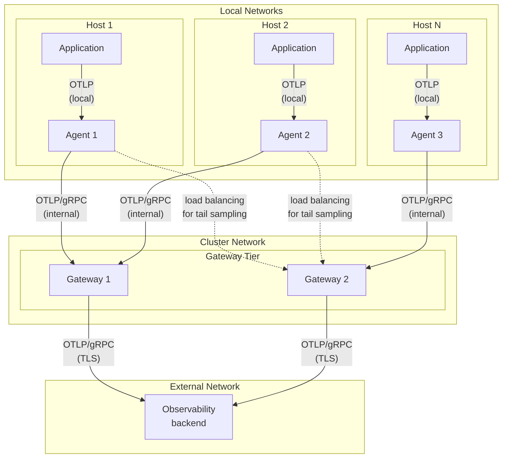
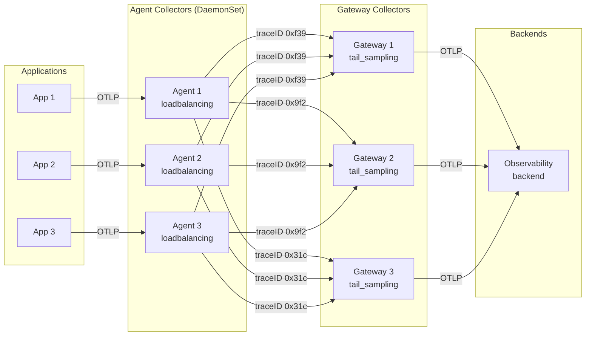

[에이전트][agents]와 [게이트웨이][gateways]는 서로 다른 문제를 해결한다. 이 둘을
배포에 결합하면 다음과 같은 문제를 해결하는 옵저버빌리티 아키텍처를 만들 수
있다.

- **관심사 분리**: 모든 머신이나 노드에 복잡한 구성과 처리 로직을 두지 않는다.
  에이전트 구성은 작고 집중된 상태를 유지하고, 중앙 프로세서가 더 무거운 수집
  작업을 처리한다.
- **확장 가능한 비용 관리**: 여러 에이전트로부터 텔레메트리를 수신할 수 있는
  게이트웨이에서 더 나은 샘플링 및 배칭 결정을 내린다. 게이트웨이는 완전한
  트레이스를 포함한 전체 그림을 볼 수 있으며, 독립적으로 확장할 수 있다.
- **보안 및 안정성**: 로컬 네트워크를 통해 에이전트에서 게이트웨이로
  텔레메트리를 전송한다. 게이트웨이는 재시도를 처리하고 자격 증명을 관리할 수
  있는 안정적인 이그레스(egress) 지점이 된다.

## 에이전트-게이트웨이 아키텍처 예시 {#example-agent-to-gateway-architecture}

다음 다이어그램은 에이전트와 게이트웨이를 결합한 배포의 아키텍처를 보여준다.

- 에이전트 컬렉터는 DaemonSet 패턴으로 각 호스트에서 실행되며, 로드 밸런싱을
  통해 호스트에서 실행 중인 서비스의 텔레메트리와 호스트 자체의 텔레메트리를
  수집한다.
- 게이트웨이 컬렉터는 에이전트로부터 데이터를 수신하고, 필터링과 샘플링 같은
  중앙 집중식 처리를 수행한 뒤 백엔드로 데이터를 내보낸다.
- 애플리케이션은 내부 호스트 네트워크를 사용해 로컬 에이전트와 통신하고,
  에이전트는 내부 클러스터 네트워크를 통해 게이트웨이와 통신하며, 게이트웨이는
  TLS를 사용해 외부 백엔드와 안전하게 통신한다.



## 이 패턴을 사용해야 할 때 {#when-to-use-this-pattern}

에이전트-게이트웨이 패턴은 더 단순한 배포 옵션에 비해 운영 복잡성을 더한다. 다음
기능 중 하나 이상이 필요할 때 이 패턴을 사용한다.

- **중앙 집중식 처리**: 테일 기반 샘플링, 고급 필터링, 데이터 변환과 같은 복잡한
  처리 작업을 모든 호스트가 아니라 한 중앙 위치에서 수행하고 싶은 경우.

- **네트워크 격리**: 특정 이그레스 지점만 외부 백엔드와 통신할 수 있는 제한된
  네트워크 환경에서 애플리케이션이 실행되는 경우.

- **대규모 비용 최적화**: 완전한 트레이스 데이터를 기반으로 샘플링을 결정하거나
  백엔드로 데이터를 보내기 전에 여러 소스에 걸쳐 집계를 수행해야 하는 경우.

## 더 단순한 패턴이 더 나은 경우 {#when-simpler-patterns-work-better}

다음에 해당한다면 에이전트-게이트웨이 패턴이 필요하지 않을 수 있다.

- 애플리케이션이 OTLP를 사용해 백엔드로 직접 텔레메트리를 전송할 수 있다.
- 호스트별 메트릭이나 로그를 수집할 필요가 없다.
- 테일 기반 샘플링과 같은 복잡한 처리가 필요하지 않다.
- 이 패턴이 제공하는 이점보다 운영 단순성이 더 중요한 소규모 배포를 운영하고
  있다.

더 단순한 사용 사례에는 [에이전트][agents]만 사용하거나 [게이트웨이][gateways]만
사용하는 것을 고려한다.

## 구성 예시 {#configuration-examples}

다음 예시는 에이전트-게이트웨이 배포에서 에이전트와 게이트웨이의 일반적인 구성을
보여준다.

> [!WARNING]
>
> 모든 클라이언트가 로컬인 경우 일반적으로 엔드포인트를 `localhost`에 바인딩하는
> 것이 좋지만, 예시 구성에서는 편의를 위해 "지정되지 않음(unspecified)" 주소인
> `0.0.0.0`을 사용한다. 컬렉터는 기본적으로 `localhost`를 사용한다. 이 두 선택
> 중 어느 쪽을 엔드포인트 구성 값으로 사용할지에 대한 자세한 내용은
> [서비스 거부 공격 방지](/docs/security/config-best-practices/#protect-against-denial-of-service-attacks)를
> 참고한다.

### 로드 밸런싱을 사용하지 않는 에이전트 구성 예시 {#example-agent-configuration-without-load-balancing}

다음 예시는 애플리케이션 텔레메트리와 호스트 메트릭을 수집한 뒤 게이트웨이로
전달하는 에이전트 구성을 보여준다. 테일 샘플링을 하거나, 누적 메트릭을 델타로
변환하거나, 다른 이유로 데이터 인식 라우팅이 필요하다면, 데이터 인식 로드
밸런싱을 사용하는 예시는
[다음 구성](#example-agent-configuration-with-load-balancing)을 참고한다.

```yaml
receivers:
  # Receive telemetry from applications
  otlp:
    protocols:
      grpc:
        endpoint: 0.0.0.0:4317

  # Collect host metrics
  host_metrics:
    scrapers:
      cpu:
      memory:
      disk:
      filesystem:
      network:

processors:
  # Detect and add resource attributes about the host
  resourcedetection:
    detectors: [env, system, docker]
    timeout: 5s

  # Prevent memory issues
  memory_limiter:
    check_interval: 1s
    limit_mib: 512

exporters:
  # Send to gateway
  otlp:
    endpoint: otel-gateway:4317
    # Absorb short gateway outages
    sending_queue:
      batch:
        sizer: items
        flush_timeout: 1s

service:
  pipelines:
    traces:
      receivers: [otlp]
      processors: [memory_limiter, resourcedetection]
      exporters: [otlp]
    metrics:
      receivers: [otlp, host_metrics]
      processors: [memory_limiter, resourcedetection]
      exporters: [otlp]
    logs:
      receivers: [otlp]
      processors: [memory_limiter, resourcedetection]
      exporters: [otlp]
```

### 로드 밸런싱을 사용하는 에이전트 구성 예시 {#example-agent-configuration-with-load-balancing}

다음 예시는 `traceID`를 기준으로 텔레메트리를 라우팅하도록 로드 밸런싱
익스포터를 사용하는 에이전트를 구성한다. 테일 기반 샘플링과 누적-델타 메트릭
변환을 포함한 일부 처리에는 데이터 인식 라우팅이 필요하다.

```yaml
receivers:
  otlp:
    protocols:
      grpc:
        endpoint: 0.0.0.0:4317

processors:
  memory_limiter:
    check_interval: 1s
    limit_mib: 512

exporters:
  # Load balance by trace ID
  loadbalancing:
    resolver:
      dns:
        hostname: otel-gateway-headless
        port: 4317
    routing_key: traceID
    sending_queue:
      batch:
        sizer: items
        flush_timeout: 1s

service:
  pipelines:
    traces:
      receivers: [otlp]
      processors: [memory_limiter]
      exporters: [loadbalancing]
```

### 게이트웨이 구성 예시 {#example-gateway-configuration}

다음 예시는 에이전트로부터 데이터를 수신하고, 테일 샘플링을 수행한 뒤 백엔드로
내보내는 게이트웨이 구성을 보여준다.

```yaml
receivers:
  # Receive from agents
  otlp:
    protocols:
      grpc:
        endpoint: 0.0.0.0:4317

processors:
  # Prevent memory issues with higher limits
  memory_limiter:
    check_interval: 1s
    limit_mib: 2048

  # Optional: tail-based sampling
  tail_sampling:
    policies:
      # Always sample traces with errors
      - name: errors-policy
        type: status_code
        status_code: { status_codes: [ERROR] }
      # Sample 10% of other traces
      - name: probabilistic-policy
        type: probabilistic
        probabilistic: { sampling_percentage: 10 }

exporters:
  # Export to your observability backend
  otlp:
    endpoint: your-backend:4317
    headers:
      api-key: ${env:BACKEND_API_KEY}
    # Absorb backend outages
    sending_queue:
      batch:
        sizer: items
        flush_timeout: 10s

service:
  pipelines:
    traces:
      receivers: [otlp]
      processors: [memory_limiter, tail_sampling]
      exporters: [otlp]
    metrics:
      receivers: [otlp]
      processors: [memory_limiter]
      exporters: [otlp]
    logs:
      receivers: [otlp]
      processors: [memory_limiter]
      exporters: [otlp]
```

## 에이전트와 게이트웨이의 프로세서 {#processors-in-agents-and-gateways}

에이전트-게이트웨이 패턴에서는 데이터의 정확성을 보장하기 위해 신중하게
텔레메트리를 처리해야 한다.

### 권장 처리 {#recommended-processing}

에이전트와 게이트웨이 모두 다음을 포함해야 한다.

- **메모리 리미터 프로세서**: 메모리 사용량이 높을 때 백프레셔(backpressure)를
  적용해 메모리 부족 문제를 방지하는 프로세서다. 파이프라인의 첫 번째 프로세서로
  구성한다. 에이전트는 일반적으로 더 작은 제한이 필요하고, 게이트웨이는 배칭과
  샘플링 작업을 위해 더 많은 메모리가 필요하다. 워크로드의 요구 사항과 사용
  가능한 리소스에 따라 제한을 조정한다.

- **배칭**: 내보내기 전에 텔레메트리 데이터를 배칭하면 효율성을 높일 수 있다.
  지연 시간과 메모리 사용량을 최소화하려면 에이전트를 더 작은 배치 크기와 더
  짧은 타임아웃으로 구성한다. 처리량과 백엔드 효율성을 높이려면 게이트웨이를 더
  큰 배치 크기와 더 긴 타임아웃으로 구성한다.

### 샘플링 고려 사항 {#sampling-considerations}

- **확률적 샘플링**: 여러 컬렉터에서 확률적 샘플링을 사용할 때는 일관된 샘플링
  결정을 위해 동일한 해시 시드를 사용하도록 한다.

- **테일 기반 샘플링**: 게이트웨이에서만 테일 기반 샘플링을 구성한다. 이
  프로세서가 샘플링을 결정하려면 트레이스의 모든 스팬을 봐야 한다. 에이전트에서
  [`loadbalancingexporter`](https://github.com/open-telemetry/opentelemetry-collector-contrib/tree/main/exporter/loadbalancingexporter)를
  사용해 트레이스 ID로 게이트웨이 인스턴스에 트레이스를 분산한다.

  > [!CAUTION]
  >
  > 테일 샘플링 프로세서는 트레이스의 모든 스팬이 동일한 컬렉터 인스턴스에
  > 도착해야만 정확한 결정을 내릴 수 있다. 로드 밸런싱 익스포터가 트레이스 ID로
  > 라우팅하는 것을 지원하지만, 여러 게이트웨이 인스턴스에 걸쳐 테일 샘플링을
  > 실행하는 것은 고급 설정이며, 백엔드가 변경될 때 라우팅이 재분할되는 문제나
  > 캐시/결정 일관성 같은 실질적인 주의 사항이 있다. 견고한 스티키 라우팅 전략이
  > 없다면, 신중하게 테스트하고 리소스가 충분한 단일 테일 샘플링 게이트웨이를
  > 사용하는 것을 권장한다.

#### 테일 샘플링 아키텍처 예시 {#example-tail-sampling-architecture}

다음 다이어그램은 트레이스 ID 기반 로드 밸런싱이 여러 게이트웨이 인스턴스에 걸친
테일 기반 샘플링과 어떻게 함께 동작하는지 보여준다.

`loadbalancingexporter`는 `traceID`를 사용해 어느 게이트웨이가 스팬을 수신할지
결정한다.

- **traceID 0xf39**의 모든 스팬(어느 에이전트에서 오든)은 Gateway 1로
  라우팅된다.
- **traceID 0x9f2**의 모든 스팬(어느 에이전트에서 오든)은 Gateway 2로
  라우팅된다.
- **traceID 0x31c**의 모든 스팬(어느 에이전트에서 오든)은 Gateway 3으로
  라우팅된다.

이 구성은 각 게이트웨이가 트레이스의 모든 스팬을 볼 수 있도록 보장하여 정확한
테일 기반 샘플링 결정을 가능하게 한다.



### 기타 처리 고려 사항 {#other-processing-considerations}

- **누적-델타 계산**: 누적-델타 메트릭 처리는 데이터 인식 로드 밸런싱이
  필요하다. 계산이 정확하려면 특정 메트릭 시리즈의 모든 포인트가 동일한
  게이트웨이 컬렉터에 도달해야 하기 때문이다. 에이전트-게이트웨이 배포에서
  [`cumulativetodelta` 프로세서](https://github.com/open-telemetry/opentelemetry-collector-contrib/tree/main/processor/cumulativetodeltaprocessor)를
  사용할 때는 각 메트릭 스트림을 단일 컬렉터로 전송하도록 해야 한다.

## 에이전트와 게이트웨이 간 통신 {#communication-between-agents-and-gateways}

에이전트는 텔레메트리 데이터를 게이트웨이로 안정적으로 전송해야 한다. 환경에
맞게 통신 프로토콜, 엔드포인트, 보안 설정을 적절히 구성한다.

### 프로토콜 선택 {#protocol-selection}

에이전트와 게이트웨이 간 통신에는 OTLP 프로토콜을 사용한다. OTLP는
오픈텔레메트리 생태계 전반에서 최고의 호환성을 제공한다. 에이전트의 게이트웨이
OTLP 수신기로 데이터를 전송하도록 에이전트의 OTLP 익스포터를 구성한다.

쿠버네티스 환경에서는 엔드포인트 구성에 서비스 이름을 사용한다. 예를 들어
게이트웨이 서비스 이름이 `otel-gateway`라면, 에이전트 익스포터를
`endpoint: otel-gateway:4317`로 구성한다.

### 재시도 {#retries}

에이전트와 게이트웨이 사이 또는 게이트웨이와 백엔드 사이의 일시적인 중단을
처리하려면, 에이전트와 게이트웨이에서 익스포터 큐 및 재시도 설정(예:
`retry_on_failure` 또는 `sending_queue` 설정)을 구성한다. 게이트웨이는 백엔드
중단을 처리하기 위해 일반적으로 더 큰 큐와 재시도 정책이 필요하다. 또한 과도한
크기의 페이로드로 인한 일시적인 백엔드 거부를 피하려면 배치에 대한 `max_size`
설정도 고려한다.

## 에이전트와 게이트웨이 확장 {#scaling-agents-and-gateways}

텔레메트리 양이 증가함에 따라 컬렉터를 적절히 확장해야 한다. 에이전트와
게이트웨이는 서로 다른 확장 특성과 요구 사항을 가진다.

### 에이전트 {#agents}

에이전트는 각 호스트에서 실행되므로 일반적으로 수평 확장이 필요하지 않다. 대신
리소스 제한을 조정해 에이전트를 수직으로 확장한다. 컬렉터의
[내부 메트릭](/docs/collector/internal-telemetry/)을 통해 CPU와 메모리 사용량을
모니터링할 수 있다.

### 게이트웨이 {#gateways}

게이트웨이는 수직 및 수평으로 모두 확장할 수 있다.

- **테일 샘플링을 사용하지 않는 경우**: 라운드 로빈 분산을 지원하는 로드
  밸런서나 쿠버네티스 서비스를 사용한다. 모든 게이트웨이 인스턴스는 독립적으로
  동작한다.

  > [!NOTE]
  >
  > 메트릭을 내보내는 게이트웨이 인스턴스를 확장할 때는, 여러 컬렉터가 동일한
  > 시계열에 동시에 쓰는 것을 방지하기 위해 배포가 단일 작성자
  > 원칙(single-writer principle)을 따르도록 한다. 자세한 내용은
  > [게이트웨이 배포 문서](/docs/collector/deploy/gateway/#multiple-collectors-and-the-single-writer-principle)를
  > 참고한다.

- **테일 샘플링을 사용하는 경우**: `loadbalancingexporter`를 사용해 에이전트를
  배포하여 트레이스 ID로 스팬을 라우팅하고, 트레이스의 모든 스팬이 동일한
  게이트웨이 인스턴스로 가도록 한다.

쿠버네티스에서 자동으로 확장하려면 CPU나 메모리 메트릭을 기반으로
[수평 파드 자동 확장(Horizontal Pod Autoscaling, HPA)](https://kubernetes.io/docs/concepts/workloads/autoscaling/horizontal-pod-autoscale/)을
사용한다. 워크로드 패턴에 맞게 게이트웨이를 확장하도록 HPA를 구성한다.

## 추가 자료 {#additional-resources}

더 자세한 내용은 다음 문서를 참고한다.

- [컬렉터 벤치마크](/docs/collector/benchmarks/)
- [컬렉터 구성](/docs/collector/configuration/)
- [누적-델타 프로세서](https://github.com/open-telemetry/opentelemetry-collector-contrib/tree/main/processor/cumulativetodeltaprocessor)
- [로드 밸런싱 익스포터](https://github.com/open-telemetry/opentelemetry-collector-contrib/tree/main/exporter/loadbalancingexporter)
- [메모리 리미터 프로세서](https://github.com/open-telemetry/opentelemetry-collector/tree/main/processor/memorylimiterprocessor)
- [테일 샘플링 프로세서](https://github.com/open-telemetry/opentelemetry-collector-contrib/tree/main/processor/tailsamplingprocessor)

[agents]: /docs/collector/deploy/agent/
[gateways]: /docs/collector/deploy/gateway/
