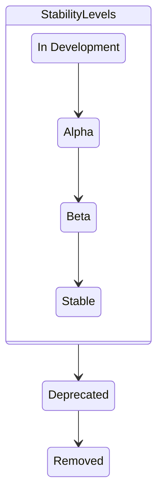

오픈텔레메트리(OpenTelemetry) 컬렉터 인스턴스는 자체 내부 텔레메트리를
확인함으로써 상태를 점검할 수 있다. 이어지는 내용에서 이 텔레메트리에 대해
알아보고, 컬렉터를
[모니터링](#use-internal-telemetry-to-monitor-the-collector)하거나
[문제를 해결](/docs/collector/troubleshooting/)하는 데 도움이 되도록 설정하는
방법을 살펴본다.

> [!WARNING]
>
> 컬렉터는 자신의 내부 텔레메트리를 내보내는(export) 방법을 설정하기 위해
> 오픈텔레메트리 SDK의
> [선언적 설정 스키마(declarative configuration schema)](https://github.com/open-telemetry/opentelemetry-configuration)를
> 사용한다. 이 스키마는 아직 [개발](/docs/specs/otel/document-status/) 중이며
> 향후 릴리스에서 **호환성이 깨지는 변경(breaking change)** 이 발생할 수 있다.
> 1.0 스키마 릴리스가 나오기 전까지는 이전 스키마 지원을 계속 유지할 계획이며,
> 사전 1.0 스키마를 폐기하기 전에 사용자가 설정을 업데이트할 수 있도록 전환
> 기간을 제공할 예정이다. 자세한 내용과 진행 상황을 추적하려면
> [이슈 #10808](https://github.com/open-telemetry/opentelemetry-collector/issues/10808)을
> 참고한다.

## 컬렉터에서 내부 텔레메트리 활성화하기 {#activate-internal-telemetry-in-the-collector}

기본적으로 컬렉터는 다음 두 가지 방식으로 자체 텔레메트리를 노출한다.

- 내부 [메트릭](#configure-internal-metrics)은 기본적으로 `8888` 포트를 사용하는
  Prometheus 인터페이스를 통해 노출된다.
- [로그](#configure-internal-logs)는 기본적으로 `stderr`로 출력된다.

### 리소스 속성 설정 {#configure-resource-attributes}

컬렉터는 내부 텔레메트리 시그널에 `service.name`, `service.version`, (무작위로
생성되는) `service.instance.id` 리소스 속성을 자동으로 부여한다. 속성 값을
`null`로 설정하면(예: `service.name: null`) 이를 비활성화할 수 있다.

컬렉터의 내부 텔레메트리 시그널(트레이스, 메트릭, 로그)에 추가 리소스 속성을
덧붙이고 싶다면 `service::telemetry::resource` 아래에 설정하면 된다.

```yaml
service:
  telemetry:
    resource:
      attribute_key: 'attribute_value'
```

### 내부 메트릭 설정 {#configure-internal-metrics}

#### 내부 메트릭용 OTLP 익스포터 {#otlp-exporter-for-internal-metrics}

컬렉터가 내부 메트릭을 생성(generate)하고 노출하는 방식을 설정할 수 있다.
기본적으로 컬렉터는 자신에 대한 기본적인 메트릭을 생성하고, 오픈텔레메트리 Go
[Prometheus 익스포터](https://github.com/open-telemetry/opentelemetry-go/tree/main/exporters/prometheus)를
사용해 `http://127.0.0.1:8888/metrics`에서 스크래핑(scraping)할 수 있도록
노출한다.

다음 설정을 통해 컬렉터가 내부 메트릭을 OTLP 백엔드로 푸시하도록 할 수 있다.

```yaml
service:
  telemetry:
    metrics:
      readers:
        - periodic:
            exporter:
              otlp:
                protocol: http/protobuf
                endpoint: https://backend:4318
```

사용 가능한 모든 옵션은 [OTLP 익스포터 옵션](#otlp-exporter-options)을 참고한다.

#### 내부 메트릭용 Prometheus 엔드포인트 {#prometheus-endpoint-for-internal-metrics}

또는 필요에 따라 Prometheus 엔드포인트를 특정 네트워크 인터페이스 하나 또는 모든
네트워크 인터페이스에 노출할 수도 있다. 컨테이너화된 환경에서는 이 포트를 공용
인터페이스에 노출하고 싶을 수 있다.

`service::telemetry::metrics` 아래에 Prometheus 설정을 지정한다.

```yaml
service:
  telemetry:
    metrics:
      readers:
        - pull:
            exporter:
              prometheus:
                host: '0.0.0.0'
                port: 8888
```

Prometheus 메트릭에 추가 레이블을 붙이고 싶다면
`prometheus::with_resource_constant_labels`를 사용해 추가할 수 있다.

```yaml
prometheus:
  host: '0.0.0.0'
  port: 8888
  with_resource_constant_labels:
    included:
      - label_key
```

그런 다음 `service::telemetry::resource`에서 해당 레이블을 참조한다.

```yaml
resource:
  label_key: label_value
```

#### 서비스 주소 {#service-address}

> [!NOTE] 내부 텔레메트리 설정 변경
>
> 컬렉터 [v0.123.0][] 기준으로, `service::telemetry::metrics::address` 설정은
> 무시된다. 이전 버전에서는 다음과 같이 설정할 수 있었다.
>
> ```yaml
> service:
>   telemetry:
>     metrics:
>       address: 0.0.0.0:8888
> ```

[v0.123.0]:
  https://github.com/open-telemetry/opentelemetry-collector/releases/tag/v0.123.0

#### 메트릭 상세도 {#metric-verbosity}

`level` 필드를 다음 값 중 하나로 설정하여 컬렉터 메트릭 출력의 상세도를 조정할
수 있다.

- `none`: 텔레메트리를 수집(collect)하지 않는다.
- `basic`: 필수적인 서비스 텔레메트리이다.
- `normal`: 기본 레벨로, basic 위에 표준 지표를 추가한다.
- `detailed`: 가장 상세한 레벨로, 차원과 뷰를 포함한다.

각 상세도 레벨은 특정 메트릭이 출력되는 기준점을 나타낸다. 레벨별로 정리된 전체
메트릭 목록은 [내부 메트릭 목록](#lists-of-internal-metrics)을 참고한다.

메트릭 출력의 기본 레벨은 `normal`이다. 다른 레벨을 사용하려면
`service::telemetry::metrics::level`을 설정한다.

```yaml
service:
  telemetry:
    metrics:
      level: detailed
```

#### 메트릭 뷰 {#metric-views}

[`views`](/docs/specs/otel/metrics/sdk/#view)를 사용하면 컬렉터의 메트릭이
출력되는 방식을 더 세밀하게 설정할 수 있다. 예를 들어 다음 설정은
`otelcol_process_uptime`이라는 메트릭이 새로운 이름 `process_uptime`과 설명으로
출력되도록 업데이트한다.

> [!NOTE]
>
> 내부 메트릭용 Prometheus 익스포터를(`readers`를 사용해) 수동으로 설정할 때,
> `without_type_suffix`와 `without_units`를 `true`로 설정하지 않으면
> `otelcol_process_uptime`이 `otelcol_process_uptime_seconds_total`로 내보내질
> 수 있다. 이 경우에도 뷰에서는 `instrument_name` 값으로
> `otelcol_process_uptime`(OTLP 이름)을 사용한다. Prometheus 전용 접미사를
> 제어하는 방법은 [단위 접미사](#unit-suffixes)를 참고한다.

```yaml
service:
  telemetry:
    metrics:
      views:
        - selector:
            instrument_name: otelcol_process_uptime
            instrument_type:
          stream:
            name: process_uptime
            description: The amount of time the Collector has been up
```

`views`를 사용하면 결과 집계(aggregation), 속성, 카디널리티 제한도 업데이트할 수
있다. 전체 옵션 목록은 오픈텔레메트리 설정 스키마
[저장소](https://github.com/open-telemetry/opentelemetry-configuration/blob/main/snippets/View_kitchen_sink.yaml)의
예시를 참고한다.

### 내부 로그 설정 {#configure-internal-logs}

로그 출력은 `stderr`에서 확인할 수 있다. `service::telemetry::logs` 설정에서
로그를 설정할 수 있으며,
[설정 옵션](https://github.com/open-telemetry/opentelemetry-collector/blob/main/service/telemetry/otelconftelemetry/config.go)은
다음과 같다.

| 필드 이름              | 기본값       | 설명                                                                                                                                                                                                                                                              |
| ---------------------- | ------------ | ----------------------------------------------------------------------------------------------------------------------------------------------------------------------------------------------------------------------------------------------------------------- |
| `level`                | `INFO`       | 활성화할 최소 로깅 레벨을 설정한다. 그 외 가능한 값으로 `DEBUG`, `WARN`, `ERROR`가 있다.                                                                                                                                                                          |
| `development`          | `false`      | 로거를 개발(development) 모드로 전환한다.                                                                                                                                                                                                                         |
| `encoding`             | `console`    | 로거의 인코딩을 설정한다. 그 외 가능한 값은 `json`이다.                                                                                                                                                                                                           |
| `disable_caller`       | `false`      | 호출한 함수의 파일 이름과 줄 번호를 로그에 표시하지 않도록 한다. 기본적으로 모든 로그에는 이 정보가 표시된다.                                                                                                                                                     |
| `disable_stacktrace`   | `false`      | 스택 트레이스(stacktrace) 자동 캡처를 비활성화한다. 개발 환경에서는 `WARN` 레벨 이상, 프로덕션 환경에서는 `ERROR` 레벨 이상의 로그에 대해 스택 트레이스가 캡처된다.                                                                                               |
| `sampling::enabled`    | `true`       | 샘플링 정책을 설정한다.                                                                                                                                                                                                                                           |
| `sampling::tick`       | `10s`        | 로거가 각 샘플링에 적용하는 간격(초)이다.                                                                                                                                                                                                                         |
| `sampling::initial`    | `10`         | 각 `sampling::tick`가 시작될 때 기록되는 메시지 개수이다.                                                                                                                                                                                                         |
| `sampling::thereafter` | `100`        | `sampling::initial` 메시지가 기록된 이후의 메시지에 대한 샘플링 정책을 설정한다. `sampling::thereafter`가 `N`으로 설정되면 매 `N`번째 메시지만 기록되고 나머지는 삭제된다. `N`이 0이면, `sampling::initial` 메시지가 기록된 이후의 모든 메시지를 로거가 삭제한다. |
| `output_paths`         | `["stderr"]` | 로깅 출력을 기록할 URL 또는 파일 경로 목록이다.                                                                                                                                                                                                                   |
| `error_output_paths`   | `["stderr"]` | 로거 오류를 기록할 URL 또는 파일 경로 목록이다.                                                                                                                                                                                                                   |
| `initial_fields`       |              | 로깅 컨텍스트를 보강하기 위해 모든 로그 항목에 추가되는 정적 키-값 쌍의 모음이다. 기본적으로 초기 필드는 없다.                                                                                                                                                    |

Linux systemd 시스템에서는 `journalctl`을 사용해 컬렉터의 로그를 확인할 수도
있다.

 {}

```sh
journalctl | grep otelcol
```

{} {}

```sh
journalctl | grep otelcol | grep Error
```

{} 

다음 설정을 사용하면 컬렉터의 내부 로그를 OTLP/HTTP 백엔드로 출력할 수 있다.

```yaml
service:
  telemetry:
    logs:
      processors:
        - batch:
            exporter:
              otlp:
                protocol: http/protobuf
                endpoint: https://backend:4318
```

사용 가능한 모든 옵션은 [OTLP 익스포터 옵션](#otlp-exporter-options)을 참고한다.

### 내부 트레이스 설정 {#configure-internal-traces}

컬렉터는 기본적으로 트레이스를 노출하지 않지만, 이를 노출하도록 설정할 수 있다.

> [!CAUTION]
>
> 내부 트레이싱은 실험적인 기능이며, 출력되는 스팬 이름과 속성의 안정성에
> 대해서는 어떠한 보장도 하지 않는다.

다음 설정을 사용하면 컬렉터의 내부 트레이스를 OTLP 백엔드로 출력할 수 있다.

```yaml
service:
  telemetry:
    traces:
      processors:
        - batch:
            exporter:
              otlp:
                protocol: http/protobuf
                endpoint: https://backend:4318
```

추가 옵션은 [예시 설정][kitchen-sink-config]을 참고한다. 그 설정에서
`tracer_provider` 섹션이 여기서의 `traces`에 해당한다는 점에 유의한다. OTLP
익스포터 옵션에 대한 구체적인 내용은 [아래](#otlp-exporter-options)를 참고한다.

[kitchen-sink-config]:
  https://github.com/open-telemetry/opentelemetry-configuration/blob/v0.3.0/examples/kitchen-sink.yaml

### OTLP 익스포터 옵션 {#otlp-exporter-options}

세 가지 시그널 모두에 대해 OTLP 익스포터에서 사용할 수 있는
[옵션](https://github.com/open-telemetry/opentelemetry-go-contrib/blob/otelconf/v0.23.0/otelconf/v0.3.0/generated_config.go#L256)은
다음과 같다. [메트릭에 대한](#otlp-exporter-options-metrics) 추가 옵션도 있다.

- `metrics::readers[*]::periodic::exporter::otlp`
- `logs::processors[*]::batch::exporter::otlp`
- `traces::processors[*]::batch::exporter::otlp`

| 필드 이름            | 기본값                                                  | 설명                                                                                                                                                                                                                                        |
| -------------------- | ------------------------------------------------------- | ------------------------------------------------------------------------------------------------------------------------------------------------------------------------------------------------------------------------------------------- |
| `endpoint`           | `localhost:4317`(gRPC), `localhost:4318`(http/protobuf) | 텔레메트리를 전송할 대상 URL이다. 예: `https://backend:4318`. `http/protobuf`의 경우 URL에 포함된 경로는 그대로 익스포터에 전달되며, 경로가 지정되지 않으면 시그널별 기본 경로(`/v1/traces`, `/v1/metrics`, `/v1/logs` 중 하나)가 사용된다. |
| `protocol`           | (필수)                                                  | 전송 프로토콜이다. 지원하는 값: `grpc`, `http/protobuf`.                                                                                                                                                                                    |
| `compression`        |                                                         | 전송 전에 적용되는 압축 알고리즘이다. 지원하는 값: `gzip`, `none`.                                                                                                                                                                          |
| `timeout`            | `10000`                                                 | 각 내보내기 시도에 대한 타임아웃(밀리초)이다.                                                                                                                                                                                               |
| `headers`            |                                                         | 요청 헤더로 전송되는 키-값 쌍 목록이다. 각 항목에는 `name` 필드와 `value` 필드가 필요하다.                                                                                                                                                  |
| `headers_list`       |                                                         | [W3C Baggage](https://www.w3.org/TR/baggage/) 형식의 헤더이다(예: `key1=value1,key2=value2`). `headers`와 `headers_list`가 모두 설정된 경우, 개별 헤더 단위로 `headers`가 우선한다.                                                         |
| `certificate`        |                                                         | 서버의 인증서를 검증하는 데 사용되는 PEM 인코딩 CA 인증서 파일 경로이다.                                                                                                                                                                    |
| `client_certificate` |                                                         | mTLS용 PEM 인코딩 클라이언트 인증서 파일 경로이다. `client_key`가 설정된 경우 필수이다.                                                                                                                                                     |
| `client_key`         |                                                         | 클라이언트 인증서용 PEM 인코딩 개인 키 파일 경로이다. `client_certificate`가 설정된 경우 필수이다.                                                                                                                                          |
| `insecure`           | `false`                                                 | `grpc` 프로토콜에만 적용된다. `true`로 설정하면, 엔드포인트 스킴이 `http`나 `https`가 아닌 gRPC 연결에 대해 TLS를 비활성화한다. `http/protobuf`의 경우, 이 옵션과 무관하게 엔드포인트가 `http` 스킴을 사용하지 않는 한 TLS가 활성화된다.    |

> [!NOTE]
>
> 내부 OTLP 익스포터는 컬렉터가 사용하는 Go SDK에 구현되어 있다. Go SDK는
> [환경 변수 기반 설정](/docs/languages/sdk-configuration/otlp-exporter/)을
> 지원하지만, 컬렉터의 프로그래밍 방식 설정이 우선하므로 예기치 않은 동작을
> 피하려면 컬렉터의 YAML 설정을 사용하는 것을 권장한다.

#### 메트릭에 대한 추가 옵션 {#otlp-exporter-options-metrics}

다음
[옵션](https://github.com/open-telemetry/opentelemetry-go-contrib/blob/otelconf/v0.23.0/otelconf/v0.3.0/generated_config.go#L288)은
OTLP 메트릭 익스포터(`metrics::readers[*].periodic.exporter.otlp`)에만 적용된다.

| 필드 이름                | 기본값       | 설명                                                                                                                                                                                                                                  |
| ------------------------ | ------------ | ------------------------------------------------------------------------------------------------------------------------------------------------------------------------------------------------------------------------------------- |
| `temporality_preference` | `cumulative` | 메트릭 계측기(instrument)의 집계 temporality이다. 지원하는 값: `cumulative`(모든 계측기), `delta`(카운터, 히스토그램, observable 카운터는 delta, 나머지는 cumulative), `lowmemory`(카운터와 히스토그램은 delta, 나머지는 cumulative). |

## 내부 텔레메트리의 유형 {#types-of-internal-telemetry}

오픈텔레메트리 컬렉터는 자체 운영 메트릭을 명확하게 노출함으로써 관찰 가능한
서비스의 모범 사례가 되는 것을 목표로 한다. 또한 동일한 호스트에서 실행되는 다른
프로세스로 인해 문제가 발생했는지 파악하는 데 도움이 되도록 호스트 리소스
메트릭도 수집한다. 컬렉터의 특정 구성 요소는 자체 커스텀 텔레메트리를 내보낼
수도 있다. 이 절에서는 컬렉터 자체가 내보내는 다양한 유형의 옵저버빌리티에 대해
알아본다.

### 내부 메트릭으로 관찰 가능한 값 요약 {#summary-of-values-observable-with-internal-metrics}

컬렉터는 최소한 다음 값에 대해 내부 메트릭을 출력한다.

- 프로세스 가동 시간(uptime)과 시작 이후의 CPU 시간.
- 프로세스 메모리 및 힙(heap) 사용량.
- 리시버: 데이터 타입별로 수락(accept)되거나 거부(refuse)된 항목 수.
- 프로세서: 들어오고 나가는 항목 수.
- 익스포터: 데이터 타입별로 전송에 성공한 항목, 큐잉(enqueue)에 실패한 항목,
  전송에 실패한 항목 수.
- 익스포터: 큐 크기와 용량.
- HTTP/gRPC 요청 및 응답의 개수, 지속 시간, 크기.

더 자세한 목록은 다음 절에서 확인할 수 있다.

### 메트릭 이름 {#metric-names}

이 절에서는 일부 내부 메트릭에 적용되는 특별한 명명 규칙(naming convention)을
설명한다.

#### `otelcol_` 접두사 {#otelcol-prefix}

컬렉터 v0.106.1부터, 내부 메트릭 이름은 그 출처에 따라 다르게 처리된다.

- 컬렉터 구성 요소에서 생성된 메트릭에는 `otelcol_` 접두사가 붙는다.
- 계측 라이브러리에서 생성된 메트릭은, 메트릭 이름에 명시적으로 접두사가 붙지
  않는 한 기본적으로 `otelcol_` 접두사를 사용하지 않는다.

v0.106.1 이전 버전의 컬렉터에서는, 출처와 관계없이 Prometheus 익스포터를 통해
출력되는 모든 내부 메트릭에 `otelcol_` 접두사가 붙는다. 여기에는 컬렉터 구성
요소와 계측 라이브러리 양쪽에서 생성된 메트릭이 모두 포함된다.

#### `_total` 접미사 {#total-suffix}

Prometheus에서만 나타나는 기본 동작으로, Prometheus 익스포터는 Prometheus 명명
규칙을 따르기 위해 `otelcol_exporter_send_failed_spans_total`과 같이
합산(summation) 메트릭에 `_total` 접미사를 붙인다. 이 동작은 Prometheus 익스포터
설정에서 `without_type_suffix: true`를 설정하여 비활성화할 수 있다.

컬렉터 설정에서 `service::telemetry::metrics::readers`를 생략하면, 컬렉터가
자동으로 구성하는 기본 Prometheus 익스포터는 이미 `without_type_suffix`가
`false`로 설정되어 있다. 하지만 readers를 커스터마이징하여 Prometheus 익스포터를
직접 추가하는 경우에는, "원본(raw)" 메트릭 이름으로 되돌리려면 해당 옵션을 직접
설정해야 한다. 자세한 내용은
[컬렉터 v1.25.0/v0.119.0 릴리스 노트](https://github.com/codeboten/opentelemetry-collector/blob/313167505b44e5dc9a29c0b9242cc4547db11ec3/CHANGELOG.md#v1250v01190)를
참고한다.

OTLP를 통해 내보내지는 내부 메트릭에는 이러한 동작이 적용되지 않는다. 이
페이지의 [내부 메트릭](#lists-of-internal-metrics)은
`otelcol_exporter_send_failed_spans`와 같이 OTLP 형식으로 표기되어 있다.

#### `_seconds` 등 단위 접미사 {#unit-suffixes}

Prometheus 익스포터는 단위가 있는 메트릭에 단위 접미사를 추가한다. 예를 들어
`otelcol_process_uptime`(단위: 초)은 `otelcol_process_uptime_seconds_total`로
내보내질 수 있는데, 이때 `_seconds` 단위 접미사가 먼저 추가되고 그 다음 `_total`
카운터 접미사가 추가된다.

컬렉터가 구성하는 기본 Prometheus 익스포터는(`readers`가 지정되지 않은 경우)
하위 호환성을 위해 이미 `without_type_suffix`와 `without_units`를 `true`로
설정해 두었으므로, `otelcol_process_uptime`이 그대로 사용된다.

하지만 `service::telemetry::metrics::readers` 아래에서 Prometheus 익스포터를
직접 설정하는 경우에는 이 옵션들이 기본적으로 설정되어 있지 않다. 원래의 더 짧은
메트릭 이름을 유지하려면 두 옵션을 모두 명시적으로 `true`로 설정한다.

```yaml
service:
  telemetry:
    metrics:
      readers:
        - pull:
            exporter:
              prometheus:
                host: '0.0.0.0'
                port: 8888
                without_type_suffix: true
                without_units: true
```

이렇게 설정하면 `otelcol_process_uptime_seconds_total`이
`otelcol_process_uptime`으로 내보내진다.

#### 점(`.`)과 밑줄(`_`) {#dots-v-underscores}

`http*`와 `rpc*` 메트릭은 계측 라이브러리에서 비롯된 것이다. 원래 이름에는
점(`.`)이 사용되었다. 컬렉터 v0.120.0 이전에는, Prometheus로 노출되는 내부
메트릭이 Prometheus 명명 규칙에 맞추기 위해 점(`.`)을 밑줄(`_`)로 변경했으며, 그
결과 `rpc_server_duration`과 같은 형태의 메트릭 이름이 만들어졌다.

컬렉터 0.120.0 이상 버전은 Prometheus 3.0 스크래퍼를 사용하므로, 점이 포함된
원래의 `http*` 및 `rpc*` 메트릭 이름이 그대로 유지된다. 이 페이지의
[내부 메트릭](#lists-of-internal-metrics)은 `rpc.server.call.duration`과 같이
원래 형태로 표기되어 있다. 자세한 내용은
[컬렉터 v0.120.0 릴리스 노트](https://github.com/open-telemetry/opentelemetry-collector-contrib/blob/main/CHANGELOG.md#v01200)를
참고한다.

### 내부 메트릭 목록 {#lists-of-internal-metrics}

다음 표는 각 내부 메트릭을 `basic`, `normal`, `detailed` 상세도 레벨별로
그룹화한 것이다. 각 메트릭은 이름과 설명으로 식별되며, 계측 타입별로 분류된다.



To compile this list, configure a Collector instance to emit its own metrics to
the localhost:8888/metrics endpoint. Select a metric and grep for it in the
Collector core repository. For example, the `otelcol_process_memory_rss` can be
found using:`grep -Hrn "memory_rss" .` Make sure to eliminate from your search
string any words that might be prefixes. Look through the results until you find
the .go file that contains the list of metrics. In the case of
`otelcol_process_memory_rss`, it and other process metrics can be found in
<https://github.com/open-telemetry/opentelemetry-collector/blob/31528ce81d44e9265e1a3bbbd27dc86d09ba1354/service/internal/proctelemetry/process_telemetry.go#L92>.
Note that the Collector's internal metrics are defined in several different
files in the repository.



#### `basic` 레벨 메트릭 {#basic-level-metrics}

| 메트릭 이름                                            | 설명                                                                        | 타입          |
| ------------------------------------------------------ | --------------------------------------------------------------------------- | ------------- |
| `otelcol_exporter_enqueue_failed_`<br>`log_records`    | 익스포터가 큐잉(enqueue)에 실패한 로그 수.                                  | Counter       |
| `otelcol_exporter_enqueue_failed_`<br>`metric_points`  | 익스포터가 큐잉에 실패한 메트릭 포인트 수.                                  | Counter       |
| `otelcol_exporter_enqueue_failed_`<br>`spans`          | 익스포터가 큐잉에 실패한 스팬 수.                                           | Counter       |
| `otelcol_exporter_in_flight_requests`                  | 재시도 대기(retry backoff)를 포함하여 현재 진행 중인 내보내기 요청 수.      | UpDownCounter |
| `otelcol_exporter_queue_capacity`                      | 전송 큐의 고정 용량(배치 단위).                                             | Gauge         |
| `otelcol_exporter_queue_size`                          | 전송 큐의 현재 크기(배치 단위).                                             | Gauge         |
| `otelcol_exporter_send_failed_`<br>`log_records`       | 익스포터가 목적지로 전송하는 데 실패한 로그 수.                             | Counter       |
| `otelcol_exporter_send_failed_`<br>`metric_points`     | 익스포터가 목적지로 전송하는 데 실패한 메트릭 포인트 수.                    | Counter       |
| `otelcol_exporter_send_failed_`<br>`spans`             | 익스포터가 목적지로 전송하는 데 실패한 스팬 수.                             | Counter       |
| `otelcol_exporter_sent_log_records`                    | 목적지로 성공적으로 전송된 로그 수.                                         | Counter       |
| `otelcol_exporter_sent_metric_points`                  | 목적지로 성공적으로 전송된 메트릭 포인트 수.                                | Counter       |
| `otelcol_exporter_sent_spans`                          | 목적지로 성공적으로 전송된 스팬 수.                                         | Counter       |
| `otelcol_process_cpu_seconds`                          | 총 CPU 사용자 및 시스템 시간(초).                                           | Counter       |
| `otelcol_process_memory_rss`                           | 총 물리 메모리(RSS, resident set size, 바이트).                             | Gauge         |
| `otelcol_process_runtime_heap_`<br>`alloc_bytes`       | 할당된 힙 객체의 바이트 수('go doc runtime.MemStats.HeapAlloc' 참고).       | Gauge         |
| `otelcol_process_runtime_total_`<br>`alloc_bytes`      | 힙 객체에 할당된 누적 바이트 수('go doc runtime.MemStats.TotalAlloc' 참고). | Counter       |
| `otelcol_process_runtime_total_`<br>`sys_memory_bytes` | OS로부터 확보한 총 메모리 바이트 수('go doc runtime.MemStats.Sys' 참고).    | Gauge         |
| `otelcol_process_uptime`                               | 프로세스의 가동 시간(초).                                                   | Counter       |
| `otelcol_processor_incoming_items`                     | 프로세서로 전달된 항목 수.                                                  | Counter       |
| `otelcol_processor_outgoing_items`                     | 프로세서에서 출력된 항목 수.                                                | Counter       |
| `otelcol_receiver_accepted_`<br>`log_records`          | 성공적으로 유입(ingest)되어 파이프라인으로 전달된 로그 수.                  | Counter       |
| `otelcol_receiver_accepted_`<br>`metric_points`        | 성공적으로 유입되어 파이프라인으로 전달된 메트릭 포인트 수.                 | Counter       |
| `otelcol_receiver_accepted_spans`                      | 성공적으로 유입되어 파이프라인으로 전달된 스팬 수.                          | Counter       |
| `otelcol_receiver_refused_`<br>`log_records`           | 파이프라인으로 전달되지 못한 로그 수.                                       | Counter       |
| `otelcol_receiver_refused_`<br>`metric_points`         | 파이프라인으로 전달되지 못한 메트릭 포인트 수.                              | Counter       |
| `otelcol_receiver_refused_spans`                       | 파이프라인으로 전달되지 못한 스팬 수.                                       | Counter       |
| `otelcol_scraper_errored_`<br>`metric_points`          | 컬렉터가 스크래핑(scraping)에 실패한 메트릭 포인트 수.                      | Counter       |
| `otelcol_scraper_scraped_`<br>`metric_points`          | 컬렉터가 스크래핑한 메트릭 포인트 수.                                       | Counter       |

#### 추가 `normal` 레벨 메트릭 {#additional-normal-level-metrics}

| 메트릭 이름                                             | 설명                                       | 타입      |
| ------------------------------------------------------- | ------------------------------------------ | --------- |
| `otelcol_processor_batch_batch_`<br>`send_size`         | 전송된 배치에 포함된 유닛(unit) 수.        | Histogram |
| `otelcol_processor_batch_batch_size_`<br>`trigger_send` | 크기 트리거로 인해 배치가 전송된 횟수.     | Counter   |
| `otelcol_processor_batch_metadata_`<br>`cardinality`    | 처리 중인 고유한 메타데이터 값 조합의 수.  | Counter   |
| `otelcol_processor_batch_timeout_`<br>`trigger_send`    | 타임아웃 트리거로 인해 배치가 전송된 횟수. | Counter   |

> [!NOTE] 배치 프로세서 메트릭 레벨 변경
>
> 컬렉터 [v0.99.0][]에서, `otelcol_processor_batch_batch_send_size_bytes`를
> 제외한 모든 배치 프로세서 메트릭이 `basic`에서 `normal`(현재 레벨)로
> 상향되었다. `otelcol_processor_batch_batch_send_size_bytes`는 도입 이후 계속
> `detailed`였다. 다만 이 메트릭들은 v0.109.0부터 v0.121.0까지 실수로 다시
> `basic`으로 되돌아갔었다는 점에 유의한다.

[v0.99.0]:
  https://github.com/open-telemetry/opentelemetry-collector/releases/tag/v0.99.0

#### 추가 `detailed` 레벨 메트릭 {#additional-detailed-level-metrics}

| 메트릭 이름                                           | 설명                                                     | 타입      |
| ----------------------------------------------------- | -------------------------------------------------------- | --------- |
| `http.client.request.body.size`                       | HTTP 클라이언트 요청 본문의 크기를 측정한다.             | Counter   |
| `http.client.request.duration`                        | HTTP 클라이언트 요청의 지속 시간을 측정한다.             | Histogram |
| `http.server.request.body.size`                       | HTTP 서버 요청 본문의 크기를 측정한다.                   | Counter   |
| `http.server.request.duration`                        | HTTP 서버 요청의 지속 시간을 측정한다.                   | Histogram |
| `http.server.response.body.size`                      | HTTP 서버 응답 본문의 크기를 측정한다.                   | Counter   |
| `otelcol_processor_batch_batch_`<br>`send_size_bytes` | 전송된 배치의 바이트 수.                                 | Histogram |
| `rpc.client.call.duration`                            | 나가는 원격 프로시저 호출(RPC)의 지속 시간을 측정한다.   | Histogram |
| `rpc.server.call.duration`                            | 들어오는 원격 프로시저 호출(RPC)의 지속 시간을 측정한다. | Histogram |

#### 출력되는 메트릭의 소유권 {#ownership-of-emitted-metrics}

일부 메트릭은 컬렉터 SIG가 소유하지 않으며, 일부는 특정 구성 요소로 제한된다.

**`http*`와 `rpc` 메트릭**

이 메트릭들은 컬렉터 SIG의 관리 범위에 있지 않으며, 따라서 아래의 성숙도 레벨이
적용되지 않는다.

**`rpc` 메트릭**

컬렉터의 내부 RPC 메트릭은 업스트림
[`otelgrpc`](https://github.com/open-telemetry/opentelemetry-go-contrib/tree/main/instrumentation/google.golang.org/grpc/otelgrpc)
계측에서 비롯되며, 이는
[오픈텔레메트리 RPC 시맨틱 컨벤션](/docs/specs/semconv/rpc/rpc-metrics/)을
따른다. 컬렉터가 출력하는 RPC 메트릭 집합은 릴리스마다 변경되어 왔다.

| 컬렉터 버전   | 출력되는 RPC 메트릭                                                                                                                                           |
| ------------- | ------------------------------------------------------------------------------------------------------------------------------------------------------------- |
| v0.146.x 이하 | `rpc.client.duration`, `rpc.server.duration`, `rpc.*.request.size`, `rpc.*.response.size`, `rpc.*.requests_per_rpc`, `rpc.*.responses_per_rpc`                |
| v0.147.0      | `rpc.client.call.duration`, `rpc.server.call.duration`, `rpc.*.request.size`, `rpc.*.response.size`(`*_per_rpc` 메트릭은 지원 중단되어 더 이상 출력되지 않음) |
| v0.148.0 이상 | `rpc.client.call.duration`, `rpc.server.call.duration`만 해당                                                                                                 |

RPC 크기 메트릭은 컬렉터 v0.148.0 이상에서는 출력되지 않는다.
[RPC 시맨틱 컨벤션 v1.40.0](https://github.com/open-telemetry/semantic-conventions/releases/tag/v1.40.0)에서
정의가 모호하고 구현이 일관되지 않다는 이유로 이를 지원 중단(deprecate)했다.

**`otelcol_processor_batch_*` 메트릭**

이 메트릭들은 `batchprocessor`에만 존재한다.

**`helper` 패키지 메트릭**

`otelcol_receiver_`, `otelcol_scraper_`, `otelcol_processor_`,
`otelcol_exporter_` 메트릭은 각각에 대응하는 `helper` 패키지에서 비롯된다.
따라서 이러한 패키지를 사용하지 않는 일부 구성 요소는 이 메트릭들을 출력하지
않을 수 있다.

### 내부 로그로 관찰 가능한 이벤트 {#events-observable-with-internal-logs}

컬렉터는 다음과 같은 내부 이벤트를 로깅한다.

- 컬렉터 인스턴스가 시작되거나 중지된다.
- 로컬 포화(saturation), 다운스트림 포화, 다운스트림 사용 불가 등 특정 이유로
  인한 스로틀링(throttling)으로 데이터 삭제가 시작된다.
- 스로틀링으로 인한 데이터 삭제가 중지된다.
- 유효하지 않은 데이터로 인해 데이터 삭제가 시작된다. 유효하지 않은 데이터의
  샘플이 함께 포함된다.
- 유효하지 않은 데이터로 인한 데이터 삭제가 중지된다.
- 정상 종료와 구분되는 크래시(crash)가 감지된다. 가능한 경우 크래시 데이터가
  포함된다.

## 텔레메트리 성숙도 레벨 {#telemetry-maturity-levels}

컬렉터 텔레메트리 레벨은 컬렉터가 생성하는 모든 자체(first-party) 텔레메트리에
적용된다. 오픈텔레메트리 Go를 포함한 서드파티 라이브러리에는 이 성숙도 레벨이
적용되지 않는다.

### 트레이스 {#traces}

트레이싱 계측은 아직 활발히 개발 중이며, 스팬 이름, 첨부된 속성, 계측된
엔드포인트, 또는 텔레메트리의 다른 측면이 변경될 수 있다. 이 기능이 stable로
승격되기 전까지는 트레이싱 계측에 대한 하위 호환성이 보장되지 않는다.

### 메트릭 {#metrics}

컬렉터의 자체 메트릭은 다음과 같은 생명 주기(lifecycle)를 따른다.



이 안정성 레벨은 [OTEP-0232][OTEP-0232]에서 파생된 시맨틱 컨벤션
[가이드][SemConvGuidance]를 따른다. 컬렉터 메트릭은 `release_candidate` 레벨을
건너뛴다.

deprecated와 deleted 단계는 안정성 레벨이 아니라 생명 주기 상태라는 점에
유의한다.

오픈텔레메트리 Go 계측 라이브러리에서 생성된 것을 포함한 서드파티 메트릭에는 이
성숙도 레벨이 적용되지 않는다.

#### 개발 중(Development) {#development}

Development 메트릭은 아직 활발히 개발 중이며 어느 릴리스에서든 변경될 수 있다.

#### 알파(Alpha) {#alpha}

Alpha 메트릭은 안정성이 보장되지 않는다. 이 메트릭들은 언제든지 수정되거나
삭제될 수 있다.

#### 베타(Beta) {#beta}

Beta 메트릭은 릴리스 간에 여전히 변경될 수 있지만, 구성 요소 소유자는 호환성이
깨지는 변경을 최소화하려고 노력해야 한다. 이 단계는 더 폭넓은 사용을 장려하며
`stable` 이전의 마지막 단계이다.

#### 안정(Stable) {#stable}

Stable 메트릭은 변경되지 않을 것이 보장된다. 이는 다음을 의미한다.

- 지원 중단(deprecated) 시그니처가 없는 stable 메트릭은 삭제되거나 이름이
  변경되지 않는다.
- stable 메트릭의 타입과 속성은 수정되지 않는다.

#### 지원 중단(Deprecated) {#deprecated}

Deprecated 메트릭은 삭제가 예정되어 있지만 여전히 사용할 수 있다. 이러한
메트릭의 설명에는 지원 중단된 버전에 대한 주석이 포함된다. 예를 들면 다음과
같다.

지원 중단 이전:

```sh
# HELP otelcol_exporter_queue_size this counts things
# TYPE otelcol_exporter_queue_size counter
otelcol_exporter_queue_size 0
```

지원 중단 이후:

```sh
# HELP otelcol_exporter_queue_size (Deprecated since 1.15.0) this counts things
# TYPE otelcol_exporter_queue_size counter
otelcol_exporter_queue_size 0
```

#### 삭제됨(Deleted) {#deleted}

Deleted 메트릭은 더 이상 게시되지 않으며 사용할 수 없다.

### 로그 {#logs}

개별 로그 항목과 그 형식은 릴리스마다 변경될 수 있다. 현재로서는 안정성이
보장되지 않는다.

## 내부 텔레메트리로 컬렉터 모니터링하기 {#use-internal-telemetry-to-monitor-the-collector}

이 절에서는 컬렉터 자체 텔레메트리를 사용하여 컬렉터를 모니터링하기 위한 모범
사례(best practice)를 제안한다.

### 모니터링 {#monitoring}

#### 큐 길이 {#queue-length}

대부분의 익스포터는
[큐 및/또는 재시도 메커니즘](https://github.com/open-telemetry/opentelemetry-collector/blob/main/exporter/exporterhelper/README.md)을
제공하며, 컬렉터의 모든 프로덕션 배포에서 사용하는 것이 권장된다.

`otelcol_exporter_queue_capacity` 메트릭은 전송 큐의 용량(배치 단위)을 나타낸다.
`otelcol_exporter_queue_size` 메트릭은 전송 큐의 현재 크기를 나타낸다. 이 두
메트릭을 사용하여 큐 용량이 작업 부하를 감당할 수 있는지 확인한다.

다음 세 가지 메트릭을 사용하면 전송 큐에 도달하지 못한 스팬, 메트릭 포인트, 로그
레코드의 수를 파악할 수 있다.

- `otelcol_exporter_enqueue_failed_spans`
- `otelcol_exporter_enqueue_failed_metric_points`
- `otelcol_exporter_enqueue_failed_log_records`

이러한 실패는 처리되지 않은 요소로 가득 찬 큐로 인해 발생할 수 있다. 전송 속도를
낮추거나 컬렉터를 수평으로 확장해야 할 수도 있다.

큐 또는 재시도 메커니즘은 모니터링을 위한 로깅도 지원한다.
`Dropping data because sending_queue is full`과 같은 메시지가 있는지 로그를
확인한다.

#### 수신 실패 {#receive-failures}

`otelcol_receiver_refused_log_records`, `otelcol_receiver_refused_spans`,
`otelcol_receiver_refused_metric_points`의 값이 지속적으로 높다면 클라이언트에
너무 많은 오류가 반환되고 있음을 나타낸다. 배포 방식과 클라이언트의
복원력(resilience)에 따라, 이는 클라이언트의 데이터 손실을 의미할 수도 있다.

`otelcol_exporter_send_failed_log_records`,
`otelcol_exporter_send_failed_spans`,
`otelcol_exporter_send_failed_metric_points`의 값이 지속적으로 높다면 컬렉터가
예상대로 데이터를 내보내지 못하고 있음을 나타낸다. 재시도가 있을 수 있으므로 이
메트릭들이 데이터 손실을 그 자체로 의미하지는 않는다. 하지만 실패율이 높다면
네트워크나 데이터를 수신하는 백엔드에 문제가 있음을 나타낼 수 있다.

#### 데이터 흐름 {#data-flow}

`otelcol_receiver_accepted_log_records`, `otelcol_receiver_accepted_spans`,
`otelcol_receiver_accepted_metric_points` 메트릭으로 데이터 유입(ingress)을,
`otelcol_exporter_sent_log_records`, `otelcol_exporter_sent_spans`,
`otelcol_exporter_sent_metric_points` 메트릭으로 데이터 유출(egress)을
모니터링할 수 있다.

[SemConvGuidance]:
  /docs/specs/semconv/general/semantic-convention-groups#group-stability
[OTEP-0232]:
  https://github.com/open-telemetry/opentelemetry-specification/blob/v1.50.0/oteps/0232-maturity-of-otel.md
