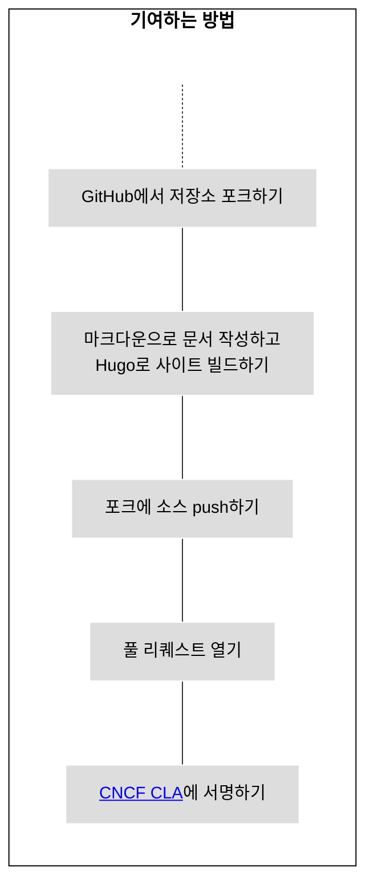
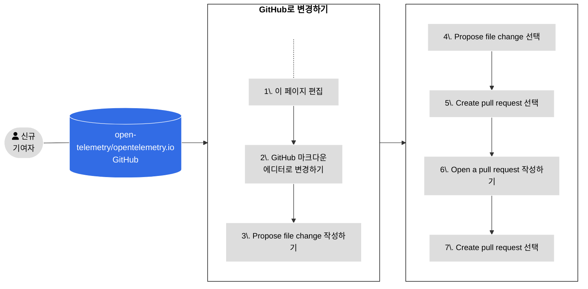
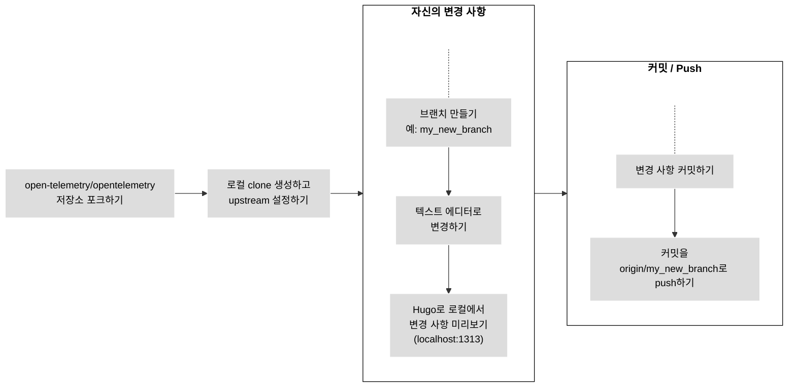
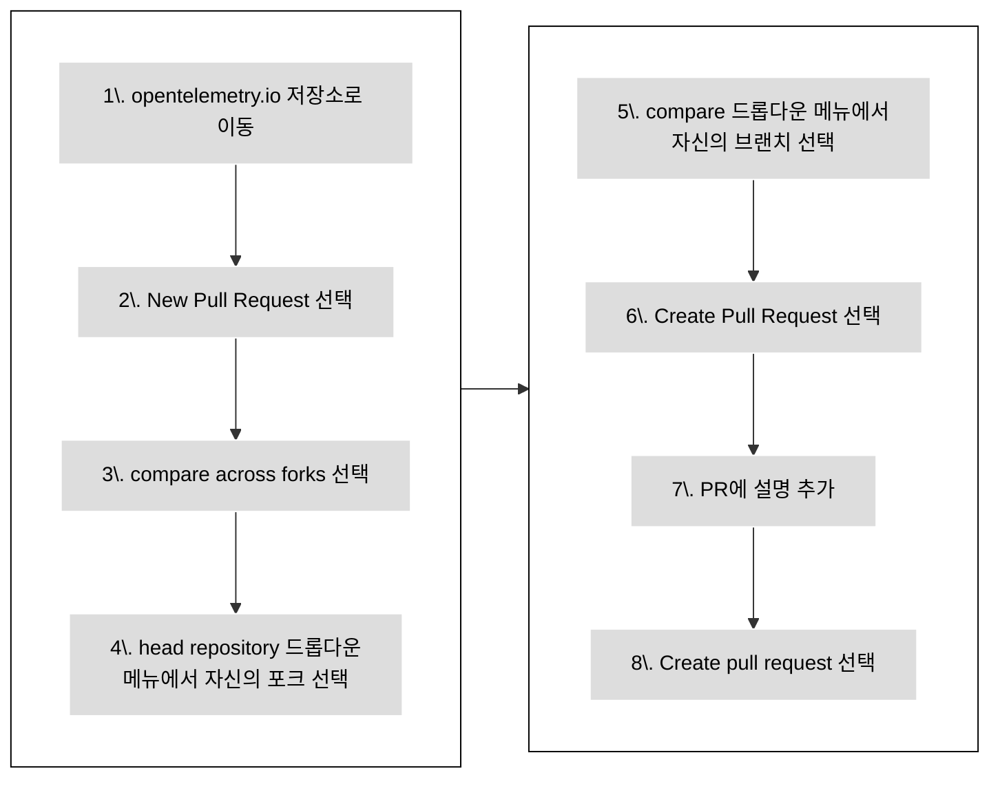

새 문서를 기여하거나 기존 문서를 개선하려면 [풀 리퀘스트(pull request,
PR)][PR]를 제출한다.

- 변경 사항이 작다면, 또는 [Git][]에 익숙하지 않다면
  [GitHub 사용하기](#changes-using-github)에서 페이지를 편집하는 방법을
  알아본다.
- 그렇지 않다면 [로컬 포크로 작업하기](#fork-the-repo)에서 자신의 로컬 개발
  환경에서 변경 사항을 만드는 방법을 알아본다.

## 생성형 AI 기여 정책 {#using-ai}

> [!WARNING] **처음 기여하는 사람**은 유의하기!
>
> [처음 기여하는 사람][first-time contributor]이라면 다음 사항을 유의한다.
>
> 이 저장소에 대한 처음 3건의 기여는 주로 사람이 직접 작성해야 하며, 사소한 AI
> 지원만 허용된다
> ([AIL1](https://danielmiessler.com/blog/ai-influence-level-ail)). 즉 코드는
> 직접 작성해야 하지만, AI가 코드 완성, 서식 지정, 린팅, 모범 사례를 따르는 데
> 도움을 줄 수는 있다. PR 설명은 AI 관여 없이 전적으로 사람이 작성해야
> 한다(AIL0).
>
> 물론 저장소, 프로젝트, 기여 방법 등에 대해 질문하고 알아보는 데는 AI 도구를
> 사용해도 된다.
>
> 이런 요구 사항을 두는 이유는, 기여하면서 배울 수 있도록 돕고, 관리자와
> 승인자가 소중한 자원인 자신의 시간을 아낄 수 있도록 돕기 위해서이다.
>
> 자신의 기여가 명백히 "지나가며 하는" 것이고 관리자 쪽에서 큰 추가 노력 없이
> 머지할 수 있음이 분명하다면, 관리자는 예외를 둘 수 있다.

생성형 AI는 허용되지만, AI가 생성한 모든 콘텐츠를 **리뷰하고 검증**할 책임은
**자신에게 있다**. 이해하지 못한다면 제출하지 않는다!

자세한 내용은 [생성형 AI 기여 정책][Generative AI Contribution Policy]을
참고한다.

[first-time contributor]: ../#first-time-contributing
[Generative AI Contribution Policy]:
  https://github.com/open-telemetry/community/blob/main/policies/genai.md

## 기여하는 방법 {#how-to-contribute}

다음 그림은 새 문서에 기여하는 방법을 보여준다.



_그림 1. 새 콘텐츠 기여하기._

> [!TIP]
>
> 콘텐츠가 아직 리뷰 준비가 되지 않았음을 관리자에게 알리려면 풀 리퀘스트의
> 상태를 **Draft**로 설정한다. 관리자는 여전히 댓글을 달거나 상위 수준의 리뷰를
> 할 수 있지만, Draft 상태를 해제하기 전까지는 콘텐츠를 전체적으로 리뷰하지
> 않는다.

## GitHub 사용하기 {#changes-using-github}

### 브라우저에서 변경 사항 편집하고 제출하기 {#page-edit-from-browser}

Git 워크플로에 덜 익숙하다면, 새 풀 리퀘스트(PR)를 준비하고 여는 더 쉬운 방법이
있다. 그림 2는 각 단계의 개요를 보여주며, 자세한 내용은 그 뒤에 이어진다.



_그림 2. GitHub를 사용해 PR을 여는 단계._

1. 이슈가 보이는 페이지에서 오른쪽 내비게이션 패널에 있는 **Edit this page**
   옵션을 선택한다.

1. 프로젝트의 멤버가 아니라면, GitHub가 저장소의 포크를 만들도록 제안한다.
   **Fork this repository**를 선택한다.

1. GitHub 에디터에서 변경 사항을 만든다.

1. **Propose file change** 양식을 작성한다.

1. **Propose file change**를 선택한다.

1. **Create pull request**를 선택한다.

1. **Open a pull request** 화면이 나타난다. 자신의 설명은 리뷰어가 변경 사항을
   이해하는 데 도움이 된다.

1. **Create pull request**를 선택한다.

풀 리퀘스트가 머지되기 전에, 오픈텔레메트리 커뮤니티 구성원이 이를 리뷰하고
승인한다.

리뷰어가 변경을 요청하면 다음과 같이 한다.

1. **Files changed** 탭으로 이동한다.
1. 풀 리퀘스트로 변경된 파일에서 연필(edit) 아이콘을 선택한다.
1. 요청받은 변경 사항을 만든다. 코드 제안(suggestion)이 있다면 이를 적용한다.
1. 변경 사항을 커밋한다.

리뷰가 완료되면 리뷰어가 자신의 PR을 머지하고, 몇 분 후 변경 사항이 실제로
반영된다.

### PR 체크 실패 고치기 {#fixing-prs-in-github}

PR을 제출하면 GitHub가 몇 가지 빌드 체크를 실행한다. 서식 지정 문제와 같은 특정
체크 실패는 자동으로 고칠 수 있다.

자신의 PR에 다음 댓글을 추가한다.

```text
/fix
```

그러면 OpenTelemetry bot이 빌드 문제를 고치도록 트리거된다. 이 bot은 자신의 fix
명령어로 되돌아가는 링크를 담은 진행 상황 댓글로 답하고, 이후 같은 댓글을 결과로
업데이트한다. 즉 자신이 실행하는 fix 명령어마다 각각의 bot 댓글이 생긴다. 또는
특정 실패를 해결하기 위해 다음 fix 명령어 중 하나를 사용할 수도 있다.

```text
/fix:code-excerpts
/fix:dict
/fix:expired
/fix:filenames
/fix:format
/fix:i18n
/fix:l10n
/fix:link-cache
/fix:markdown
/fix:submodule
/fix:text
```

fix 명령어는 댓글의 첫 번째 줄이어야 한다. 이어지는 줄에는 설명 텍스트를 추가할
수 있다. 이미 실행 중인 fix 명령어가 있는 상태에서 새 fix 명령어를 실행하면 진행
중이던 실행이 취소되어 최신 명령어가 우선하며, 가능한 경우 취소된 실행의 bot
댓글에는 취소되었다는 메모가 업데이트된다.

> [!TIP] 알아두면 좋은 팁
>
> fix 명령어는 로컬에서도 실행할 수 있다. 전체 fix 명령어 목록을 보려면
> `npm run -s '_list:fix:*'`를 실행한다.

## 로컬에서 작업하기 {#fork-the-repo}

Git에 더 익숙하거나 변경 사항이 몇 줄보다 많다면, 로컬 포크에서 작업한다.

컴퓨터에 [`git`가 설치되어][`git` installed] 있는지 확인한다. Git용 사용자
인터페이스를 사용할 수도 있다.

그림 3은 로컬 포크로 작업할 때 따라야 할 단계를 보여준다. 각 단계에 대한 세부
사항이 뒤에 이어진다.



_그림 3. 로컬 포크로 작업해 변경 사항을 만드는 방법._

### 저장소 포크하기 {#fork-the-repository}

1. [`opentelemetry.io`](https://github.com/open-telemetry/opentelemetry.io/)
   저장소로 이동한다.
1. **Fork**를 선택한다.

### Clone하고 upstream 설정하기 {#clone-and-set-upstream}

1. 터미널 창에서 자신의 포크를 clone하고 요구 사항을 설치한다.

   ```shell
   git clone git@github.com:<your_github_username>/opentelemetry.io.git
   cd opentelemetry.io
   npm install
   ```

1. `open-telemetry/opentelemetry.io` 저장소를 `upstream` 리모트로 설정한다.

   ```shell
   git remote add upstream https://github.com/open-telemetry/opentelemetry.io.git
   ```

1. `origin`과 `upstream` 저장소를 확인한다.

   ```shell
   git remote -v
   ```

   출력은 다음과 비슷하다.

   ```none
   origin	git@github.com:<your_github_username>/opentelemetry.io.git (fetch)
   origin	git@github.com:<your_github_username>/opentelemetry.io.git (push)
   upstream	https://github.com/open-telemetry/opentelemetry.io.git (fetch)
   upstream	https://github.com/open-telemetry/opentelemetry.io.git (push)
   ```

1. 자신의 포크의 `origin/main`과 `open-telemetry/opentelemetry.io`의
   `upstream/main`에서 커밋을 fetch한다.

   ```shell
   git fetch origin
   git fetch upstream
   ```

   이렇게 하면 변경 사항을 만들기 전에 자신의 로컬 저장소가 최신 상태인지 확인할
   수 있다. upstream의 변경 사항을 정기적으로 origin에 push해 자신의 포크를
   upstream과 동기화된 상태로 유지한다.

### 브랜치 만들기 {#create-a-branch}

1. 새 브랜치를 만든다. 이 예시에서는 기준 브랜치가 `upstream/main`이라고
   가정한다.

   ```shell
   git checkout -b <my_new_branch> upstream/main
   ```

1. 코드 에디터나 텍스트 에디터로 변경 사항을 만든다.

언제든 `git status` 명령어로 자신이 변경한 파일을 확인할 수 있다.

### 변경 사항 커밋하기 {#commit-your-changes}

풀 리퀘스트를 제출할 준비가 되면 변경 사항을 커밋한다.

1. 로컬 저장소에서 커밋해야 할 파일을 확인한다.

   ```shell
   git status
   ```

   출력은 다음과 비슷하다.

   ```none
   On branch <my_new_branch>
   Your branch is up to date with 'origin/<my_new_branch>'.

   Changes not staged for commit:
   (use "git add <file>..." to update what will be committed)
   (use "git checkout -- <file>..." to discard changes in working directory)

   modified:   content/en/docs/file-you-are-editing.md

   no changes added to commit (use "git add" and/or "git commit -a")
   ```

1. **Changes not staged for commit** 아래에 나열된 파일을 커밋에 추가한다.

   ```shell
   git add <your_file_name>
   ```

   각 파일마다 이 작업을 반복한다.

1. 모든 파일을 추가한 후, 커밋을 만든다.

   ```shell
   git commit -m "Your commit message"
   ```

1. 자신의 로컬 브랜치와 새 커밋을 자신의 리모트 포크로 push한다.

   ```shell
   git push origin <my_new_branch>
   ```

1. 변경 사항을 push하면, GitHub가 PR을 만들 수 있음을 알려준다.

### 새 PR 열기 {#open-a-pr}

그림 4는 자신의 포크에서
[opentelemetry.io](https://github.com/open-telemetry/opentelemetry.io)로 PR을
여는 단계를 보여준다.



_그림 4. 자신의 포크에서
[opentelemetry.io](https://github.com/open-telemetry/opentelemetry.io)로 PR을
여는 단계._

1. 웹 브라우저에서
   [`opentelemetry.io`](https://github.com/open-telemetry/opentelemetry.io)
   저장소로 이동한다.
1. **New Pull Request**를 선택한다.
1. **compare across forks**를 선택한다.
1. **head repository** 드롭다운 메뉴에서 자신의 포크를 선택한다.
1. **compare** 드롭다운 메뉴에서 자신의 브랜치를 선택한다.
1. **Create Pull Request**를 선택한다.
1. 풀 리퀘스트에 대한 설명을 추가한다.
   - **Title**(50자 이하): 변경 의도를 요약한다.
   - **Description**: 변경 사항을 더 자세히 설명한다.
     - 관련된 GitHub 이슈가 있다면, 머지 후 GitHub 자동화가 해당 이슈를 닫도록
       설명에 `Fixes #12345`나 `Closes #12345`를 포함한다. 관련된 다른 PR이
       있다면 그것도 함께 링크한다.
     - 특정 사항에 대해 조언을 원한다면, 리뷰어가 고려해주길 바라는 질문을
       설명에 포함한다.

1. **Create pull request** 버튼을 선택한다.

자신의 풀 리퀘스트는
[Pull requests](https://github.com/open-telemetry/opentelemetry.io/pulls)에서
확인할 수 있다.

PR을 연 후, GitHub는 자동화된 테스트를 실행하고
[Netlify](https://www.netlify.com/)를 사용해 미리보기를 배포하려 한다.

- Netlify 빌드가 실패하면 자세한 내용을 보려면 **Details**를 선택한다.
- Netlify 빌드가 성공하면 **Details**를 선택해 자신의 변경 사항이 적용된
  오픈텔레메트리 웹사이트의 스테이징 버전을 연다. 리뷰어는 이렇게 자신의 변경
  사항을 확인한다.

그 밖의 체크도 실패할 수 있다. [모든 PR 체크 목록](../pr-checks)을 참고한다.

### 문제 고치기 {#fix-issues}

저장소에 변경 사항을 제출하기 전에, 다음 명령어를 실행하고 (i) 보고된 문제를
해결하고, (ii) 스크립트로 변경된 모든 파일을 커밋한다.

```sh
npm run test-and-fix
```

자신의 파일에 있는 모든 문제를 개별적으로 테스트하고 고치려면 다음을 실행한다.

```sh
npm run test # 체크는 하지만 파일을 업데이트하지는 않는다
npm run fix  # 파일을 업데이트할 수도 있다
```

사용 가능한 NPM 스크립트 목록을 보려면 `npm run`을 실행한다. 풀 리퀘스트 체크와
오류를 자동으로 고치는 방법에 대한 자세한 내용은 [PR 체크](../pr-checks)를
참고한다.

### 변경 사항 미리보기 {#preview-locally}

변경 사항을 push하거나 풀 리퀘스트를 열기 전에 로컬에서 미리 확인한다.
미리보기를 이용하면 빌드 오류나 마크다운 서식 문제를 미리 발견할 수 있다.

Hugo로 사이트를 로컬에서 빌드하고 서비스로 실행하려면 다음 명령어를 실행한다.

```shell
npm run serve
```

웹 브라우저에서 <http://localhost:1313>으로 이동해 로컬 미리보기를 확인한다.
Hugo는 변경 사항을 감지해 필요에 따라 사이트를 다시 빌드한다.

로컬 Hugo 인스턴스를 멈추려면 터미널로 돌아가 `Ctrl+C`를 입력하거나 터미널 창을
닫는다.

### 사이트 배포와 PR 미리보기 {#site-deploys-and-pr-previews}

PR을 제출하면 Netlify가 [배포 미리보기][deploy preview]를 만들어 변경 사항을
리뷰할 수 있게 해준다. PR이 머지되면 Netlify는 업데이트된 사이트를 운영 서버에
배포한다.

> **참고**: PR 미리보기에는 _draft 페이지_가 포함되지만, 운영 빌드에는 포함되지
> 않는다.

배포 로그 등을 보려면 프로젝트의 [대시보드][dashboard]를 방문한다. Netlify
로그인이 필요하다.

### PR 가이드라인 {#pr-guidelines}

PR이 머지되기 전에는 리뷰와 수정을 몇 차례 반복해야 하는 경우가 종종 있다. 이
과정을 자신과 우리 모두에게 최대한 쉽게 만들기 위해, 다음 사항을 지켜주기를
요청한다.

- PR이 간단한 수정이 아니라면 **포크에서 작업한다**.
  [Fork](https://github.com/open-telemetry/opentelemetry.io/fork) 버튼을 저장소
  상단에서 클릭하고 포크를 로컬로 clone한다. 준비가 되면 upstream 저장소로 PR을
  올린다.
- 자신의 포크의 **`main` 브랜치에서 작업하지 말고**, PR 전용 브랜치를 만든다.
- 관리자가
  [자신의 풀 리퀘스트에 변경 사항을 적용할 수 있도록 허용한다](https://docs.github.com/en/pull-requests/collaborating-with-pull-requests/working-with-forks/allowing-changes-to-a-pull-request-branch-created-from-a-fork).

### 리뷰어의 변경 사항 {#changes-from-reviewers}

가끔 리뷰어가 자신의 풀 리퀘스트에 커밋한다. 다른 변경 사항을 만들기 전에, 해당
커밋을 fetch한다.

1. 자신의 리모트 포크에서 커밋을 fetch하고 작업 중인 브랜치를 rebase한다.

   ```shell
   git fetch origin
   git rebase origin/<your-branch-name>
   ```

1. rebase한 후, 새 변경 사항을 자신의 포크로 강제 push한다.

   ```shell
   git push --force-with-lease origin <your-branch-name>
   ```

GitHub UI에서 머지 충돌을 해결할 수도 있다.

### 머지 충돌과 rebase {#merge-conflicts-and-rebasing}

다른 기여자가 다른 PR에서 같은 파일을 변경하면 머지 충돌이 발생할 수 있다. PR의
모든 머지 충돌을 해결해야 한다.

1. 자신의 포크를 업데이트하고 로컬 브랜치를 rebase한다.

   ```shell
   git fetch origin
   git rebase origin/<your-branch-name>
   ```

   그런 다음 변경 사항을 자신의 포크로 강제 push한다.

   ```shell
   git push --force-with-lease origin <your-branch-name>
   ```

1. `open-telemetry/opentelemetry.io`의 `upstream/main`에서 변경 사항을 fetch하고
   자신의 브랜치를 rebase한다.

   ```shell
   git fetch upstream
   git rebase upstream/main
   ```

1. rebase 결과를 확인한다.

   ```shell
   git status
   ```

   그러면 여러 파일이 충돌한 것으로 표시된다.

1. 충돌한 각 파일을 열어 충돌 마커 `>>>`, `<<<`, `===`를 찾는다. 충돌을 해결하고
   충돌 마커를 삭제한다.

   자세한 내용은
   [충돌이 표시되는 방식](https://git-scm.com/docs/git-merge#_how_conflicts_are_presented)을
   참고한다.

1. 변경 사항 세트에 파일을 추가한다.

   ```shell
   git add <filename>
   ```

1. rebase를 계속한다.

   ```shell
   git rebase --continue
   ```

1. 필요에 따라 2단계에서 5단계를 반복한다.

   모든 커밋을 적용하고 나면 `git status` 명령어가 rebase가 완료되었음을
   보여준다.

1. 브랜치를 자신의 포크로 강제 push한다.

   ```shell
   git push --force-with-lease origin <your-branch-name>
   ```

   풀 리퀘스트에 더는 충돌이 표시되지 않는다.

### 머지 요구 사항 {#merge-requirements}

풀 리퀘스트는 다음 기준을 충족하면 머지된다.

- 승인자, 관리자, 기술 위원회(technical committee) 위원, 주제 전문가의 모든
  리뷰가 "Approved" 상태이다.
- 해결되지 않은 대화(conversation)가 없다.
- 최소 한 명의 승인자가 승인했다.
- 실패한 PR 체크가 없다.
- PR 브랜치가 기준 브랜치와 최신 상태로 동기화되어 있다.
- 문서 페이지 변경 사항이 [로케일에 걸쳐 있지 않다][do not span locales].

[do not span locales]: ../localization/#prs-should-not-span-locales

> **중요**
>
> 실패한 PR 체크에 대해 너무 걱정하지 않는다. 커뮤니티 구성원이 고치는 방법을
> 안내해주거나 대신 고쳐주는 방식으로 문제를 해결하도록 도와준다.

[dashboard]: https://app.netlify.com/sites/opentelemetry/overview
[deploy preview]:
  https://www.netlify.com/blog/2016/07/20/introducing-deploy-previews-in-netlify/
[Git]: https://docs.github.com/en/get-started/using-git/about-git
[`git` installed]: https://git-scm.com/book/en/v2/Getting-Started-Installing-Git
[PR]: https://docs.github.com/en/pull-requests
