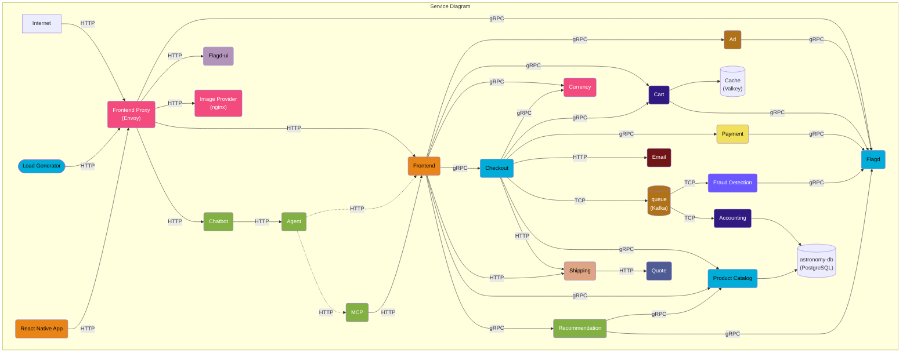
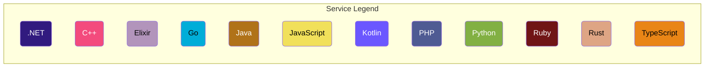
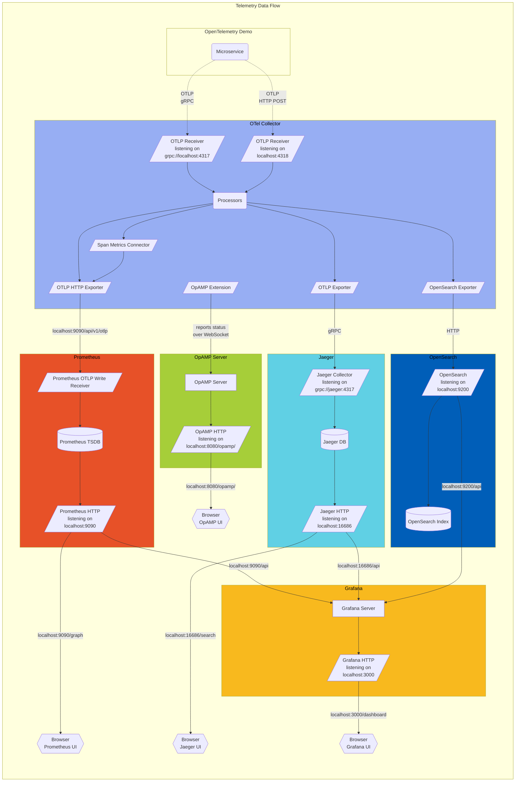

**오픈텔레메트리 데모(OpenTelemetry Demo)** 는 서로 다른 프로그래밍 언어로
작성되어 gRPC와 HTTP를 통해 통신하는 마이크로서비스와, 사용자 트래픽을 가상으로
생성하기 위해 [k6](https://k6.io/)를 사용하는 부하 생성기로 구성된다.

데모 애플리케이션의 [로그](/docs/demo/telemetry-features/log-coverage/),
[메트릭](/docs/demo/telemetry-features/metric-coverage/),
[트레이스](/docs/demo/telemetry-features/trace-coverage/) 계측 현황을 확인하려면
다음 링크를 참고한다.

컬렉터는
[otelcol-config.yml](https://github.com/open-telemetry/opentelemetry-demo/blob/main/src/otel-collector/otelcol-config.yml)에서
구성되며, 여기서 다른 익스포터를 구성할 수 있다.

옵저버빌리티 스택과 함께 실행할 때, 컬렉터는
[OpAMP 익스텐션](https://github.com/open-telemetry/opentelemetry-collector-contrib/tree/main/extension/opampextension)을
통해 데모의 OpAMP 서버에도 연결하여 자신의 상태(health), 버전, 속성, 유효
구성(effective configuration)을 보고한다. OpAMP
UI(<http://localhost:8080/opamp/>)를 열고 컬렉터 인스턴스를 선택하면 보고된
상태를 확인할 수 있다.

**프로토콜 버퍼 정의(Protocol Buffer Definitions)** 는 `/pb/` 디렉터리에서 찾을
수 있다.
