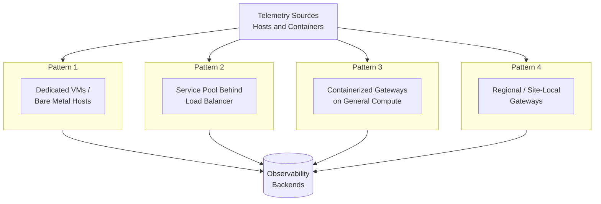
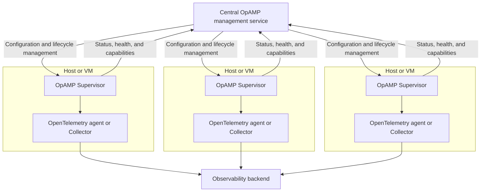
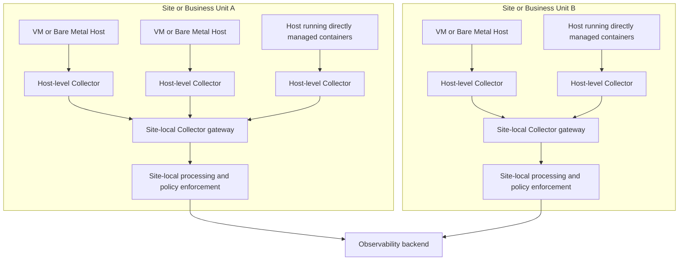

## 요약 {#summary}

이 블루프린트는 전통적인 가상 머신(VM), 베어메탈(bare metal),
온프레미스(on-premises) 환경에서 운영하는 플랫폼 엔지니어링 및 SRE 팀을 위한
전략적 레퍼런스를 제시한다. 여기에는 쿠버네티스(Kubernetes)와 같은
오케스트레이터(orchestrator) 없이 운영체제에서 직접 컨테이너를 실행하는
시나리오도 포함된다.

이 블루프린트는 이질적인 인프라, 레거시 프로세스, 컨테이너화된 워크로드 전반에
걸쳐 일관된 옵저버빌리티를 구축하려 할 때 흔히 발생하는 마찰을 다룬다.

이 블루프린트에 제시된 패턴을 구현함으로써 조직은 다음과 같은 결과를 기대할 수
있다.

- Non-K8s 환경에서 실행되는 애플리케이션과 서비스를 위한 즉시 사용 가능한 고품질
  텔레메트리(직접 관리되는 컨테이너 포함).
- 오픈텔레메트리(OpenTelemetry) 에이전트에 대한 일관된 라이프사이클(lifecycle)
  관리와, SDK 기반 계측을 위한 표준화된 부트스트랩(bootstrap) 및 구성 패턴.
- VM, 베어메탈, 오케스트레이터 없는 컨테이너를 아우르는 혼합 인프라 전반의
  통합된 옵저버빌리티.
- 텔레메트리 시그널 품질, 데이터 보강(enrichment), 라우팅, 내보내기(export)
  파이프라인에 대한 개선된 거버넌스.
- 개발자와 운영자의 수작업 부담과 인지 부하 감소.

## 배경 {#background}

많은 조직이 쿠버네티스와 함께, 또는 쿠버네티스 대신 레거시 인프라, VM, 베어메탈
서버, 런타임에 직접 배포하는 컨테이너를 혼합해서 운영한다. 이러한 환경은
복잡하며, 오케스트레이터가 제공하는 자동화와 표준화가 부족한 경우가 많다. 이런
시나리오에서 일관되고 고품질인 옵저버빌리티를 보장하는 일은 매우 중요하지만,
파편화된 툴링과 수작업 프로세스로 인해 자주 어려움을 겪는다.

[Open Agent Management Protocol(OpAMP)](/docs/specs/opamp/)은 지원되는 범위
내에서 다양한 인프라에 걸쳐 오픈텔레메트리 에이전트를 원격으로 관리, 구성,
모니터링할 수 있는 표준화된 방법을 제공한다. 이 글을 작성하는 시점에 OpAMP
명세(Specification)는 베타(Beta) 단계이므로, 조직은 특정 솔루션을 표준으로
채택하기 전에 구현 성숙도와 운영 지원 수준을 평가해야 한다. OpAMP가 아직
적합하지 않은 곳에서는 공유 라이브러리, 사전 구성된 이미지, 중앙에서 관리하는
구성 아티팩트, 기존 배포 또는 구성 관리 툴링으로도 SDK 및 에이전트 기반 계측에
대한 일관된 라이프사이클 관리를 제공할 수 있다.

## 공통 과제 {#common-challenges}

Non-K8s 환경에서 운영하는 조직은 효과적인 옵저버빌리티를 가로막는 일련의 공통
과제에 직면한다. 내장된 자동화, 표준화, 중앙 집중식 관리가 없으면 이러한 환경은
다양한 인프라와 애플리케이션 전반에 걸쳐 일관되고 고품질인 텔레메트리를 보장하기
어려운 경우가 많다. 이러한 옵저버빌리티 과제 중 다수는 Non-K8s 환경만의 문제가
아니다. 다만 Non-K8s 환경에서는 팀이 롤아웃(rollout) 관리, 서비스 디스커버리,
메타데이터 보강, 중앙 집중식 정책 배포를 위한 내장 플랫폼 메커니즘을 갖추지 못한
경우가 더 많다.

### 1. 텔레메트리 배포 및 관리를 위한 제한적인 자동화 {#1-limited-automation-for-telemetry-deployment-and-management}

VM, 베어메탈, 직접 관리되는 컨테이너에서의 계측 및 에이전트 배포는 대체로
수작업이나 스크립트 기반으로 이루어지며, 지속적인 구성 관리는 규모가 커질수록
어려워진다. 이렇게 분산되고 임기응변적인 접근 방식은 보통 운영자나 개발자가 각
호스트나 워크로드에서 오픈텔레메트리 에이전트를 개별적으로 설치, 구성, 업데이트
하도록 요구한다.

이는 다음과 같은 결과로 이어진다.

- **높은 반복 작업(toil):** 새로운 워크로드나 호스트가 추가될 때마다 오류가
  발생하기 쉬운 구성 작업을 반복해야 한다.
- **느린 롤아웃 및 업데이트 주기:** 계측이나 구성에 대한 업데이트를 전체 플릿에
  전파하기가 느리고 어렵다.
- **운영 리스크:** 롤백, 버전 관리, 상태 모니터링을 전체 자산에 걸쳐 일관되게
  수행하기가 더 어렵다.

이러한 자동화 격차는 과제 2에서 설명하는 파편화의 토대가 되기도 한다. 각
호스트나 워크로드가 수작업으로 구성되면, 팀마다 서로 다른 에이전트, SDK,
익스포터(exporter)를 독립적으로 선택하게 되고, 이를 나중에 조율하기가
어려워진다.

### 2. 파편화된 계측 접근 방식 {#2-fragmented-instrumentation-approaches}

과제 1에서 설명한 자동화 부족을 바탕으로, 표준화된 배포 및 관리 패턴이 없으면
팀들은 호스트 기반 워크로드와 컨테이너화된 워크로드에 서로 다른 오픈텔레메트리
에이전트, SDK, 익스포터를 채택하게 된다.

이는 다음과 같은 결과로 이어진다.

- **일관성 없는 시맨틱 컨벤션(semantic conventions):** 텔레메트리 시그널에
  `service.name`, `host.id`, `host.name`, `container.id`,
  `deployment.environment`와 같은 표준 리소스 속성이 빠져 있어, 시스템 간
  상관관계 분석(correlation)이 어려워진다.
- **서로 다른 계측 동작:** 팀마다 샘플링(sampling), 전파(propagation), 리소스
  감지(resource detection), 내보내기에 대해 서로 다른 기본값을 적용해 텔레메트리
  품질이 고르지 않게 된다.
- **수작업 구성 드리프트(drift):** 호스트 및 컨테이너 기반 에이전트는 수작업
  구성이 필요한 경우가 많아 드리프트가 발생하고 오류 위험이 커진다.

### 3. 사일로화된 데이터 처리 및 내보내기 {#3-siloed-data-processing-and-export}

자동화 격차(과제 1)와 그로 인한 파편화(과제 2)는 데이터 파이프라인 계층에서 더욱
복합적으로 나타난다. 데이터 수집 및 내보내기 파이프라인이 애플리케이션별,
호스트별, 팀별로 구축되는 경우가 많기 때문이다. 중앙 집중식 관리가 없으면 개별
팀이 각 워크로드나 환경에 대해 텔레메트리 에이전트, 익스포터, 데이터 처리 로직을
독립적으로 구성하게 된다.

이는 다음과 같은 결과로 이어진다.

- **중복된 작업:** 팀들이 여러 환경에서 데이터 보강, 필터링, 라우팅 로직을
  중복해서 구현할 수 있다.
- **일관되지 않은 정책 적용:** 편집(redaction), 재시도 동작, 배칭(batching),
  라우팅 정책이 팀마다 다를 수 있다.
- **가시성 부족:** 운영 및 거버넌스 팀이 어떤 텔레메트리가 수집되고 어떻게
  처리되거나 내보내지는지에 대한 통합된 통제권을 갖지 못한다.

## 일반 가이드라인 {#general-guidelines}

위에서 설명한 과제를 해결하려면 조직은 다양한 환경에서 옵저버빌리티 관행을
간소화하도록 설계된 일련의 전략적 가이드라인을 채택해야 한다. 이러한
가이드라인은 계측을 표준화하고, 에이전트 관리를 자동화하며, 일관된 데이터 품질을
보장하기 위한 토대를 제공한다.

### 1. 통제된 커스터마이징을 허용하면서 에이전트 라이프사이클을 중앙에서 관리한다 {#1-centrally-manage-agent-lifecycle-while-allowing-controlled-customization}

**해결하는 과제:** 1, 2

지원되고 운영상 적합한 경우, OpAMP를 사용해 시스템 서비스나 서비스 컨테이너로
실행되는 오픈텔레메트리 에이전트를 중앙에서 관리한다.

OpAMP 명세가 현재 베타 단계이므로, 조직은 특정 솔루션을 표준으로 채택하기 전에
자신의 환경에서 사용 가능한 구현체의 성숙도와 지원 수준을 평가해야 한다. OpAMP가
지원되지 않거나 아직 적합하지 않은 경우, 조직은 구성 관리 도구, 골든
이미지(golden image), 표준화된 배포 아티팩트와 같은 다른 중앙 집중식 관리
메커니즘을 사용해 일관된 에이전트 배포, 구성, 라이프사이클 관리를 유지해야 한다.

어떤 관리 메커니즘을 사용하든, 플랫폼 팀은 기준 에이전트 배포판(distribution),
필수 프로세서(processor)와 익스포터, 보안 설정, 상태 보고(health reporting),
기본 리소스 감지 동작을 소유해야 한다.

동시에 조직은 환경별 또는 워크로드별 커스터마이징을 어떻게 허용할지 명시적으로
정의해야 한다. 실용적인 모델은 **계층화된 구성 방식(layered configuration
approach)** 을 사용하는 것이다.

- 필수 기본값, 보안 통제, 조직 전체 프로세서/익스포터를 위한 **플랫폼 소유
  기준선(platform-owned baseline)** 으로, 일반적으로 **플랫폼 엔지니어링** 팀이
  소유한다.
- 엔드포인트, 테넌시, 배포 환경, 사이트별 메타데이터, 네트워크별 설정과 같은
  차이를 위한 **환경 오버레이(environment overlay)** 로, 일반적으로 **인프라
  또는 환경 운영자**가 소유한다.
- 옵트인(opt-in) 리시버(receiver), 추가 리소스 속성, 안전한 튜닝 파라미터와 같이
  승인된 변형을 위한 **워크로드 오버레이(workload overlay)** 로, 플랫폼이 정의한
  가드레일 안에서 일반적으로 **애플리케이션 팀**이 소유한다.

이는 표준화와 유연성 사이에 명확한 경계를 만들어, 팀이 일회성의 관리되지 않는
배포를 만들지 않고도 승인된 구성 부분을 확장할 수 있게 한다.

이 가이드라인을 구현함으로써 조직은 다음을 기대할 수 있다.

- 모든 환경에서 자동화되고 일관된 텔레메트리 구성.
- 수작업 오류 감소와 새 워크로드 온보딩 간소화.
- 에이전트 구성의 더 빠르고 안전한 업그레이드 및 롤백.
- 중앙 거버넌스를 희생하지 않으면서 로컬 커스터마이징을 위한 통제된 메커니즘.

### 2. 오픈텔레메트리 컬렉터 게이트웨이 계층을 통해 텔레메트리 수집과 처리를 중앙화한다 {#2-centralize-telemetry-collection-and-processing-through-an-opentelemetry-collector-gateway-layer}

**해결하는 과제:** 2, 3

호스트와 직접 관리되는 컨테이너로부터 텔레메트리 데이터를 집계하는 지점으로 하나
이상의 [오픈텔레메트리 컬렉터 게이트웨이](/docs/collector/deploy/gateway/)를
배포한다. 여기서 "중앙화"가 반드시 단일한 글로벌 배포를 의미하지는 않는다. 조직
구조, 네트워크 경계, 격리 요구사항, 트래픽 패턴에 따라 게이트웨이 계층은 리전별,
사이트별, 환경별, 클라우드 계정별 등 다양한 수준에서 구현될 수 있으며, 그 범위
안에서는 여전히 중앙 집중식 정책 적용을 제공한다.

Non-K8s 환경에서는 규모와 운영 모델에 따라 다음을 포함한 여러 패턴으로 이러한
게이트웨이를 배포할 수 있다.

- 전용 게이트웨이 VM 또는 베어메탈 호스트.
- 로드 밸런서(load balancer) 뒤의 서비스 풀.
- 범용 컴퓨트에서 실행되는 컨테이너화된 게이트웨이 서비스.
- 분산 환경을 위한 리전 또는 사이트 로컬 게이트웨이.

아래 다이어그램은 대체 가능한 배포 패턴과 함께 게이트웨이 계층을 보여준다. 각
상자는 게이트웨이 역할을 구현하는 별도의 방법을 나타내며, 조직은 일반적으로 한
가지 패턴을 선택하거나 사이트별로 패턴을 조합한다.

이 가이드라인을 구현함으로써 조직은 다음을 기대할 수 있다.

- 데이터 처리, 보강, 내보내기 파이프라인에 대한 통합된 통제.
- 간소화된 거버넌스와 조직 전체 정책의 더 쉬운 구현.
- 호스트나 애플리케이션에서 외부 옵저버빌리티 백엔드로의 직접 연결 감소로,
  방화벽 및 네트워크 정책 관리 간소화.
- 호스트별 또는 애플리케이션별 내보내기 토폴로지보다 나은 복원력과 확장성.
- 로컬 수집과 중앙 집중식 정책 적용 사이의 명확한 분리.

### 3. 리소스 어트리뷰션(attribution)을 표준화하고 재사용 가능한 계측 빌딩 블록을 배포한다 {#3-standardize-resource-attribution-and-distribute-reusable-instrumentation-building-blocks}

**해결하는 과제:** 2

리소스 어트리뷰션에 대한 조직 전체 텔레메트리 표준을 정의하고, 이를 모든
워크로드에 일관되게 적용하도록 보장한다. 이는 문서화에만 의존해서는 안 되며,
다음과 같은 재사용 가능한 빌딩 블록을 통해 제공되어야 한다.

- 사전 구성된 에이전트 이미지.
- 해당하는 경우, 패키징된 언어 에이전트와 자동 계측 아티팩트.
- 표준화된 오픈텔레메트리 컬렉터 바이너리 또는 배포판.
- SDK 기반 계측을 위한 공유 라이브러리 또는 스타터 패키지.
- 표준 시작 래퍼(startup wrapper) 또는 환경 변수 컨벤션.
- 중앙에서 관리하는 구성 스니펫이나 템플릿.

Non-K8s 환경을 위한 권장 리소스 모델은
[오픈텔레메트리 리소스 시맨틱 컨벤션](/docs/specs/semconv/resource/)에 부합해야
하며, 가능한 한 자동 리소스 감지에 의존해야 한다. 오픈텔레메트리에서 리소스는
호스트, VM, 프로세스, 컨테이너, 서비스 인스턴스 등 텔레메트리를 생성한 엔티티를
식별한다. 실무에서 조직은 지원되는 곳에서 자동으로 감지된 속성을 사용해 다음
리소스 도메인 전반에서 텔레메트리 상관관계 분석이 가능하도록 해야 한다.

- **[호스트](/docs/specs/semconv/resource/host/)**
- **[디바이스](/docs/specs/semconv/resource/device/)**(해당하는 경우)
- **[프로세스](/docs/specs/semconv/resource/process/)**
- **[프로세스 런타임](/docs/specs/semconv/resource/process/#process-runtimes)**
- **[운영체제](/docs/specs/semconv/resource/os/)**
- **[컨테이너](/docs/specs/semconv/resource/container/)**(해당하는 경우)
- **[서비스 식별자](/docs/specs/semconv/resource/#service)**

해당하는 모든 속성을 수작업으로 유지 관리하기보다, 조직은 호스트, 프로세스,
런타임, OS, 컨테이너 메타데이터에 대해 기존 계측과 리소스 감지를 우선적으로
사용하고, 공유 구성이나 부트스트랩 아티팩트를 사용해 이러한 감지가 일관되게
활성화되도록 유지해야 한다.

가장 신중한 표준화가 필요한 영역은 대체로 **서비스 식별자(service identity)**
이다. 조직은 서비스 텔레메트리가 `service.name`과, 관련이 있다면
`service.version`, `service.namespace`, `service.instance.id`,
`deployment.environment`와 같은 속성을 포함한 적절한
[서비스 시맨틱 컨벤션](/docs/specs/semconv/registry/attributes/service/)을
사용하도록 보장해야 한다.

어떤 서비스 속성이 필요한지는 환경 내에서 워크로드가 어떻게 배포되고
식별되는지에 따라 달라진다. 예를 들어 `service.namespace`는 조직이나 플랫폼 경계
전반에서 서비스를 구분하는 데 유용할 수 있고, `service.instance.id`는 동일한
서비스의 복제된 인스턴스를 구분하는 데 필요할 수 있다.

애플리케이션 텔레메트리는 호스트 및 인프라 수준 텔레메트리와의 상관관계 분석을
뒷받침할 수 있을 만큼 충분한 서비스 및 인프라 컨텍스트를 포함해야 하며, 각
리소스 유형에 어떤 식별 속성이 적용되는지는 시맨틱 컨벤션을 기준으로 삼아야
한다.

이 가이드라인을 구현함으로써 조직은 다음을 기대할 수 있다.

- 시스템 전반에서 텔레메트리 데이터의 상관관계 분석과 검색 가능성 향상.
- 인프라 유형과 무관한 더 쉬운 분석과 트러블슈팅.
- 모든 팀이 계측 패턴을 처음부터 다시 만들 필요 없이 확보하는 일관된 메타데이터
  품질.
- 재사용 가능하고 지원되는 빌딩 블록을 통한 더 빠른 도입.

## 구현 {#implementation}

이러한 가이드라인을 실제로 적용하려면 자동화, 표준화된 툴링, 중앙 집중식 관리를
결합해야 한다. 아래의 구현 단계는 조직이 순서대로 계획하고 실행할 수 있는
체크리스트 형태의 작업을 담은 로드맵 항목으로 작성되었다.

### 1. 기준 텔레메트리 표준과 계층화된 구성 모델을 정의한다 {#1-define-a-baseline-telemetry-standard-and-layered-configuration-model}

**뒷받침하는 가이드라인:** 1, 3

조직에 필요한 최소한의 텔레메트리 표준을 정의하고, 텔레메트리 구성의 어느 부분이
중앙에서 소유되고 어느 부분이 로컬에서 커스터마이징 가능한지 문서화한다.
여기에는 해당하는 경우 호스트 또는 서비스 에이전트, 언어 에이전트, SDK 기반
계측, 로컬 수집이나 전달에 사용되는 오픈텔레메트리 컬렉터를 위해 지원되는 구성이
포함된다. OpAMP를 사용하는 경우, 중앙에서 관리되는 에이전트 구성이 동일한 기준선
및 승인된 오버레이를 따르도록 이 모델과 정렬되어야 한다. 이는 규모에 맞는
일관성을 위한 토대이다.

체크리스트:

- 모든 워크로드가 반드시 내보내야 하는 필수 리소스 속성과 시그널 컨벤션을
  정의한다.
- 해당하는 경우 에이전트, 언어 에이전트, SDK, 오픈텔레메트리 컬렉터를 포함해
  지원되는 텔레메트리 컴포넌트의 기준 구성을 정의한다.
- 각 컴포넌트의 역할에 따라 익스포터, 인증, TLS, 상태 보고, 기본 프로세서를
  표준화한다.
- 환경별, 워크로드별 커스터마이징을 위한 허용된 확장 지점을 정의한다.
- 모든 기준선 및 오버레이 구성을 버전 관리해 안전하게 롤아웃하고 롤백할 수 있게
  한다.
- 팀이 무엇을 수정할 수 있고 없는지 알 수 있도록 소유권 경계를 공개한다.

문서:

- [OpAMP 명세](/docs/specs/opamp/)
- [오픈텔레메트리 시맨틱 컨벤션](/docs/specs/semconv/)

### 2. 에이전트를 위한 OpAMP 관리 플레인을 구축한다 {#2-stand-up-an-opamp-management-plane-for-agents}

**뒷받침하는 가이드라인:** 1

지원되는 에이전트에 대한 구성 관리, 상태 보고, 헬스 모니터링, 통제된 롤아웃을
관리하는 중앙 OpAMP 관리 기능을 제공한다. 이 블루프린트는 관리 패턴을 권장할 뿐,
특정 예시 서버 구현을 권장하지 않는다. 조직은 자신의 환경에 적합한 프로덕션
수준의 솔루션을 사용해야 한다.

체크리스트:

- 사용 중인 환경의 배포판이 가진 역량(예: 업스트림 배포판인지 벤더 특화
  배포판인지, OpAMP 클라이언트를 내장하고 있는지,
  [오픈텔레메트리 컬렉터용 OpAMP 수퍼바이저(Supervisor)](https://github.com/open-telemetry/opentelemetry-collector-contrib/tree/main/cmd/opampsupervisor)를
  사용하는지, OpAMP가 컴파일에 포함되어 있는지 별도로 패키징되어 있는지)와
  중앙에서 관리하고자 하는 컴포넌트를 바탕으로, 어떤 에이전트나 오픈텔레메트리
  컬렉터 배포를 OpAMP로 관리할지 결정한다.
- [컬렉터 관리 문서](/docs/collector/management/#opamp)에 따라 적절한 인증,
  인가, 전송 보안을 갖춘 프로덕션 수준의 OpAMP 서버 또는 관리 엔드포인트를
  구축하거나 도입한다.
- [OpAMP 명세](/docs/specs/opamp/)에 정의된 대로, 에이전트나 수퍼바이저가 관리
  서비스에 등록하고 자신의 신원, 기능, 상태, 유효 구성 상태를 보고하도록
  구성한다.
- 개발, 스테이징, 프로덕션, 리전, 환경과 같은 논리적 그룹으로 에이전트를
  조직화해, 구성 변경을 단계적으로 롤아웃할 수 있게 한다.
- 롤아웃 그룹 사이에서 구성 업데이트가 어떻게 승격되는지, 실패한 변경을 어떻게
  감지하고 되돌리는지 정의한다.
- 관리 플레인 상태, 에이전트 연결, 업데이트 상태, 구성 드리프트를 모니터링해
  플릿(fleet)이 통제 아래 있도록 유지한다.

OpAMP는 서로 다른 범위의 기능을 가지고 두 가지 방식으로 오픈텔레메트리 컬렉터와
통합될 수 있다.

- **OpAMP 수퍼바이저(Supervisor)** 사용 — 컬렉터의 라이프사이클을 관리하고 원격
  구성을 적용하는 동시에 상태, 헬스, 기능을 보고하는 별도의 호스트 로컬
  프로세스이다. 이는 가장 강력한 통합 방식이며, OpAMP가 구성 및 라이프사이클
  관리의 주된 메커니즘일 때 적합하다.

- **컬렉터에 내장된 OpAMP 익스텐션(extension)** 사용 — 상태, 헬스, 기능을 관리
  서비스에 보고하지만 원격 구성 전달이나 라이프사이클 관리는 처리하지 않는 경량
  통합이다. 이는 구성과 라이프사이클이 이미 다른 툴링(예: 구성 관리, 골든
  이미지, 패키징된 배포판)으로 처리되고 있고, OpAMP가 주로 에이전트 플릿의 중앙
  집중식 옵저버빌리티를 위해 사용될 때 적합하다.

수퍼바이저 기반 배포에서는 관리 서비스가 호스트 로컬 수퍼바이저와 통신하고,
수퍼바이저가 로컬 에이전트나 컬렉터의 라이프사이클과 구성을 관리한다. 아래
다이어그램은 수퍼바이저 패턴을 보여준다. 익스텐션 전용 패턴도 비슷하지만
수퍼바이저 상자가 없고, 관리 서비스가 상태 보고만을 위해 컬렉터와 직접 통신한다.

문서:

- [OpAMP 명세](/docs/specs/opamp/)
- [OpAMP 시작 가이드](/docs/collector/management/)
- [오픈텔레메트리 컬렉터 구성](/docs/collector/configuration/)

### 3. 표준화된 에이전트와 SDK 부트스트랩 아티팩트를 패키징하고 배포한다 {#3-package-and-deploy-standardized-agents-and-sdk-bootstrap-artifacts}

**뒷받침하는 가이드라인:** 1, 3

구성 관리와 이미지 패키징을 사용해 호스트와 컨테이너화된 워크로드 전반에
지원되는 텔레메트리 컴포넌트를 일관되게 전달한다. SDK 기반 계측이 지원되는
곳에서는
[선언적 구성(declarative configuration)](/docs/specs/otel/configuration/#declarative-configuration)을
우선 사용한다. 지원되지 않는 곳에서는 환경 변수, 시작 옵션, 또는
[SDK별 구성](/docs/languages/sdk-configuration/) 패턴을 표준화해 팀이 최소한의
수작업 설정으로 일관된 기본값을 물려받을 수 있게 한다.

일반적인 패키징 패턴에는 호스트 기반 에이전트를 위한 표준 시스템 서비스 패키지,
컬렉터 또는 에이전트 배포를 위한 사전 구성된 컨테이너 이미지, 스타터 패키지나
시작 래퍼와 같은 공유 SDK 부트스트랩 아티팩트가 포함된다. 예를 들면 다음과 같다.

- 호스트 기반 컬렉터는 중앙에서 관리하는 구성 파일과 환경 파일을 가진 표준
  시스템 서비스로 설치할 수 있다.
- 컨테이너화된 배포는 승인된 컬렉터 바이너리, 익스텐션, 기본 구성을 포함하는
  사전 구성된 이미지를 사용할 수 있다.
- SDK 기반 계측은 조직에서 승인한 기본값을 자동으로 적용하는 공유 시작 래퍼,
  [언어 에이전트](/docs/zero-code/), 스타터 패키지를 통해 배포할 수 있다.

체크리스트:

- 호스트 기반 에이전트를 표준 시스템 서비스로 패키징한다.
- 컨테이너화된 배포를 위한 사전 구성된 이미지나 서비스 컨테이너 정의를 제공한다.
- 지원되는 SDK 언어를 위한 공유 라이브러리, 스타터 패키지, 부트스트랩 래퍼를
  공개한다.
- 지원되는 곳에서는 선언적 SDK 구성을 우선 사용하고, 그렇지 않은 곳에서는 환경
  전반에서 환경 변수, 시작, 구성 파일 컨벤션을 표준화한다.
- 새로운 워크로드가 기본적으로 기준 구성을 물려받는지 검증한다.

문서:

- [오픈텔레메트리 컬렉터 구성](/docs/collector/configuration/)
- [오픈텔레메트리 언어 SDK와 API](/docs/languages/)
- [오픈텔레메트리 제로 코드 계측(zero-code instrumentation)](/docs/zero-code/)
- [자바 제로 코드 계측](/docs/zero-code/java/)
- [자바 에이전트 구성](/docs/zero-code/java/agent/configuration/)

### 4. 오픈텔레메트리 컬렉터 게이트웨이 계층을 배포한다 {#4-deploy-an-opentelemetry-collector-gateway-layer}

**뒷받침하는 가이드라인:** 2

중앙 처리 및 내보내기 계층으로 하나 이상의 오픈텔레메트리 컬렉터 게이트웨이를
배포한다. 전용 VM, 로드 밸런서 뒤의 서비스 풀, 리전 게이트웨이 노드 등 환경에
적합한 토폴로지를 선택한다.

체크리스트:

- 각 환경에 맞는 게이트웨이 배포 토폴로지를 선택한다.
- 로컬 에이전트가 게이트웨이를 어떻게 검색하고 연결하는지 정의한다.
- 배칭, 메모리 보호, 보강, 재시도, 라우팅을 위한 프로세서를 구성한다.
- 규모가 필요로 하는 경우 경량 인제스트(ingest)와 더 무거운 중앙 집중식 처리를
  분리한다.
- 게이트웨이의 고가용성 및 장애 조치(failover) 동작을 정의한다.
- 옵저버빌리티 백엔드로의 엔드투엔드 라우팅을 검증한다.

Non-K8s 환경에서 흔한 패턴은 개별 호스트에서 호스트 수준 컬렉터를 실행하고,
사이트 로컬 또는 리전 로컬 컬렉터 게이트웨이로 텔레메트리를 전달하는 것이다.
해당 게이트웨이 계층은 수평적으로 확장 가능하고 고가용성을 갖춰야 하며, 클라우드
네이티브 스케일링 패턴이나 비클라우드 인프라에서의 동등한 고가용성 구성과 같이
환경에 적합한 로드 밸런싱 및 장애 조치 메커니즘을 사용해야 한다.

문서:

- [오픈텔레메트리 컬렉터 배포 패턴](/docs/collector/deploy/)
- [오픈텔레메트리 컬렉터 구성](/docs/collector/configuration/)

### 5. 리소스 어트리뷰션과 상관관계 분석 표준을 강제한다 {#5-enforce-resource-attribution-and-correlation-standards}

**뒷받침하는 가이드라인:** 1, 3

모든 텔레메트리가 인프라와 애플리케이션 계층 전반의 상관관계 분석에 필요한
메타데이터를 포함하도록 보장한다.

체크리스트:

- 감지하고 상관관계를 분석해야 할 호스트, 프로세스, 런타임, 운영체제, 컨테이너
  리소스를 정의하고, 공유 구성, 부트스트랩 아티팩트, 중앙에서 관리하는 템플릿을
  통해 이에 대한 자동 리소스 감지를 일관되게 활성화한다.
- SDK 구성, 언어 에이전트, 시작 래퍼, 또는 지원되는 자동 리소스 감지 등을 통해,
  애플리케이션 텔레메트리가 필요한 경우 `host.id`나 `host.name`과 같이 상관관계
  분석에 충분한 인프라 컨텍스트를 포함하도록 보장한다.
- 지원되는 모든 곳에서 리소스 감지기(detector)를 활성화하고 검증해 호스트, OS,
  프로세스, 런타임, 컨테이너 메타데이터가 자동으로 일관되게 채워지도록 하고,
  필요한 경우 중앙에서 정의한 속성으로 감지기 출력을 보완한다.
- 광범위한 롤아웃 이전에 호스트와 애플리케이션의 대표적인 텔레메트리를 확인해,
  내보내진 텔레메트리를 정의된 속성 표준에 맞춰 검증한다.
- 배포 파이프라인이나 배포 후 검증 단계에 정합성(conformance) 검사를 추가해,
  새로운 워크로드를 예상되는 속성 집합에 맞춰 검증할 수 있게 한다.

이 블루프린트는 텔레메트리를 일관되게 내보내는 데 필요한 속성 요구사항과
워크로드 수준의 관행에 초점을 맞춘다. 더 상세한 중앙 집중식 강제 및 정규화
패턴은 이 섹션의 범위를 벗어나며 별도로 다룰 수 있다.

문서:

- [오픈텔레메트리 시맨틱 컨벤션](/docs/specs/semconv/)
- [오픈텔레메트리 리소스 시맨틱 컨벤션](/docs/specs/semconv/resource/)

### 6. 거버넌스, 정책 적용, 변경 관리를 중앙화한다 {#6-centralize-governance-policy-enforcement-and-change-management}

**뒷받침하는 가이드라인:** 2, 3

컬렉터 게이트웨이 계층과 중앙에서 소유하는 구성을 사용해, 텔레메트리 처리,
라우팅, 내보내기에 대한 조직 전체 규칙을 강제한다.

체크리스트:

- 승인된 익스포터와 백엔드 목적지를 정의한다.
- 편집, 필터링, 보강, 라우팅 정책을 중앙화한다.
- 표준 재시도, 배칭, 샘플링 정책을 정의한다.
- 기본값과 다른 동작이 필요한 워크로드를 위한 예외 절차를 수립한다.
- 텔레메트리 품질과 정책 준수 여부를 정기적으로 검토한다.

문서:

- [오픈텔레메트리 컬렉터 구성](/docs/collector/configuration/)
- [오픈텔레메트리 컬렉터 게이트웨이 배포](/docs/collector/deploy/gateway/)

## 레퍼런스 아키텍처 {#reference-architectures}

이 블루프린트에 설명된 패턴은 다음 최종 사용자에 의해 성공적으로 구현되었다.

_곧 공개될 예정!_

이 블루프린트에 대한 아키텍처를 구현한 경험이 있는가? 경험담이나 관련 글의
링크를 [최종 사용자 SIG](https://github.com/open-telemetry/sig-end-user/issues)
GitHub 저장소에 이슈를 등록해 공유해 준다.
