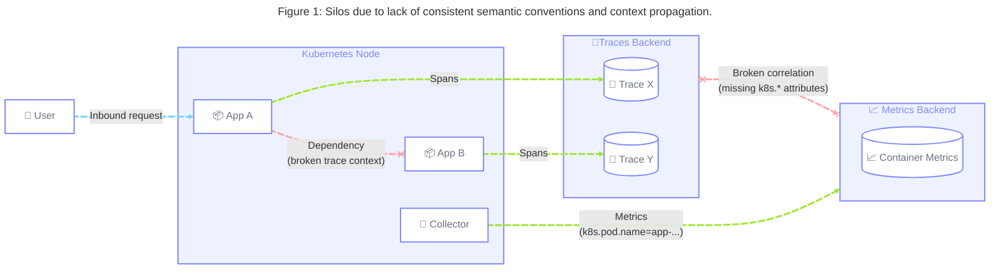
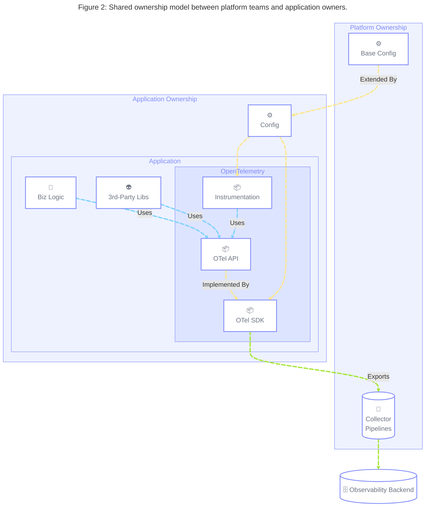
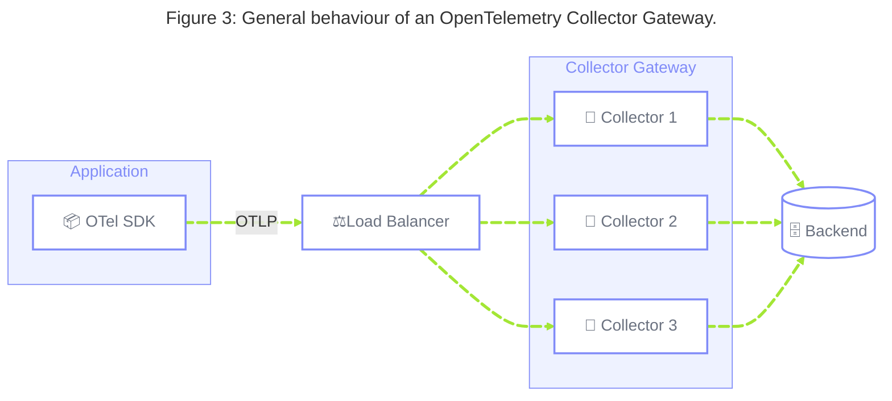
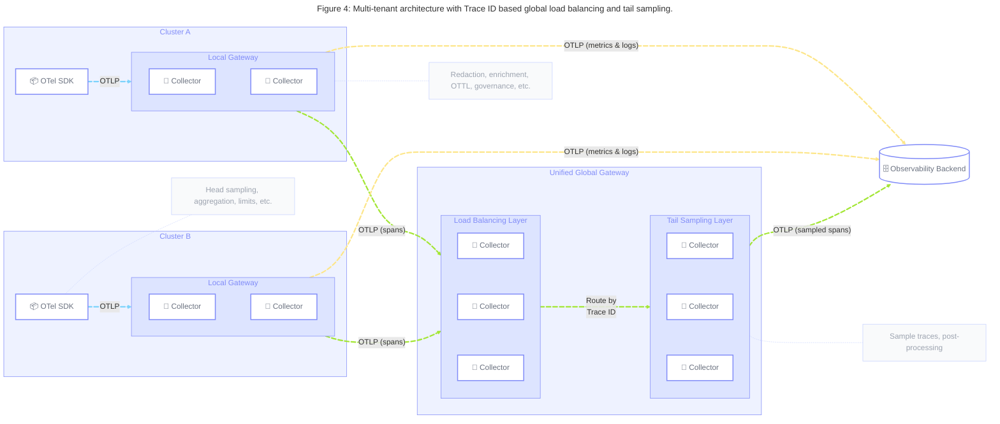

## 요약 {#summary}

이 블루프린트는 엔지니어링 팀 전반에 걸쳐 오픈텔레메트리(OpenTelemetry) 툴링과
표준의 도입을 쉽게 하기 위해 플랫폼 엔지니어링(Platform Engineering) 관행을
따르고자 하는 조직을 위한 전략적 가이드를 제공한다. 여기에는 "서비스형(as a
service)"으로 소비되도록 설계된 셀프서비스 툴링과 짝을 이루는 중앙 관리형
텔레메트리 플랫폼을 제공하기 위해 SDK, 계측 라이브러리, 구성 패턴, 컬렉터
아키텍처를 사용하는 것이 포함된다.

이 블루프린트는 클라우드 및 쿠버네티스(Kubernetes) 환경에서 운영하며, 높은
자율성을 가진 제품 팀이 소유한 워크로드 전반에 걸쳐 일관되고 확장 가능하며
거버넌스가 갖춰진 텔레메트리 플랫폼을 제공하고자 하는 조직을 대상으로 하며,
다음과 같은 결과를 목표로 한다.

- 일관된 SDK 및 계측 구성으로, 모든 워크로드에 걸쳐 조직 고유의 표준 도입을
  촉진해 가치 실현까지 걸리는 시간을 단축하고 제품 팀의 인지 부하를 줄인다.
- 클라이언트 측부터 인프라까지 시그널, 애플리케이션, 도메인 간 텔레메트리
  상관관계 분석(correlation)을 가능하게 하는 응집력 있는 시맨틱 컨벤션(semantic
  conventions)으로, 수동 또는 자동 분석에 활용할 수 있는 고품질 텔레메트리를
  제공한다.
- 컬렉터 구성 난립 해소로, 텔레메트리 파이프라인을 통합해 운영상 반복 작업을
  줄인다.
- 단일 장애점(single point of failure)이 없는, 모든 텔레메트리 시그널을 위한
  복원력 있고 확장 가능하며 신뢰할 수 있는 인제스트(ingest) 파이프라인.
- 텔레메트리 처리에 필요한 스토리지, 네트워크 전송, 컴퓨트 요구사항을 최소화해
  운영 비용과 탄소 배출을 줄이는 중앙 집중식 텔레메트리 거버넌스와 데이터
  최적화.
- 애플리케이션 계측이나 수집 인프라를 거의 변경하지 않고도 데이터
  마이그레이션이나 멀티 벤더 전략을 가능하게 함으로써, 근간이 되는 옵저버빌리티
  백엔드의 변화로부터 제품 팀을 보호하는 미래 지향적인 텔레메트리 파이프라인.

## 배경 {#background}

조직이 클라우드 네이티브 표준과 현대적인 소프트웨어 제공 관행의 도입 속도를
높이면서, 팀이나 사업부가 높은 자율성을 가지고 운영하며 시스템 설계부터 프로덕션
운영까지 소프트웨어 개발 생명주기(Software Development Lifecycle, SDLC) 전체를
책임지는 연합형(federated) 모델을 채택하는 경우가 많아지고 있다.

이 "you build, you run it"(만든 사람이 직접 운영한다는) 모델은 제품 제공을
강화하도록 설계되었지만, 의도치 않게 오픈텔레메트리와 현대적인 옵저버빌리티
툴링의 이점을 제대로 누리지 못하는 파편화된 서비스 관리 관행과 어수선한
옵저버빌리티 환경을 만들어낼 수 있다. 제품 팀은 텔레메트리 계측과 같은 비기능
요구사항(Non-Functional Requirements, NFR)보다 기능 제공을 우선시하며, 이러한
작업을 제공 목표에 대한 부담으로 여긴다.

이를 해결하기 위해 조직은 인지 부하를 줄이고 복잡성을 추상화하는 클라우드
네이티브 플랫폼 엔지니어링 모델을 널리 도입하고 있다. 옵저버빌리티를 큐레이션된
내부 [플랫폼 제품][1]으로 다룸으로써, 조직은 최소한의 마찰로 고품질의 맥락화된
옵저버빌리티를 보장하는 포장된 길, 즉 골든 패스(golden path)를 제공하는 동시에,
팀이 기본으로 제공되는 텔레메트리로는 담아낼 수 없는 도메인 특화 개념을 계측하는
데 집중할 수 있게 한다.

## 공통 과제 {#common-challenges}

이러한 연합형 분산 환경에서 운영하는 조직은 효과적인 옵저버빌리티와 클라우드
네이티브 성숙도를 가로막는 뚜렷한 일련의 과제에 직면한다.

### 1. 일관되지 않은 구성과 조직 표준의 낮은 도입률 {#challenge-1}

제품 팀이 자율적으로 운영하는 환경에서는, 공유된 컴퓨트 계층 위에서 운영되면서도
개별 애플리케이션과 서비스를 옵저버빌리티를 위해 구성하는 서로 다른 방식이
공존할 수 있다. 여기에는 애플리케이션을 위한 오픈텔레메트리 SDK 설정, 계측
패키지와 라이브러리 구성, 또는 의존성과의 사이에서 옵저버빌리티 컨텍스트를
어떻게 전파할지 결정하는 것이 포함된다.

조직은 모든 엔지니어가 따르기를 바라는 문서화된 엔지니어링 표준을 갖추고 있을 수
있지만, 종종 이러한 표준을 각 개별 팀이 구성 및 코드 수준 변경을 포함해
수작업으로 구현하는 데 의존한다. 이는 소프트웨어 설계 프로세스의 일부가 아니라
나중에 생각하는 일로 취급되는 경우가 많으며, 전체 분산 시스템을 전체적으로
고려하지 않고 특정 애플리케이션에만 초점을 맞추게 된다.



이는 다음과 같은 결과로 이어진다.

- **일관되지 않은 [시맨틱 컨벤션][2]:** 텔레메트리에 `service.version`,
  `k8s.cluster.name`, `example.cost.center`와 같은 공통 [리소스][3] 속성이 없어,
  서로 다른 시그널, 애플리케이션, 시스템 계층 전반의 상관관계 분석이 깨지고,
  자동 분석을 위한 옵저버빌리티 데이터의 유용성이 제한된다.
- **컨텍스트 사일로:** 모든 SDK에 [컨텍스트 전파][4](예: W3C Trace Context)가
  일관되게 내장되어 있지 않으면, 서비스 경계에서 분산 트레이스가 끊어져 백엔드
  성능 저하를 고객 대면 비즈니스 영향과 연결 짓는 것이 불가능해진다.
- **SDK 버전 파편화**: 프로덕션에서 서로 크게 다른 버전의 오픈텔레메트리 SDK가
  실행되어, 유지 관리와 보안 문제를 유발한다.
- **높은 인지 부하:** 개발자가 새로운 서비스마다 SDK와 계측 패키지를 수작업으로
  구성해야 하므로, 반복 작업과 잘못된 구성의 위험이 커진다.
- **낮아진 속도:** 텔레메트리 계측과 관련된 엔지니어링 표준의 변경이나, 데이터나
  프로토콜 마이그레이션과 같은 근간 옵저버빌리티 백엔드의 변경은 마찰을
  일으키며, 기술 도입이 결국 수작업 구현에 의해 지연되어 조직 전체의 속도를
  떨어뜨린다.

### 2. 클러스터 전반에 걸친 컬렉터 구성 난립 {#challenge-2}

오픈텔레메트리 도입이 확장되고 조직이 수십에서 수백 개의 쿠버네티스 클러스터에
걸쳐 배포하면서, 이러한 환경 전반의 개별 오픈텔레메트리 컬렉터 구성을 수작업으로
관리하는 일은 유지 관리 부담을 만든다. 이는 서로 다른 컬렉터 배포를 서로 다른
팀이 처리하는 조직에서 특히 어려운 문제다.

이는 다음과 같은 결과로 이어진다.

- **구성 드리프트(drift):** 클러스터마다 파싱 규칙, 필터링 로직, 엔드포인트
  구성이 달라져 예측할 수 없는 텔레메트리 동작이 발생한다.
- **관심사 분리 부족:** 컬렉터의 서로 다른 계층에서 수행되는 서로 다른 유형의
  텔레메트리 처리(예: 어디서 변환할지, 어디서 샘플링할지) 사이에 명확한 구분이
  없어 데이터가 일관되지 않거나 불완전해질 수 있다.
- **수작업 부담:** 플랫폼 팀이 확장 가능한 솔루션을 구축하는 대신 반복적인 구성
  작업과 수작업 업데이트에 과도한 시간을 쓰게 된다.
- **신뢰할 수 없는 롤아웃(rollout):** 버전 관리되고 감사 가능한 배포가 없으면,
  전체 플릿(fleet)에 걸쳐 수정 사항이나 새로운 구성을 적용하는 일이 매우
  위험하고 오류가 발생하기 쉬워진다.

### 3. 옵저버빌리티 데이터 요구사항에 최적화되지 않은 데이터 파이프라인 {#challenge-3}

일부 레거시 계측 모델에서는 애플리케이션이나 계측 에이전트가 텔레메트리를
텔레메트리 백엔드로 직접 내보내는 경우가 많다. 이 모델에는 애플리케이션과 백엔드
사이에서 텔레메트리를 처리하고 변환할 방법이 없어 데이터 주권(data
sovereignty)이 약화된다. 백엔드가 서드파티 벤더이거나 퍼블릭 트래픽 또는 인증이
필요한 엔드포인트인 경우 추가적인 복잡성이 발생할 수도 있다. 수천 개의
애플리케이션에 걸쳐 자격 증명을 관리하는 일은 어려울 수 있으며, 단일
익스포터(exporter)와 퍼블릭 엔드포인트 사이의 간헐적인 네트워크 연결 문제는
서비스 중단을 일으킬 수 있다.

반대로 데이터 파이프라인이 중앙화된 환경에서는, 텔레메트리 데이터에 대한 데이터
요구사항이 다른 유형의 데이터에 대한 요구사항과 혼재되는 경우가 많다. 이는
컨텍스트를 인식하는 변환이나 저지연 처리보다는 완전성(예: 감사 로깅, 재무 데이터
보고)에 최적화된 솔루션으로 이어질 수 있다. 이는 안정적인 운영을 유지하는 데
필요한, 데이터 발생과 실행 가능한 인사이트 사이의 시간을 늘린다.

이는 다음과 같은 결과로 이어진다.

- **단일 장애점:** 수백 개의 개별 애플리케이션에서 인터넷으로의 직접적인
  아웃바운드 트래픽은 조직에서 중앙 네트워크 거버넌스와 로드 밸런싱된 내보내기를
  앗아간다.
- **지연 시간과 운영 가치:** 결국 오래된 옵저버빌리티 데이터는 옵저버빌리티
  데이터가 아예 없는 것이나 다름없다. 지나치게 복잡한 로깅 파이프라인은 상당한
  지연을 유발해, 주요 장애 상황에서 실시간 운영 경보를 무용지물로 만들 수 있다.
- **중앙 통제 부족:** 구성이 개별 애플리케이션에 깊숙이 내장되어 있으면, 플랫폼
  팀이 데이터를 손쉽게 재라우팅하거나, 벤더를 변경하거나, 전역 네트워크 정책을
  적용하기 어렵다.

> [!NOTE] 도움 요청
>
> 이 블루프린트의 범위는 저지연 및 효율적인 리소스 사용에 최적화된 파이프라인을
> 제공하려는 플랫폼 팀이 직면하는 공통 과제로 정의된다. 감사 로깅이나 비즈니스
> 보고가 필요한 시나리오처럼, 완전성이나 내구성 보장의 균형을 맞추는 일이 중요한
> 경우도 있다. 이러한 과제는 이 블루프린트의 범위를 벗어나며 별도의
> 블루프린트에서 다룰 수 있다. 기여에 관심이 있다면 [가이던스][5]를 참고한다.

### 4. 텔레메트리 거버넌스 부족과 낮은 ROI {#challenge-4}

중앙 집중식 거버넌스와 옵저버빌리티 표준의 측정 가능한 도입이 없으면, 자율적인
팀이 방대한 양의 저가치 데이터를 생성해 신호 대 잡음비(signal-to-noise ratio)를
떨어뜨릴 수 있다. 오픈텔레메트리 시그널이 본래 의도한 목적으로 사용되지 않는
경우가 많아, 결국 플랫폼 팀이 이를 유지 관리하기가 더 어려워진다 (예: 특정
서비스의 요청 수를 계산하기 위해 며칠에서 몇 주 분량의 개별 로그에 대해 빠르고
정확한 쿼리를 보장해야 하는 경우). 트래픽이 늘고 텔레메트리 양이 증가하면서,
옵저버빌리티를 담당하는 팀은 자신의 영역 전반에서 데이터 품질을 보장할 확장
가능한 방법을 갖지 못하게 된다.

이는 다음과 같은 결과로 이어진다.

- **귀속되지 않는 데이터 품질 문제**: 일관된 시맨틱 컨벤션이 강제되지 않아,
  플랫폼 팀이 텔레메트리 지출이나 데이터 품질을 특정 비즈니스 유닛이나
  엔지니어링 팀과 연관 지을 수 없다.
- **비효율적인 데이터 유형:** 원래 의도한 용도로 사용되지 않는 원시 로그나 다른
  시그널에 대해 조직이 막대한 저장 및 인덱싱 비용을 부담하게 되며, 옵저버빌리티
  데이터에서 얻는 인사이트의 전반적인 품질은 낮아진다.
- **불필요한 비용**: 시스템을 안정적으로 운영하는 데 필요한 인사이트를 항상
  개선하지는 않는 데이터로 인해 발생하는 데이터 저장, 네트워크 이그레스, 특정
  백엔드로의 인제스트 관련 비용 증가.
- **탄소 배출**: 저가치 데이터의 처리는 그린 소프트웨어 목표 달성에 해가 될 수
  있으며, 여기에는 옵저버빌리티 데이터를 빠르게 조회하는 데 필요한 장치(예:
  SSD)에 내재된 탄소로 인한 스코프 3 배출도 포함된다.
- **높은 인지 부하**: 대용량 데이터는 불필요한 비용을 초래할 뿐만 아니라
  노이즈를 늘려, 사용자와 에이전트가 관련 텔레메트리를 찾기 위해 저품질 데이터를
  걸러내야 하는 부담을 준다.

> [!NOTE] 도움 요청
>
> 멀티테넌트 환경은 엄격한 컴플라이언스 요구사항(GDPR, HIPAA, PCI)과 파이프라인
> 계층 사이의 인증 및 암호화 같은 보안 문제를 자주 다뤄야 한다. 이러한 과제는 이
> 블루프린트의 범위를 벗어나며 별도의 블루프린트에서 다룰 수 있다. 기여에 관심이
> 있다면 [가이던스][5]를 참고한다.

### 5. SDK와 데이터 파이프라인의 낮은 옵저버빌리티 및 운영 효율성 {#challenge-5}

프로덕션에서 오픈텔레메트리 SDK와 컬렉터를 운영하는 데 따르는 과제 중 하나는,
텔레메트리 데이터의 큐잉(queuing), 재시도, 배칭(batching)에 적용되는 기본 구성이
특정 환경에 최적이 아닌지, 그리고 그것이 언제인지를 파악하는 것이다.
오픈텔레메트리의 합리적인 기본값은 리소스 사용을 더 가볍게 하려는 접근이나 더
높은 신뢰성 보장 어느 쪽에도 적합하지 않을 수 있다. 이는 사용 중인 아키텍처
패턴에 따라 달라질 수 있는데, 예를 들어 로컬 클러스터 엔드포인트로 내보내는
경우는 퍼블릭 인터넷 엔드포인트보다 더 적은 버퍼링을 필요로 할 수 있다.

이는 다음과 같은 결과로 이어진다.

- **조용한 데이터 손실과 내보내기 실패:** 백엔드나 컬렉터로의 내보내기가
  실패하면서 결국 데이터가 유실되지만, 이러한 오류가 관측되거나 경보로 이어지지
  않는다.
- **불필요한 리소스 사용:** 운영자가 SDK와 컬렉터의 리소스를 과잉
  프로비저닝(overprovision)해 리소스 사용량이 늘고, 성능 오버헤드와 비용에
  영향을 줄 수 있다.

## 일반 가이드라인 {#general-guidelines}

### 1. SDK와 계측 패키지를 위한 기본, 확장 가능한 구성을 중앙화한다 {#guideline-1}

**해결하는 과제**: [1](#challenge-1), [4](#challenge-4) | **구현 작업**:
[1](#action-1), [2](#action-2)

옵저버빌리티 툴링을 담당하는 팀이 [SDK][6]와 [계측 라이브러리][7]에 대한
기본적인 즉시 사용 가능한 구성을 제공하기 위한 일련의 리소스를 유지 관리할 것을
권장한다([작업 1](#action-1) 참고). 목표는 쿠버네티스 클러스터에 배포된
애플리케이션이 애플리케이션 소유자로부터 최소한의 입력만으로(예를 들어 많아야
어노테이션 추가나 공유 내부 라이브러리 호출 정도로) 기본 수준의 텔레메트리를
내보내고 의존성과의 사이에서 컨텍스트를 전파하게 하는 것이다.

플랫폼 팀은 이 기본 구성이 확장 가능한 상태를 유지하도록 보장해, 애플리케이션
소유자가 자신의 애플리케이션에 특화된 요구사항을 충족하기 위해 SDK의 여러 측면
(예: 버퍼 크기, 익스포터 재시도)과 계측 라이브러리를 제어할 수 있게 해야 한다.

이 가이드라인을 구현함으로써 조직은 다음을 기대할 수 있다.

- **응집력 있는 조직 표준:** 특정 조직 표준(예: 리소스 속성, 익스포터 엔드포인트
  등)이 전체 스택에 걸쳐 자동으로 적용된다.
- **일관된 컨텍스트 전파:** 호환되는 전파자(propagator) 구성을 사용해 서비스
  간에 Trace Context가 전파된다.
- **낮아진 인지 부하:** 애플리케이션 소유자가 오픈텔레메트리 SDK 설정과 관련된
  것과 같은 저수준 구성으로부터 스스로를 추상화할 수 있다.
- **더 쉬운 유지 관리:** 내부 툴링의 버전 업데이트만으로 새로운 표준을 롤아웃할
  수 있어, 옵저버빌리티의 엔지니어링 표준과 모범 사례를 도입하는 데 드는 노력이
  최소화된다.

### 2. 텔레메트리 생산에 대한 공동 소유권을 확립한다 {#guideline-2}

**해결하는 과제**: [4](#challenge-4), [5](#challenge-5) | **구현 작업**:
[1](#action-1), [2](#action-2), [5](#action-5)

거버넌스와 자율성 사이의 균형을 맞추기 위해, 이 블루프린트에서 설명하는 환경에서
운영하는 플랫폼 팀은 계측에 대해 "왼쪽으로 이동(shift left)"하는 것을 목표로
삼아, 애플리케이션 소유자가 자신의 애플리케이션이 내보내는 텔레메트리에 대한
완전한 통제와 소유권을 갖도록 해야 한다. [가이드라인 1](#guideline-1)에서 언급한
기본 구성은 클러스터, 배포, 파드 같은 기술적 속성과 팀, 비즈니스 도메인 같은
조직 정보를 포함해 데이터의 출처(provenance)가 보장되도록 해야 하며, 이를 통해
텔레메트리의 출처와 소유 팀을 쉽게 식별할 수 있게 하는 것을 목표로 한다.

오픈텔레메트리의 [클라이언트 설계 원칙][8]은 기본적으로 no-op(아무 동작도 하지
않는) 구현체인 API와, 등록되었을 때 해당 API에 대한 구현을 제공하는 SDK 사이에
명확한 분리를 확립한다. 이는 책임의 명확한 분리를 제공하며, 애플리케이션
소유자가 오픈텔레메트리 API에만 의존하면서, 일반적인 방식으로는 담아낼 수 없는
도메인 특화 컨텍스트(예: 비즈니스 트랜잭션, 사용자 ID)로 텔레메트리를 보강하는
데 노력을 집중하고, 제공된 기본 구성에 의존해 즉시 사용 가능한 텔레메트리를
생산할 수 있게 한다.



이 모델은 구현 세부 사항을 추상화하는 오픈텔레메트리의 API 설계에 의존한다.
단순히 구현 세부 사항을 숨기는 것보다 더 큰 가치를 제공하지 않는 한, 서로 다른
시그널 API를 직접 사용하고 그 위에 추가적인 추상화를 만드는 것은 피하는 것을
권장한다. 필요한 경우 [Metric View][9]나 [Span Processor][10]와 같은 SDK 기능을
사용해 애플리케이션 수준에서 텔레메트리를 변환할 수 있다
([가이드라인 4](#guideline-4) 참고).

> [!NOTE] 도움 요청
>
> [Weaver][11]는 팀이 조직 고유의 시맨틱 컨벤션 레지스트리를 관리하고, 이에 대한
> 준수 여부를 측정하고 검증해 계측 품질을 설계 단계에서부터 보장하도록 도와줄 수
> 있다. Weaver에 대해 자세히 알아보려면 [이 블로그 글][12]을 참고한다. 시맨틱
> 컨벤션 거버넌스는 이 블루프린트의 범위를 벗어나며 향후 블루프린트에서 다룰 수
> 있다. 기여에 관심이 있다면 [가이던스][5]를 참고한다.

궁극적으로 애플리케이션 소유자는 자신의 애플리케이션이 내보내는 텔레메트리
데이터(수동으로 계측되었든 자동으로 계측되었든)의 소유자로 남아 있어야 하며, 그
품질과 복원력에 대한 책임을 져야 한다. 여기에는 이를 지원하는 언어에서 플랫폼
팀이 자동으로 구성한 [SDK 텔레메트리][13]를 모니터링하고 이에 대해 경보를
설정하는 것, 그리고 자신의 텔레메트리 양에 따라 필요에 맞게 구성을 최적화하는
것이 포함된다. 여기에는 버퍼 크기, 재시도 큐, 카디널리티(cardinality) 제한,
타임아웃을 변경하기 위해 `BatchSpanProcessor`나 `PeriodicMetricReader`와 같은
SDK 컴포넌트를 튜닝하는 작업이 포함된다.

이 가이드라인을 구현함으로써 조직은 다음을 기대할 수 있다.

- **비즈니스 성과와의 상관관계 분석:** 애플리케이션이 내보내는 텔레메트리에
  사용자 경험을 기술적 컴포넌트 및 인프라와 연관 지을 수 있는 필요한 도메인 및
  비즈니스 로직 컨텍스트가 포함된다.
- **명확한 소유권과 책임:** 데이터의 출처가 보장되어, 팀이 텔레메트리 품질을
  측정하고 표준이 규모에 맞게 도입되도록 보장할 수 있다.
- **개선된 텔레메트리 시그널 활용:** 애플리케이션 소유자가 조직 표준의 안내를
  받아 오픈텔레메트리 시그널에 익숙해질수록, 오픈텔레메트리 API를 최적으로
  활용하는 능력이 향상된다.
- **신뢰할 수 있는 텔레메트리 생산:** 내부 SDK 메트릭을 모니터링하면
  애플리케이션이나 플랫폼 소유자가 텔레메트리 데이터의 큐잉, 재시도, 배칭과
  관련된 측면을 최적화하는 데 필요한 정보를 얻을 수 있다.

### 3. 중앙에서 관리되는 컬렉터 게이트웨이 집합을 유지한다 {#guideline-3}

**해결하는 과제**: [2](#challenge-2), [3](#challenge-3), [4](#challenge-4) |
**구현 작업**: [1](#action-1), [3](#action-3), [5](#action-5)

이러한 유형의 쿠버네티스 환경에서 텔레메트리는 오픈텔레메트리 [컬렉터
게이트웨이][14]로 배포된 중앙 집중식 계층으로 자동 인제스트되는 것을 권장한다.
[가이드라인 1](#guideline-1)의 일부로 제공되는 기본 구성은 OTLP를 사용해
텔레메트리가 이 계층으로 내보내지도록 보장해야 한다.



멀티테넌트 환경에서는 서로 다른 시나리오를 수용하기 위해 여러 컬렉터
게이트웨이를 체인으로 연결해야 할 수도 있다. 예를 들어 클러스터별 로컬
게이트웨이와 테일 샘플링(tail-sampling)을 위한 글로벌 게이트웨이를 함께 사용하는
멀티 클러스터 구성(가이드라인 4 참고), 또는 강하게 연합된 환경에서 독립적인 팀이
관리하는 네임스페이스 범위의 게이트웨이가 클러스터 전체 게이트웨이로 피드하는
구성이 있을 수 있다([가이드라인 4](#guideline-4) 참고).

이상적으로는 기본 SDK 구성이 애플리케이션 환경에서 사용 가능한 정보(예: 지역
기반 트래픽 라우팅, 환경 이름에 따라 조건부로 서버 주소를 변경하는 등)에 따라
가장 최적인 컬렉터 엔드포인트와 필요한 자격 증명을 자동으로 선택해야 한다.

마지막으로, 조직별 조건에 따라 서로 다른 오픈텔레메트리 시그널에 서로 다른
비기능 요구사항이 부여될 수 있다. 예를 들어 안정적인 텔레메트리 양과 중요한
경보에서의 사용으로 인해, 메트릭에는 스팬(span)보다 더 높은 신뢰성 요구사항이
부여되어 스팬 쪽의 데이터를 먼저 드롭하도록 우선시될 수 있다. 이러한 조건을
수용하기 위해 플랫폼 팀은 다음을 포함한 다양한 옵션을 고려할 수 있다.

- **시그널별 격리된 게이트웨이:** 로그, 메트릭, 스팬을 위한 별도의 게이트웨이를
  배포한다. 격리된 배포는 시그널별 컴퓨트 리소스 할당과 용량 계획을
  단순화하지만, 공유 프로세서 구성을 게이트웨이 전반에 중복해서 관리해야 한다.
  이는 Kapitan, Kustomize 같은 외부 템플릿 도구를 통해, 또는 서로를
  오버라이드하는 여러 구성 [위치][61]를 사용해 관리할 수 있다. 다만 유지 관리
  부담이 늘어날 수 있다.
- **단일 게이트웨이의 여러 메모리 제한기:** 시그널별로 서로 다른 임계값을 가진
  별도의 [memory_limiter][15] 구성을 정의한다. 이는 `memory_limiter` 앞단의 OTLP
  리시버가, 텔레메트리가 거부될 때 OTLP 클라이언트(예: SDK나 다른 컬렉터)에
  재시도 가능한 오류 코드를 반환해 필요에 따라 백프레셔(backpressure) 를
  적용하는 것에 의존한다. 우선순위가 낮은 파이프라인은 더 낮은 메모리 제한기
  임계값으로 구성해 백프레셔를 더 일찍 적용하고, 우선순위가 높은 파이프라인을
  위한 메모리 여유 공간을 남겨둘 수 있다.

플랫폼 엔지니어는 [내부 컬렉터 텔레메트리][16]를 활용해 자신의 파이프라인이
인제스트, 처리, 내보내는 데이터의 신뢰성을 보장하고, 이에 맞춰 구성을 최적화해야
한다. 여기에는 `memory_limiter`나 `sending_queue`, `retry_on_failure`와 같은
OTLP 옵션 같은 컴포넌트를 구성하는 작업이 포함된다. 이러한 메트릭은 컬렉터
게이트웨이의 기본 CPU 기반 오토스케일링 대신, 갑작스러운 텔레메트리 급증을
처리하기 위해 파이프라인 큐 깊이나 메모리 사용량을 기준으로 플릿을 스케일링하는
데 사용해야 한다.

이 가이드라인을 구현함으로써 조직은 다음을 기대할 수 있다.

- **옵저버빌리티 데이터 요구사항에 최적화된 파이프라인:** OTLP 익스포터와 리시버
  구성을, 로드 밸런싱되고 신뢰할 수 있는 컬렉터 파이프라인과 결합함으로써 팀은
  시그널별로 신뢰성 요구사항을 충족할 수 있다.
- **효율적인 컴퓨트 리소스 사용:** 수평적으로 확장된 중앙 집중식 게이트웨이는,
  이질적인 멀티테넌트 환경에서 노드별 DaemonSet이나 파드별 사이드카(sidecar)
  보다 컴퓨트 리소스를 더 효율적으로 사용한다. DaemonSet은 변동하는 노드
  크기(예: 하나의 노드가 4개 또는 40개의 애플리케이션 파드를 서비스할 수 있음)와
  시간에 따라 변동하는 파드별 텔레메트리 양을 처리하기 위해 일반적으로 과잉
  프로비저닝해야 한다. 팀이 더 작은 노드에 워크로드를 스케줄링하는 데 어려움을
  겪는 경우가 많으므로, 노드별 사용 공간을 작게 유지하는 것이 중요하다. 중앙
  게이트웨이 계층은 독립적으로 확장되며, 전체 텔레메트리 양에 맞춰 크기가
  조정된다.
- **통합된 컬렉터 구성:** [작업 3](#action-3)에서 설명한 것처럼, 이 모델은 여러
  계층에 걸쳐 컬렉터 구성을 통합된 형태로 배포할 수 있게 해, 유지 관리 부담을
  최소화하고 변경 실패의 위험을 줄인다.

### 4. 서로 다른 계층에서 텔레메트리를 효율적으로 집계, 처리, 샘플링한다 {#guideline-4}

**해결하는 과제**: [3](#challenge-3), [4](#challenge-4) | **구현 작업**:
[2](#action-2), [4](#action-4)

애플리케이션 수준에서 오픈텔레메트리 클라이언트 설계는 계측 API와 그 SDK
구현체를 분리한다. 이를 통해 계측 작성자(애플리케이션이나 라이브러리 소유자
포함)는 이러한 것들이 메모리에서 어떻게 집계되고, 처리되고, 최종적으로
내보내질지 정의할 필요 없이 API를 사용해 [측정값을 기록][17]하거나, [스팬을
생성][18]하거나, [로그 레코드를 내보낼][19] 수 있다. 이러한 결정은 SDK 설정의
일부로 [meter][20], [tracer][21], [logger][22] provider가 생성되는 시점으로 미룰
수 있다. 이러한 측면의 구성은 공유되어야 하며, 플랫폼 팀이 기본 계층의 구성을
제공하고 애플리케이션 소유자가 자신의 특정 사용 사례에 맞게 그 구성을 확장하는
형태여야 한다.

분산 시스템 수준에서는 가장 가치 있는 트레이스를 일관된 방식으로 효율적으로
저장하기 위해 서로 다른 [트레이스 샘플링][23] 기법이 사용될 수 있다. 이러한
기법에 대한 소개는 [부록 1](#appendix-1)을 참고한다.

트레이스 샘플링이 구현되면 시맨틱 컨벤션의 일관된 사용이 매우 중요해진다.
메트릭은 [Exemplar][27]를 사용해 주어진 오퍼레이션의 세밀한 트레이스 스팬과
상관관계를 분석함으로써 완전하지만(집계된) 텔레메트리 뷰를 제공하며, 이는 다시
로그와 다른 텔레메트리 시그널(예: 프로파일)로 연결될 수 있다. 표준 시맨틱
컨벤션과 일관된 _리소스(Resource)_ 속성을 사용하는 것은 이러한 시그널 간의
상관관계 분석도 가능하게 해, 운영자가 장기간에 걸친 집계된 메트릭 스트림에서
매우 세밀하고 맥락화된 트레이스로 "확대"할 수 있게 한다.

아래 다이어그램은 테일 샘플링 멀티 클러스터 시나리오에서 집계, 처리, 샘플링이
구성될 수 있는 여러 계층을 요약해서 보여준다.



일반적으로 텔레메트리 처리는 컴퓨트와 전송 비용을 피하기 위해 애플리케이션
계층에 가능한 한 가깝게 이루어져야 한다. 하지만 유지 관리를 쉽게 하거나, 표준을
강제하거나, [OTTL][28]로 고급 필터링/변환을 수행하거나, 민감한 정보가 특정
백엔드에 도달하지 않도록 [편집(redaction)][31] 규칙으로 파이프라인을 보호하는
것과 같은 특정 상황에서는 처리 결정을 서로 다른 컬렉터 계층으로 미루는 것이
바람직할 수도 있다.

지능적인 샘플링, 서로 다른 계층에서의 메트릭 집계, 노이즈가 많은 텔레메트리를
줄이기 위한 중앙 변환/필터 프로세서를 결합함으로써, 이러한 아키텍처는 엔지니어링
팀을 위한 운영 가시성을 유지하면서도 전송 및 컴퓨트 비용을 줄일 수 있다.

이 가이드라인을 구현함으로써 조직은 다음을 기대할 수 있다.

- **효율적인 텔레메트리 양:** 오픈텔레메트리 시그널, 샘플링, 집계를 최적으로
  활용하면 조직이 높은 세밀도, 비용, 옵저버빌리티 요구사항 사이에서 균형을 맞출
  수 있는 텔레메트리 양을 얻을 수 있다.
- **효율적인 컴퓨트 리소스 사용:** 여러 수준에 데이터 처리를 배치하면, 초기
  단계에서 집계되거나 필터링될 수 있는 데이터와 관련된 데이터 전송과 컴퓨트
  리소스가 줄어든다.
- **중앙 거버넌스와 가드레일:** 플랫폼 팀은 데이터 배출을 통제할 수 있는 중앙
  지점을 확보해, 조직 표준을 따르지 않거나 데이터 양 제한을 준수하지 않는
  텔레메트리를 필터링, 변환, 편집, 완전히 차단할 수 있으며, 이를 통해 원치 않는
  데이터가 백엔드로 전송되지 않도록 조직을 보호한다.

## 구현 {#implementation}

### 1. 애플리케이션 수준 구성을 위해 오픈텔레메트리 오퍼레이터(Operator) 또는 내부 공유 패키지를 사용한다 {#action-1}

**구현된 가이드라인:** [1](#guideline-1)

범위에 있는 환경이 지원되는 [쿠버네티스 버전][32]과 [계측 대상 언어][33]에
해당한다면, [자동 계측(auto-instrumentation)][35]을 위해 [쿠버네티스용
오픈텔레메트리 오퍼레이터][34]를 우선 사용할 것을 권장한다. 이는 다음을
포함한다.

- 오픈텔레메트리 오퍼레이터 설치.
- SDK와 계측을 구성하기 위한 관련 `Instrumentation` CR 생성.
- 개별 파드나 네임스페이스에 어노테이션 추가(네임스페이스의 모든 파드를 계측하기
  위함).

오픈텔레메트리 오퍼레이터 배포가 불가능하거나 호환되지 않는 경우, 애플리케이션
소유자에게 오픈텔레메트리 SDK와 계측 라이브러리를 쉽게 구성할 수 있는 빌드 타임
리소스를 제공할 것을 권장한다. 이는 크게 두 가지 모델로 구현할 수 있다.

- [제로 코드 계측(zero-code instrumentation)][36]이 지원되는 언어의 경우, 계측
  에이전트/라이브러리를 다운로드하고 기본 구성을 제공하며, 이러한 설정을
  활용하도록 결과 컨테이너 이미지의 기본 `CMD`를 구성하는 기본 컨테이너 이미지를
  제공할 것을 권장한다.
- 제로 코드 계측이 지원되지 않는 언어의 경우, 오픈텔레메트리 SDK와 계측
  라이브러리를 프로그래밍 방식으로 구성하고, 해당 라이브러리 사용자가 필요에
  따라 이 구성을 확장할 수 있는 훅(hook)을 제공하는 공유 [언어별
  라이브러리][37]를 제공할 것을 권장한다.

이 비-오퍼레이터 모델은 애플리케이션 소유자가 자신의 코드베이스에서 이러한 기본
컨테이너 이미지나 공유 라이브러리를 사용하도록 책임을 부여한다. 처음에는 자동
부착 계측보다 더 많은 노력이 필요할 수 있지만, 플랫폼 팀이 애플리케이션 소유자
쪽의 추가 코드 변경 없이 내부 라이브러리의 마이너 버전 업데이트만으로 단계적인
업그레이드나 구성 변경을 관리할 수 있는 메커니즘을 제공한다.

기본 컨테이너 이미지나 내부 라이브러리에서 중앙 집중식 구성을 관리할 때, 해당
언어에서 지원하는 경우 [선언적 구성(declarative configuration)][38] 사용을
표준으로 삼을 것을 권장한다. 현재 모든 언어에서 완전히 지원되지는 않지만, 이
YAML 기반 구성 모델은 SDK와 계측 구성에 일관성을 제공한다.

### 2. 조직 표준을 기본, 확장 가능한 애플리케이션 수준 구성에 포함한다 {#action-2}

**구현된 가이드라인:** [1](#guideline-1), [2](#guideline-2), [4](#guideline-4)

[작업 1](#action-1)의 일부로 구성이 어떻게 전달되든, 플랫폼 팀이 자신이 제공하는
것의 일부로 다음과 같은 최소한의 기본 구성을 포함할 것을 권장한다.

- **익스포터:** 가장 최적인 컬렉터(예: 같은 클러스터의 로컬 게이트웨이)로
  내보내도록 구성된 OTLP HTTP/protobuf(기본값) 또는 OTLP gRPC. 표준 쿠버네티스
  Service와 함께 사용되는 OTLP gRPC의 부작용에 대한 자세한 내용은
  [부록 2](#appendix-2)와 [작업 3](#action-3)을 참고한다.
  - **참고:** 백엔드/SaaS 엔드포인트나 API 키는 애플리케이션 수준 구성에
    포함하지 말아야 한다. 이는 컬렉터 게이트웨이에서 처리할 것을 권장한다.
- **전파자(Propagator):** 분산 트레이스가 서비스 경계에서 끊어지지 않도록
  보장하는 W3C Trace Context(`tracecontext`). 필요한 경우 레거시 형식을 보조
  옵션으로 포함한다(전파자 API는 구성된 순서대로 우선순위를 부여한다).
- **리소스 감지기(Resource detector):** 수작업 입력 없이 일관성을 확보하기 위한,
  근간 인프라(예: 클라우드 제공자, 쿠버네티스, OS, 컨테이너)를 위한 자동 감지기.
- **계측 라이브러리**: 최소한의 계측 라이브러리 집합이 기본으로 구성되도록
  보장한다. 자동 계측을 사용하는 경우, 플랫폼 팀은 기본적으로 모든 계측
  라이브러리를 활성화해서는 안 되며, 자신의 환경에 가장 중요한 것을 신중하게
  선택하고 클라이언트 및 서버 계측(예: gRPC, HTTP, 메시징, 데이터베이스)을
  우선시해야 한다.
- **프로세서, 리더, 뷰**: 사용 중인 백엔드에 특화된 설정(예: 집계
  시간성(temporality), 내보내기 간격, 속성 제한) 또는 조직 전체 표준(예:
  스팬/메트릭 속성).
  - **참고:** 언어 구현에 따라 OTLP 익스포터는 HTTP `429`, `503`, 또는 선택적
    `RetryInfo`와 함께 오는 gRPC `UNAVAILABLE`과 같은 재시도 가능한 오류를
    수신했을 때 재시도할 수 있다. 하지만 이러한 익스포터는 전송 큐(sending
    queue) 측면에서 컬렉터와 동일한 기능을 갖고 있지 않으며, 성공하지 못하면
    데이터 배치를 드롭한다. 플랫폼 팀은 이러한 버퍼 크기에 대해 합리적인
    기본값을 관리하고, 애플리케이션 프로세스에서 가능한 한 빠르고 신뢰성 있게
    텔레메트리를 옮기기 위해 로컬 컬렉터(예: 클러스터 로컬 게이트웨이)로의
    내보내기를 우선시해야 한다. 애플리케이션 소유자는 가능한 경우 [SDK
    텔레메트리][13]를 모니터링하고 그에 따라 대응해야 한다.

- **조직 특화 리소스 속성:** 라우팅, 청구, 소유권에 중요한 표준 컨벤션. 최소한
  다음을 권장한다.
  - 이상적으로는 기존 환경 변수나 CI/CD 툴링을 통해 주입된 레이블에서 추출한
    `service.name`.
  - 블루/그린 배포나 점진적 롤아웃 중 텔레메트리 소스를 식별하기 위한
    `service.version`.
  - 리소스 소유권을 위한 `service.namespace` 또는 `service.owner`.
  - `deployment.environment.name`(예: `production`, `staging`).
  - 애플리케이션 배포 템플릿 전반에 걸쳐 표준화된, 쿠버네티스 [Downward
    API][39](즉 `valueFrom.fieldRef.fieldPath`)를 통해 환경 변수로 주입되는 기타
    속성.

플랫폼 팀은 애플리케이션 소유자가 이 기본 구성을 오버라이드하고 확장할 수 있는
방법을 제공해야 한다. 이를 위한 메커니즘은 [작업 1](#action-1)에서 확립한 OTel
구성 제공 방법에 따라 달라진다. 가능한 옵션은 [부록 3](#appendix-3)에 문서화되어
있다.

### 3. 오픈텔레메트리 오퍼레이터 또는 Helm 차트를 사용해 컬렉터 게이트웨이를 배포한다 {#action-3}

**구현된 가이드라인:** [3](#guideline-3)

중앙 집중식 게이트웨이 계층을 배포하려면 플랫폼 팀은 [오픈텔레메트리
오퍼레이터][34] 또는 공식 [오픈텔레메트리 Helm 차트][44] 중 하나를 표준으로
삼아야 한다. 둘 다 GitOps 워크플로를 지원하지만, 엔터프라이즈 워크로드를
위해서는 각각 특정한 아키텍처적 고려가 필요하다.

- **오픈텔레메트리 오퍼레이터**: 애플리케이션 자동 계측([작업 1](#action-1))에
  이미 오퍼레이터를 사용하고 있다면 이상적이다. `OpenTelemetryCollector` CR을
  생성하고 요구사항에 따라 `mode: deployment`나 `mode: statefulset`을 설정해
  게이트웨이를 배포할 수 있다. 오퍼레이터는 대부분의 쿠버네티스 보일러
  플레이트를 추상화한다. 오토스케일링을 활성화하는 방법에 대한 자세한 안내는
  오퍼레이터 [문서][45]를 참고한다.
- **공식 Helm 차트**: 인프라 팀이 CRD에 의존하지 않고 네이티브 쿠버네티스
  매니페스트(예: 특정 `Ingress` 구성, `PodDisruptionBudget`, 복잡한 어피니티
  규칙)에 대한 세밀한 통제를 선호한다면 더 나은 선택이다.

어떤 배포 도구를 선택하든 게이트웨이 계층은 중요한 지점이므로, 소유자는 처음부터
복원력이 구성되도록 보장해야 한다.

- **[memory_limiter][15] 구성**: 모든 컬렉터 파이프라인에서 첫 번째 프로세서로
  구성하면, 메모리 사용량이 설정된 임계값에 도달했을 때 컬렉터가 데이터를
  드롭하거나 백프레셔를 적용하도록 강제해 대규모 텔레메트리 급증 시 메모리
  부족(OOM) 크래시를 방지한다. [가이드라인 3](#guideline-3)에서 언급했듯이,
  시그널별로 서로 다른 `memory_limiter` 프로세서가 필요할 수 있다.
- **[otlp][46] 또는 [otlp_http][47] 익스포터 구성:** 데이터를 드롭하기 전에
  일시적인 백엔드 장애를 처리할 수 있도록 신뢰성 대 리소스 소비에 대한 기대에
  맞춰 큐와 재시도를 조정한다. 특히 효율적인 네트워크 전송과 백프레셔 전파를
  가능하게 하는 `sending_queue` 옵션인 `batch`와, 큐(영구 또는 인메모리)가 가득
  찼을 때 컬렉터가 데이터를 드롭할지 공간이 확보될 때까지 대기할지를 제어하는
  `block_on_overflow`를 고려한다.
- **[file_storage][48] 익스텐션 고려**: 확장된 옵저버빌리티 백엔드 서비스 중단
  시 데이터를 드롭하는 것이 비즈니스 운영에 치명적이라면, [file_storage][48]
  익스텐션과 함께 OTLP 익스포터에서 `sending_queue.storage`를 구성하는 것을
  고려한다. 이 익스텐션이 구성되어 있으면 백엔드를 사용할 수 없거나 내보내기에
  속도 제한이 걸릴 때 컬렉터가 디스크에 데이터를 버퍼링하고 자동으로 재시도해
  데이터 손실을 방지한다. `file_storage` 익스텐션 배포에 대한 참고 사항은
  [부록 4](#appendix-4)를 참고한다.
- **gRPC 로드 밸런싱**: OTLP/gRPC는 매우 효율적일 수 있지만, 표준 쿠버네티스
  서비스 라우팅으로 인해 비효율적이 될 수 있다. gRPC 로드 밸런싱을 구현하는
  방법은 [부록 2](#appendix-2)를 참고하거나, 대부분의 SDK에서 기본값인
  OTLP/HTTP를 고려한다.
- **메모리와 내부 텔레메트리 기반 스케일링:** 쿠버네티스 Horizontal Pod
  Autoscaler(HPA)를 커스텀 메트릭과 결합해 사용한다([작업 5](#action-5) 참고).
  메모리 사용량, 활성 연결, 파이프라인 큐 깊이를 기준으로 게이트웨이 레플리카를
  스케일링하도록 클러스터를 구성한다.
- **코드형 구성(Configuration as code)**: Helm values나 오퍼레이터 CR을 중앙 Git
  저장소에 저장하고 ArgoCD나 Flux 같은 도구로 이를 배포한다. 이는 감사 추적을
  제공하고 단계적 롤아웃과 즉각적인 롤백을 가능하게 한다.

### 4. 효율적인 텔레메트리 양을 위해 컬렉터 프로세서를 구성한다 {#action-4}

**구현된 가이드라인:** [4](#guideline-4)

텔레메트리를 인프라 컨텍스트로 보강하고, 저가치 텔레메트리 데이터로 인한 전송 및
인제스트 비용을 줄이고, 데이터가 회사 네트워크를 벗어나기 전에 컴플라이언스를
강제하기 위해, 플랫폼 팀은 컬렉터 게이트웨이의 파이프라인이 다음 처리 단계를
(순서대로) 실행하도록 구성하는 것을 고려해야 한다.

- [**k8s_attributes**][49] **프로세서:** 일부 쿠버네티스 리소스 세부 정보(예:
  파드 ID나 네임스페이스 이름)는 애플리케이션 수준에서 추가할 수 있지만
  ([작업 2](#action-2) 참고), 플랫폼 팀은 관리되지 않는 워크로드에 대해서도 100%
  준수를 보장해야 한다. 여기에는 Downward API로는 사용할 수 없는 필드도
  포함된다. 들어오는 연결의 파드 IP를 기반으로 `k8s.deployment.name`,
  `k8s.statefulset.name` 등의 속성을 추출하고 추가하도록 이 프로세서를 구성한다.
  `k8s_attributes` 프로세서 사용 시 고려할 사항은 [부록 5](#appendix-5)를
  참고한다.
- **데이터를 필터링하고 변환하는 프로세서:** 컬렉터로 전송되기 전에 SDK 수준에서
  이러한 설정을 적용하지 못한 애플리케이션을 위한 대체 수단으로,
  [attributes][50], [filter][51], [redaction][31], [resource][52],
  [transform][53]과 같은 프로세서를 사용해 다음을 위한 규칙을 정의한다.
  - 정형화된 엔드포인트(`/health`, `/metrics`, `/ready`)에 대한 단일 스팬
    트레이스와 액세스 로그, 또는 실행 가능하지 않은 디버그 로그(`level=DEBUG`
    또는 `level=TRACE`)를 드롭한다.
  - CI/CD 파이프라인에 이러한 속성이 존재하는 쿠버네티스 환경에서 유용성이
    떨어질 수 있는 특정 노이즈 속성(예: `process.command_line`)을 제거한다.
  - 저가치의 노이즈가 많은 텔레메트리를 제거하기 위한 그 밖의 모든 처리.
- [**tail_sampling**][25] **프로세서:** 예를 들어 오류가 포함된 트레이스나 지연
  임계값을 초과하는 트레이스는 100% 보존하고, 성공적이고 정상적인 지속 시간을
  가진 요청은 소량(예: 5%)만 보존하는 등 엄격한 보존 정책을 정의한다.
  [가이드라인 4](#guideline-4)에서 설명했듯이, 이를 위해서는 첫 번째 계층에서
  [load_balancing][26] 익스포터를 사용해 Trace ID를 기준으로 두 번째 계층으로
  트레이스를 라우팅하는 두 계층의 컬렉터가 필요하다. 로드 밸런싱 내보내기에 대한
  자세한 내용은 [문서][26]를 참고한다.

이는 완전한 목록이 아니며, 오픈텔레메트리 컬렉터에는 조직이 텔레메트리
데이터에서 더 많은 가치를 끌어낼 수 있게 해주는 다양한 [프로세서][54]와
[커넥터][55]가 있다.

### 5. 신뢰성 요구사항을 보장하기 위해 SDK와 컬렉터를 모니터링한다 {#action-5}

**구현된 가이드라인:** [2](#guideline-2), [3](#guideline-3)

오픈텔레메트리 SDK와 컬렉터는 운영 중인 컴포넌트의 내부 상태를 설명하는 표준
텔레메트리를 내보낸다. 애플리케이션 소유자와 플랫폼 팀은 이러한 텔레메트리가
신뢰성 있게 생산되고, 모니터링되고, 필요에 따라 조치되도록 보장해야 한다.

텔레메트리가 애플리케이션 프로세스를 벗어나기도 전에 발생하는 데이터 손실(예:
SDK의 내부 큐가 가득 찬 경우)을 식별하고 모니터링하기 위해 다음을 권장한다.

- 언어 생태계에서 지원하는 경우(예: `opentelemetry-sdk` 계측 라이브러리를 통한
  자바, 또는 `sdk/metric` 패키지를 통한 Go), 내부 큐 용량, 드롭된 스팬, 익스포터
  지연 시간을 노출하도록 SDK 자체 메트릭을 활성화한다. [오픈텔레메트리 SDK
  시맨틱 컨벤션][56]은 SDK가 생산해야 할 텔레메트리를 정의하지만, 언어에 따라
  지원 범위가 다르다.
- 내부 텔레메트리에 대한 네이티브 SDK 메트릭 지원이 없는 언어도 다른 방식으로
  내부 진단을 지원할 수 있다(예: .NET의 `EventSource`, 자바의
  `java.util.logging`, Node.js의 `diag`). 사용자는 자신의 특정 요구사항과
  상세도에 맞게 구성하려면 각 구현체의 세부 사항을 참고해야 한다.

집계 및 처리 계층의 상태를 모니터링하기 위해, 플랫폼 팀은 내부 [컬렉터
텔레메트리][16]를 능동적으로 수집하고 이에 대해 경보를 설정해야 한다. 다음
단계를 따를 것을 권장한다.

- **내부 텔레메트리를 OTLP로 내보내기:** 회사 전체 표준에 따라 내부 메트릭을
  OTLP를 통해 옵저버빌리티 백엔드로 내보내도록 `service.telemetry` 블록을
  구성한다. 모니터링뿐만 아니라, 이러한 메트릭은 오토스케일링 결정을 위한 데이터
  소스로도 사용해야 한다([작업 3](#action-3) 참고). 이 OTLP 구성은 컬렉터
  파이프라인에 구성된 OTLP 익스포터와는 별개라는 점에 유의한다.
- **모니터링 및 트러블슈팅:** 컬렉터 문서의 [모니터링][16]과 [트러블슈팅][57]
  섹션에 있는 조언을 따르고, 개별 레플리카에 의해 데이터가 드롭되기 전에 리소스
  고갈과 수신/내보내기 실패를 감지할 수 있는 필요한 높은 우선순위의 경보를
  만든다.

## 레퍼런스 구현 {#reference-implementations}

- [Adobe: 규모에 맞는 단순성을 위해 설계된 오픈텔레메트리 파이프라인][58]
- [Mastodon: 소규모 팀으로 프로덕션에서 오픈텔레메트리 컬렉터 운영하기][59]
- [Skyscanner: 24개의 프로덕션 클러스터에 걸친 오픈텔레메트리 컬렉터 관리][60]

## 부록 {#appendix}

### 1. 분산 트레이스 샘플링 기법 {#appendix-1}

매우 높은 수준에서 샘플링은 주로 두 가지 계층에서 구성될 수 있다.

- **SDK:** SDK 수준에서 구성된 헤드 샘플링(head sampling)은, 샘플링되지 않은
  트레이스가 특정 애플리케이션에 의해 기록되거나 내보내지지 않으므로 컴퓨트
  리소스를 효율적으로 사용할 수 있게 한다. 하지만 샘플링 결정은 스팬 생성 시점에
  이루어져야 하므로 일반적으로 확률적 샘플링이 되며, 이는 (오류를 포함한
  트레이스처럼) 중요한 트레이스를 놓칠 수 있다.
- **컬렉터**: 컬렉터는 두 가지 주요 샘플링 기법을 제공한다.
  - [_확률적(Probabilistic)_][24] _샘플링:_ 어떤 컬렉터 계층에서든 구성할 수
    있으며, 동일한 트레이스에 대해 동일한 알고리즘과 시드(seed)를 사용하는 한
    컬렉터 간 조율이 필요하지 않다.
  - [_테일(Tail)_][25] _샘플링:_ 결정을 내리기 전에 단일 컬렉터 레플리카가
    주어진 트레이스에 대한 모든 스팬을 메모리에 저장해야 한다. 단일 레플리카
    배포는 프로덕션 환경에서 권장되지 않으므로, 이 모델은 일반적으로 트레이스
    ID에 따라 스팬을 [로드 밸런싱][26]하는 한 계층의 컬렉터와, 샘플링을 수행하는
    또 다른 계층을 필요로 한다.

테일 샘플링은 운영과 유지 관리에 더 많은 리소스를 필요로 한다. 하지만 조직이
서비스 운영에 중요한 트레이스만 효율적으로 저장할 수 있도록, 샘플링 정책을
정의하는 더 풍부한 방법을 제공한다. 예를 들어 특정 임계값보다 긴 지속 시간을
가진 트레이스나, 주어진 트레이스 내 어느 스팬에서든 오류를 포함한 트레이스를
대상으로 할 수 있다.

> [!NOTE] 도움 요청
>
> 분산 트레이스 샘플링은 그 자체로 복잡한 주제이며, 모든 서로 다른 계층에 걸친
> 샘플링 아키텍처를 설계하는 일이다. 이러한 과제는 이 블루프린트의 범위를
> 벗어나며 별도의 블루프린트에서 다룰 수 있다. 기여에 관심이 있다면
> [가이던스][5]를 참고한다.

### 2. gRPC 로드 밸런싱 {#appendix-2}

gRPC는 HTTP/2에 의존하며, 하나의 장수명(long-lived) TCP 연결 위에 여러 요청을
멀티플렉싱한다. 표준 쿠버네티스 서비스는 `kube-proxy`를 사용해 레이어 4(TCP)
에서 동작하므로, 개별 _요청_이 아니라 _연결_을 로드 밸런싱한다. SDK나 로컬
컬렉터, 또는 애플리케이션이 표준 쿠버네티스 서비스를 통해 게이트웨이에 연결하면,
하나의 TCP 연결을 수립하고 이를 무기한 열어둔다. 그 결과 해당 에이전트로부터의
텔레메트리 100%가 단일 게이트웨이 파드로 스트리밍된다.

높은 처리량 환경에서는 이로 인해 새로 스케일링된 파드가 트래픽을 받지 못하는
동안 특정 게이트웨이 레플리카에 핫스팟이 발생해, 수평적 파드 오토스케일링을
저해하고 장수명 파드에서 리소스 고갈 위험을 초래한다.

텔레메트리를 고르게 분산시키기 위해 플랫폼 팀은 다음 세 가지 패턴 중 하나를
고려해야 한다.

#### 클라이언트 측 로드 밸런싱 {#client-side-load-balancing}

OTLP gRPC 익스포터는 클라이언트 측에서 로드 밸런싱을 수행할 수 있다. 쿠버네티스
DNS를 조회해 사용 가능한 모든 게이트웨이 파드의 IP를 검색하고, 라운드 로빈
방식으로 요청을 분산한다.

이를 위해서는 게이트웨이 계층이 헤드리스(Headless) 서비스로 배포되어, DNS 쿼리가
단일 가상 IP가 아니라 파드 IP 목록을 반환하도록 해야 한다.

- **오픈텔레메트리 오퍼레이터:** `OpenTelemetryCollector` CR을 `statefulset`
  모드로 배포하면, 오퍼레이터가
  `{collector-name}-collector-headless.{namespace}.svc.cluster.local`이라는
  이름의 헤드리스 서비스를 자동으로 생성한다. `deployment`로 배포하는 경우,
  `ClusterIP: None`을 가진 헤드리스 쿠버네티스 서비스를 수동으로 생성해야 한다.
- **Helm 차트:** 게이트웨이를 배포할 때 `service.clusterIP: None`을 설정한다.

내보내는 쪽의 OTLP 익스포터는 DNS 리졸버(resolver)와 라운드 로빈 밸런서를
사용하도록 구성해야 한다. 컬렉터에서 OTLP 익스포터를 구성할 때(예: 로컬
컬렉터에서 게이트웨이로):

- **`endpoint`** 는 gRPC 클라이언트가 지속적인 DNS 해석을 수행하도록 지시하기
  위해 `dns:///`로 시작해야 한다.
- **`balancer_name`** 은 `round_robin`으로 설정해야 한다(컬렉터에서 `v0.105.0`
  이후 기본값).

개별 클라이언트 SDK는 gRPC 클라이언트를 서로 다른 방식으로 구성할 수 있다.
클라이언트 측 gRPC 로드 밸런싱을 구성하려면 각 클라이언트 구현체를 참고한다.

#### 레이어 7 프록시 / 서비스 메시 {#layer-7-proxy-service-mesh}

이 접근 방식에서는 OTLP gRPC 익스포터와 게이트웨이 계층 사이에 HTTP/2를 인식하는
레이어 7 프록시를 배치한다. 프록시가 레이어 7에서 동작하므로 HTTP/2 프레임을
이해한다. 단일한 장수명 TCP 연결을 받아들이고, 개별 gRPC 요청을 검사해 모든
백엔드 게이트웨이 파드에 고르게 분산한다.

**구현 방법:**

- **서비스 메시(예: Istio, Linkerd):** 클러스터에 이미 서비스 메시가 실행
  중이라면 gRPC 로드 밸런싱이 자동으로 처리된다. 메시 사이드카(또는 이에 준하는
  것)가 엣지 에이전트로부터의 이그레스 트래픽을 가로채 게이트웨이 파드 전반에
  분산한다.
- **독립형 프록시(예: Envoy, NGINX):** 게이트웨이 계층 바로 앞에 (`grpc_pass`
  용으로 구성된) Envoy나 NGINX 프록시를 배포한다. 엣지 에이전트는 프록시의
  쿠버네티스 서비스를 가리키고, 프록시가 트래픽을 게이트웨이로 분산한다.
- **인그레스 컨트롤러:** SDK나 로컬 컬렉터가 클러스터 외부(또는 여러 클러스터
  간)에서 텔레메트리를 전송하는 경우, 인그레스 컨트롤러(예: NGINX Ingress,
  Traefik, AWS ALB)가 gRPC와 HTTP/2 백엔드 라우팅을 지원하도록 명시적으로
  구성되었는지 확인한다.

#### 서버 측 연결 재활용 {#server-side-connection-recycling}

마지막으로, `keepalive.server_parameters.max_connection_age`를 사용해 게이트웨이
OTLP gRPC 리시버가 설정된 기간 이후 장수명 연결을 닫도록 구성할 수 있다. 연결이
이 기간에 도달하면 서버는 `GoAway` 프레임을 보내 클라이언트가 다시 연결하도록
강제한다. 재연결 시 표준 쿠버네티스 서비스 라우팅이 사용 가능한 게이트웨이 파드
전반에 클라이언트를 재분산한다.

이 옵션은 클라이언트 측 변경이 전혀 필요하지 않으며, 게이트웨이 리시버 구성만
업데이트하면 된다.

```yaml
receivers:
  otlp:
    protocols:
      grpc:
        keepalive:
          server_parameters:
            max_connection_age: 60s
            max_connection_age_grace: 10s
```

이 접근 방식은 요청 단위 밸런싱보다 정밀도가 떨어지며(트래픽은 요청마다가 아니라
재연결 시점에만 재분산된다), 새로 스케일링된 파드는 기존 연결이 만료될 때까지
트래픽을 받지 못한다. 하지만 헤드리스 서비스, DNS 리졸버, L7 프록시가 필요하지
않으므로 가장 단순한 옵션이다.

#### 권장 사항 {#recommendation}

조직이 이미 서비스 메시를 운영 중이라면, L7 프록시 옵션은 오픈텔레메트리 측에서
별도의 구성이 필요하지 않다. 서비스 메시가 없고 트래픽이 같은 클러스터 내에
머무른다면, 클라이언트 측 로드 밸런싱이 가장 정밀한 분산을 제공한다. 둘 다
사용할 수 없을 때는 서버 측 연결 재활용이 가장 단순한 출발점이다. 또는 운영자가
수신 백엔드를 통제할 수 없는 경우(예: 퍼블릭 인터넷을 경유하는 연결)를 포함해,
HTTP/1.1이나 짧은 수명의 HTTP/2 연결을 사용해 동일한 고정 동작을 겪지 않는
OTLP/HTTP([작업 2](#action-2) 참고) 사용을 고려한다.

### 3. SDK 구성 오버라이드 {#appendix-3}

[작업 1](#action-1)에서 확립한 OTel 구성 제공 방법에 따라, 플랫폼 팀은 개발자가
기준선을 어떻게 물려받고 이를 어떻게 확장할 수 있는지 정확히 문서화해야 한다.

- **오픈텔레메트리 오퍼레이터**: 플랫폼 팀이 클러스터에 중앙 `Instrumentation`
  CR을 프로비저닝한다. 애플리케이션 소유자는 파드/네임스페이스 어노테이션을 통해
  옵트인하거나 옵트아웃할 수 있다.
  - _기본 오버라이드:_ 애플리케이션 소유자는 표준 [환경 변수][40]를 자신의 파드
    스펙에 직접 주입해 특정 기준선 속성을 오버라이드할 수 있다. [준수
    매트릭스][41]는 언어별로 지원되는 다양한 환경 변수를 상세히 설명한다. 또한
    일부 언어 구현체(예: [자바][42])는 라이브러리별 환경 변수를 통한 계측
    라이브러리 구성을 지원한다.
  - _복잡한 오버라이드:_ 팀이 `Instrumentation` CR 자체를 수정해야 하는 경우
    (예: 커스텀 샘플러나 특정 자동 계측 라이브러리를 추가하려는 경우), 플랫폼
    팀은 Helm이나 Kustomize를 통해 CR을 관리해야 한다. 이를 통해 플랫폼은 기본
    템플릿을 유지하면서 애플리케이션 소유자가 클러스터에 배포되기 전에 병합되는
    로컬 오버라이드나 값 파일을 제공할 수 있다.
- **기본 컨테이너 이미지**: 위와 유사하게, 팀은 기본 이미지에 설정된 기본값을
  오버라이드하는 환경 변수를 통해 특정 측면을 오버라이드할 수 있다.
- **내부 라이브러리:** 내부 공유 라이브러리는 사용자가 필요에 따라 표준 구성
  블록을 전달할 수 있는 필요한 훅을 제공해야 한다. 예를 들어 자바스크립트에서
  Node SDK를 설정하는 래퍼 라이브러리는 사용자가 `resource`나 `traceExporter`와
  같은 표준 [NodeSDKConfiguration][43] 구성을 제공할 수 있게 해야 한다.
- **선언적 구성**: 플랫폼 팀은 파일 기반 구성의 환경 변수 보간(interpolation)
  기능을 활용해 애플리케이션 소유자가 기본 YAML 파일이 읽는 로컬 환경 변수를
  설정할 수 있게 하거나, 파일 기반 구성 표준이 성숙해짐에 따라 구성 병합을
  사용해 개발자가 제공하는 `custom-otel.yaml`을 플랫폼의 `base-otel.yaml`과
  혼합할 수 있다.

### 4. `file_storage` 익스텐션 배포 참고 사항 {#appendix-4}

[file_storage][48] 익스텐션과 OTLP 익스포터의 `sending_queue.storage`를 사용하면
추가적인 완전성 보장을 제공하지만, 무상태(stateless) 배포에서 벗어나
게이트웨이를 `PersistentVolumeClaim`과 함께 `StatefulSet`으로 배포해야 한다.
OTLP 익스포터 설정과 마찬가지로, 운영자는 데이터를 드롭하는 것의 치명도(이 경우
잠재적으로 오래된 데이터)와 유지 관리 부담 및 지원 비용(예: 디스크 압박 관리,
볼륨 크기 조정 등) 사이의 트레이드오프를 고려해야 한다.

또한 영구 큐를 활성화하면 다운스트림(downstream) 클라이언트로의 백프레셔 전파가
지연된다. 메모리 압박이 발생하기 전에 데이터가 디스크에 버퍼링되므로,
`memory_limiter`가 조기 백프레셔를 유발하지 않는다. 영구 큐가 가득 차면
파이프라인이 차단되고 리시버가 클라이언트에 재시도 가능한 오류(예: `429`)를
반환해 백프레셔를 알린다.

운영자는 영구 큐의 크기를 적절히 조정하고 디스크 사용량을 모니터링해야 한다.

### 5. `k8s_attributes` 프로세서 배포 참고 사항 {#appendix-5}

텔레메트리를 내보내는 파드와 이를 처리하는 컬렉터 사이에 프록시가 배치되어
있다면, 게이트웨이가 프록시의 IP가 아니라 애플리케이션의 원래 파드 IP를 볼 수
있도록 프록시에서 패스스루(pass-through) 모드가 활성화되어 있는지 확인한다. 또는
오픈텔레메트리 SDK를 구성할 때 Downward API로 사용 가능한 필드(예:
`k8s.pod.uid`)를 리소스 속성으로 주입하고, 들어오는 리소스 속성을 특정 파드와
일치시키도록 `k8s_attributes` 파드 연결 규칙을 구성한다.

`k8s_attributes` 프로세서를 사용할 때, 컬렉터가 사용하는 `ServiceAccount`는 추출
대상 속성에 해당하는 쿠버네티스 리소스에 대해 RBAC `get`, `watch`, `list` 권한을
부여받아야 한다. 예를 들어 `k8s.deployment.name`과 `k8s.deployment.uid`를
위해서는 `deployments`에 대한 권한이 필요하다. 이 중 하나라도 누락되면 컬렉터가
해당 속성에 대한 보강을 조용히 건너뛰게 된다.

마지막으로, 게이트웨이에서 이 프로세서를 실행하면 클러스터 크기에 따라 각
컬렉터의 메모리 사용량이 늘어난다. `k8s_attributes` 프로세서는 클러스터 내
객체와 관련된 메타데이터를 메모리에 보관하며, 캐시해야 할 객체가 많을수록
컬렉터가 소비하는 메모리도 늘어난다.

게이트웨이로 실행할 때, 컬렉터 Deployment나 StatefulSet의 각 파드는 클러스터
전체에 대한 모든 메타데이터를 기억해야 한다(자신의 노드에 대한 메타데이터만 알면
되는 DaemonSet으로 실행하는 경우와 반대). 컴포넌트 문서에는 [배포 및 스케일링
고려 사항][62]에 대한 자세한 내용이 있다.

<!-- Link references -->

[1]: https://platformengineering.org/talks-library/platform-as-a-product
[2]: /docs/concepts/semantic-conventions/
[3]: /docs/concepts/resources/
[4]: /docs/concepts/context-propagation/
[5]: /docs/guidance/
[6]: /docs/languages/sdk-configuration/
[7]: /docs/concepts/instrumentation/libraries/
[8]: /docs/specs/otel/library-guidelines/#opentelemetry-client-generic-design
[9]: /docs/specs/otel/metrics/sdk/#view
[10]: /docs/specs/otel/trace/sdk/#span-processor
[11]: https://github.com/open-telemetry/weaver
[12]: /blog/2025/otel-weaver/
[13]: /docs/specs/semconv/otel/sdk-metrics/
[14]: /docs/collector/deploy/gateway/
[15]:
  https://github.com/open-telemetry/opentelemetry-collector/tree/main/processor/memorylimiterprocessor/README.md
[16]: /docs/collector/internal-telemetry/
[17]: /docs/specs/otel/metrics/#programming-model
[18]: /docs/specs/otel/trace/api/#span-creation
[19]: /docs/specs/otel/logs/api/#emit-a-logrecord
[20]: /docs/specs/otel/metrics/sdk/#meterprovider
[21]: /docs/specs/otel/trace/sdk/#tracer-provider
[22]: /docs/specs/otel/logs/sdk/#loggerprovider
[23]: /docs/concepts/sampling/
[24]:
  https://github.com/open-telemetry/opentelemetry-collector-contrib/tree/main/processor/probabilisticsamplerprocessor/README.md
[25]:
  https://github.com/open-telemetry/opentelemetry-collector-contrib/tree/main/processor/tailsamplingprocessor/README.md
[26]:
  https://github.com/open-telemetry/opentelemetry-collector-contrib/tree/main/exporter/loadbalancingexporter/README.md
[27]: /docs/specs/otel/metrics/sdk/#exemplar
[28]:
  https://github.com/open-telemetry/opentelemetry-collector-contrib/blob/main/pkg/ottl/README.md
[31]:
  https://github.com/open-telemetry/opentelemetry-collector-contrib/tree/main/processor/redactionprocessor/README.md
[32]:
  https://github.com/open-telemetry/opentelemetry-operator/blob/main/docs/getting-started/compatibility.md#compatibility-matrix
[33]:
  https://github.com/open-telemetry/opentelemetry-operator/blob/main/docs/auto-instrumentation/README.md
[34]: /docs/platforms/kubernetes/operator/
[35]: /docs/platforms/kubernetes/operator/automatic/
[36]: /docs/zero-code/
[37]: /docs/languages/
[38]: /docs/languages/sdk-configuration/declarative-configuration/
[39]: https://kubernetes.io/docs/concepts/workloads/pods/downward-api/
[40]: /docs/specs/otel/configuration/sdk-environment-variables/
[41]:
  https://github.com/open-telemetry/opentelemetry-specification/blob/main/spec-compliance-matrix.md#environment-variables
[42]: /docs/zero-code/java/agent/configuration/
[43]:
  https://github.com/open-telemetry/opentelemetry-js/blob/main/experimental/packages/opentelemetry-sdk-node/src/types.ts
[44]: /docs/platforms/kubernetes/helm/
[45]: /docs/platforms/kubernetes/operator/horizontal-pod-autoscaling/
[46]:
  https://github.com/open-telemetry/opentelemetry-collector/tree/main/exporter/otlpexporter/README.md
[47]:
  https://github.com/open-telemetry/opentelemetry-collector/blob/main/exporter/otlphttpexporter/README.md
[48]:
  https://github.com/open-telemetry/opentelemetry-collector-contrib/tree/main/extension/storage/filestorage/README.md
[49]:
  https://github.com/open-telemetry/opentelemetry-collector-contrib/tree/main/processor/k8sattributesprocessor/README.md
[50]:
  https://github.com/open-telemetry/opentelemetry-collector-contrib/tree/main/processor/attributesprocessor/README.md
[51]:
  https://github.com/open-telemetry/opentelemetry-collector-contrib/tree/main/processor/filterprocessor/README.md
[52]:
  https://github.com/open-telemetry/opentelemetry-collector-contrib/tree/main/processor/resourceprocessor/README.md
[53]:
  https://github.com/open-telemetry/opentelemetry-collector-contrib/tree/main/processor/transformprocessor/README.md
[54]: /docs/collector/components/processor/
[55]: /docs/collector/components/connector/
[56]: /docs/specs/semconv/otel/
[57]: /docs/collector/troubleshooting/
[58]: /docs/guidance/reference-implementations/adobe/
[59]: /docs/guidance/reference-implementations/mastodon/
[60]: /docs/guidance/reference-implementations/skyscanner/
[61]: /docs/collector/configuration/#location
[62]:
  https://github.com/open-telemetry/opentelemetry-collector-contrib/blob/main/processor/k8sattributesprocessor/README.md#production-deployment-guide
