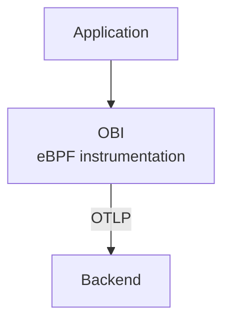
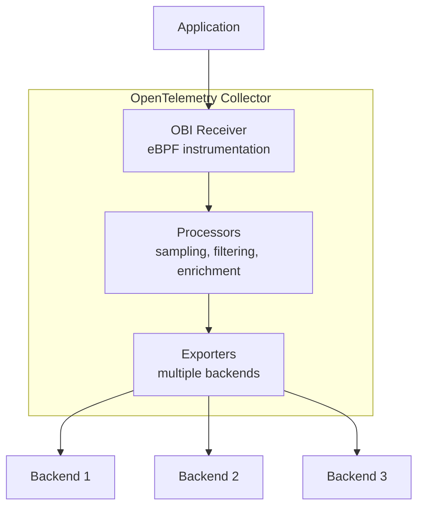

> [!NOTE]
>
> OBI v0.11.0 이상은 OBI 컬렉터 리시버에 대해 Config v1과 Config v2를 모두
> 지원한다. 이 페이지의 예시는 Config v1을 사용한다. Config v2로 리시버를
> 구성하려면
> [Config v2 참조](../config-v2/#collector-receiver-configuration)를 보거나
> [리시버 마이그레이션 안내](../migrate-to-config-v2/#migrate-a-collector-receiver)를
> 따른다.

버전 v0.5.0부터 OBI는 [오픈텔레메트리(OpenTelemetry) 컬렉터](/docs/collector)
내에서 리시버 구성 요소로 실행될 수 있다. 이 통합을 사용하면 OBI의 제로 코드
eBPF 계측이 주는 이점을 누리면서 컬렉터의 강력한 처리 파이프라인을 활용할 수
있다.

## 개요 {#overview}

OBI를 컬렉터 리시버로 실행하면 두 도구의 장점을 결합할 수 있다.

**OBI에서**:

- eBPF를 사용한 제로 코드 계측
- 자동 서비스 디스커버리
- 낮은 오버헤드의 옵저버빌리티

**오픈텔레메트리 컬렉터에서**:

- 통합 텔레메트리 파이프라인
- 풍부한 프로세서(샘플링, 필터링, 변환)
- 여러 익스포터(백엔드, 형식)
- 중앙 집중식 구성

## 컬렉터 리시버 모드를 사용해야 하는 경우 {#when-to-use-collector-receiver-mode}

### 적합한 사용 사례 {#good-use-cases}

- **중앙 집중식 처리**: 모든 텔레메트리가 통합 파이프라인을 통해 흐르도록
  하려는 경우
- **복잡한 처리**: 컬렉터가 제공하는 고급 샘플링, 필터링 또는 보강(enrichment)이
  필요한 경우
- **여러 백엔드**: 여러 옵저버빌리티 플랫폼으로 데이터를 전송하는 경우
- **규정 준수 요구 사항**: 데이터 삭제(redaction)나 PII 제거를 위한 텔레메트리
  처리가 필요한 경우
- **간소화된 배포**: 별도의 OBI + 컬렉터 프로세스 대신 단일 바이너리

### 대신 독립형 OBI를 사용해야 하는 경우 {#when-to-use-standalone-obi-instead}

- **단순한 배포**: 단일 백엔드로 직접 내보내는 것으로 충분한 경우
- **엣지 환경**: 전체 컬렉터를 실행하기에는 부담이 큰 제한된 리소스 환경
- **테스트/개발**: 컬렉터 구성 없이 빠르게 설정하는 경우

## 아키텍처 비교 {#architecture-comparison}

### 독립형 OBI {#standalone-obi}



### 컬렉터 리시버로서의 OBI {#obi-as-collector-receiver}



## 구성 {#configuration}

### OBI 리시버를 포함한 커스텀 컬렉터 빌드 {#build-a-custom-collector-with-obi-receiver}

OBI를 컬렉터 리시버로 사용하려면 OBI 리시버 구성 요소를 포함하는 커스텀 컬렉터
바이너리를 빌드해야 한다. 이는 지정한 구성 요소로 커스텀 컬렉터 바이너리를
생성하는 도구인
[OpenTelemetry Collector Builder(OCB)](/docs/collector/extend/ocb/)를 사용하여
수행한다. OCB가 설치되어 있지 않다면
[설치 안내](/docs/collector/extend/ocb/#install-the-opentelemetry-collector-builder)를
참고한다.

**요구 사항:**

- [Go](https://go.dev) 1.25 이상
- PATH에 설치되어 사용 가능한 [OCB](/docs/collector/extend/ocb/)
- v0.6.0 이상의
  [OpenTelemetry eBPF Instrumentation](https://github.com/open-telemetry/opentelemetry-ebpf-instrumentation)
  저장소 로컬 체크아웃
- [Docker](https://docs.docker.com/get-started/get-docker/)(eBPF 파일 생성용),
  또는 C 컴파일러, clang, eBPF 헤더

**빌드 단계:**

1. 로컬 OBI 소스 디렉터리에서 eBPF 파일을 생성한다.

   ```shell
   cd /path/to/obi
   make docker-generate
   # or if you have build tools installed locally:
   # make generate
   ```

   이 단계는 `ocb`로 빌드하기 전에 완료해야 한다. 이 단계는 OBI 리시버에 필요한
   eBPF 타입 바인딩을 생성한다.

2. `builder-config.yaml`을 생성한다.

   ```yaml
   dist:
     name: otelcol-obi
     description: OpenTelemetry Collector with OBI receiver
     output_path: ./dist

   exporters:
     - gomod: go.opentelemetry.io/collector/exporter/debugexporter v0.142.0
     - gomod: go.opentelemetry.io/collector/exporter/otlpexporter v0.142.0

   processors:
     - gomod: go.opentelemetry.io/collector/processor/batchprocessor v0.142.0

   receivers:
     - gomod: go.opentelemetry.io/obi v0.6.0
       import: go.opentelemetry.io/obi/collector

   providers:
     - gomod: go.opentelemetry.io/collector/confmap/provider/envprovider v1.18.0
     - gomod:
         go.opentelemetry.io/collector/confmap/provider/fileprovider v1.18.0
     - gomod:
         go.opentelemetry.io/collector/confmap/provider/httpprovider v1.18.0
     - gomod:
         go.opentelemetry.io/collector/confmap/provider/httpsprovider v1.18.0
     - gomod:
         go.opentelemetry.io/collector/confmap/provider/yamlprovider v1.18.0

   replaces:
     - go.opentelemetry.io/obi => /path/to/obi
   ```

   `/path/to/obi`를 실제 OBI 소스 디렉터리 경로로 바꾼다. `replaces:` 섹션은
   `ocb`가 공개 모듈 저장소에서 가져오는 대신 로컬 OBI 소스를 사용하도록
   지시하며, 게시된 OBI 모듈에는 생성된 BPF 코드가 포함되어 있지 않으므로 이
   설정이 필요하다.

   **버전 선택**: 각 구성 요소에 대해 버전을 지정해야 한다. 위 예시는 OBI
   v0.6.0과 호환되는 것으로 알려진 버전을 사용한다. 다른 OBI 버전을 사용하거나
   더 새로운 구성 요소 버전을 사용하려면, OBI 저장소의 `go.mod` 파일에서 어떤
   컬렉터 구성 요소 버전에 의존하는지 확인한 다음, 그에 맞게 빌더 구성의 버전을
   업데이트한다.

3. 커스텀 컬렉터를 빌드한다.

   ```shell
   ocb --config builder-config.yaml
   ```

   컴파일된 바이너리는 `./dist/otelcol-obi`에 위치한다.

### OBI 리시버를 포함한 컬렉터 구성 {#collector-configuration-with-obi-receiver}

OBI 리시버를 포함하는 오픈텔레메트리 컬렉터 구성을 생성한다.

```yaml
# collector-config.yaml
receivers:
  # OBI receiver for eBPF instrumentation
  obi:
    # Listen on port 9999 for HTTP traffic to instrument
    open_port: '9999'

    # Enable metrics collection for network and application features
    meter_provider:
      features: [network, application]

    # Optional: Service discovery configuration
    # discovery:
    #   poll_interval: 30s

processors:
  # Batch telemetry for efficiency
  batch:
    timeout: 1s
    send_batch_size: 1024

exporters:
  # Export traces locally for debugging
  debug:
    verbosity: detailed

  # Export to generic OTLP backend
  otlp:
    endpoint: https://backend.example.com:4317
    headers:
      api-key: ${env:OTLP_API_KEY}

service:
  pipelines:
    # Traces pipeline with OBI instrumentation
    traces:
      receivers: [obi]
      processors: [batch]
      exporters: [debug, otlp]

    # Metrics pipeline
    metrics:
      receivers: [obi]
      processors: [batch]
      exporters: [debug, otlp]
```

### 컬렉터 실행 {#run-the-collector}

```shell
sudo ./otelcol-obi --config collector-config.yaml
```

OBI가 eBPF를 사용하여 프로세스를 계측하려면 상승된 권한이 필요하다. 컬렉터는
`sudo`로 실행되거나, 다음 작업을 수행하기 위해 적절한 Linux
capabilities(CAP_SYS_ADMIN, CAP_DAC_READ_SEARCH, CAP_NET_RAW, CAP_SYS_PTRACE,
CAP_PERFMON, CAP_BPF)를 가져야 한다.

- 실행 중인 프로세스에 eBPF 프로브 연결(attach)
- 프로세스 메모리 및 시스템 정보 접근
- eBPF 프로그램에 대한 메모리 잠금 설정
- 네트워크 및 애플리케이션 텔레메트리 캡처

이러한 권한이 없으면 OBI는 프로세스를 계측할 수 없으며 시작에 실패한다.

## 기능 비교: 리시버 모드 대 독립형 {#feature-comparison-receiver-mode-vs-standalone}

| 기능              | 독립형 OBI  | 리시버로서의 OBI      |
| ----------------- | ----------- | --------------------- |
| eBPF 계측         | ✅ 예       | ✅ 예                 |
| 서비스 디스커버리 | ✅ 예       | ✅ 예                 |
| 트레이스 수집     | ✅ 예       | ✅ 예                 |
| 메트릭 수집       | ✅ 예       | ✅ 예                 |
| JSON 로그 보강    | ✅ 예       | ✅ 예                 |
| 직접 OTLP 내보내기 | ✅ 예      | ❌ 아니요(컬렉터 경유) |
| 컬렉터 프로세서   | ❌ 아니요   | ✅ 예                 |
| 여러 익스포터     | ⚠️ 제한적   | ✅ 완전 지원          |
| 트레이스 테일 샘플링 | ❌ 아니요 | ✅ 예                 |
| 데이터 변환       | ⚠️ 기본적   | ✅ 고급               |
| 리소스 오버헤드   | 낮음        | 보통                  |
| 구성 복잡도       | 단순        | 더 복잡              |
| 단일 바이너리 배포 | ✅ 예      | ✅ 예                 |

## 고급 구성 {#advanced-configurations}

### 다중 네임스페이스 쿠버네티스 DaemonSet 배포 {#multi-namespace-kubernetes-daemonset-deployment}

각 노드에 OBI 리시버를 포함한 컬렉터를 배포하려면, 먼저 커스텀 컬렉터
바이너리를 컨테이너 이미지로 패키징해야 한다.

1. `Dockerfile`을 생성한다.

   ```dockerfile
   FROM alpine:latest

   # Install required tools
   RUN apk --no-cache add ca-certificates

   # Copy the custom collector binary built with OCB
   COPY dist/otelcol-obi /otelcol-obi

   # Make it executable
   RUN chmod +x /otelcol-obi

   ENTRYPOINT ["/otelcol-obi"]
   ```

2. 이미지를 빌드하고 푸시한다.

   ```shell
   docker build -t my-registry/otelcol-obi:v0.6.0 .
   docker push my-registry/otelcol-obi:v0.6.0
   ```

3. DaemonSet을 배포한다.

   ```yaml
   # otel-collector-daemonset.yaml
   apiVersion: apps/v1
   kind: DaemonSet
   metadata:
     name: otel-collector-obi
     namespace: monitoring
   spec:
     selector:
       matchLabels:
         app: otel-collector-obi
     template:
       metadata:
         labels:
           app: otel-collector-obi
       spec:
         hostNetwork: true
         hostPID: true
         containers:
           - name: otel-collector
             image: my-registry/otelcol-obi:v0.6.0
             args:
               - --config=/conf/collector-config.yaml
             securityContext:
               privileged: true
               capabilities:
                 add:
                   - SYS_ADMIN
                   - SYS_PTRACE
                   - NET_RAW
                   - DAC_READ_SEARCH
                   - PERFMON
                   - BPF
                   - CHECKPOINT_RESTORE
             volumeMounts:
               - name: config
                 mountPath: /conf
               - name: sys
                 mountPath: /sys
                 readOnly: true
               - name: proc
                 mountPath: /host/proc
                 readOnly: true
             resources:
               limits:
                 memory: 1Gi
                 cpu: '1'
               requests:
                 memory: 512Mi
                 cpu: 500m
         volumes:
           - name: config
             configMap:
               name: otel-collector-config
           - name: sys
             hostPath:
               path: /sys
           - name: proc
             hostPath:
               path: /proc
   ```

### 민감한 데이터 필터링 {#filtering-sensitive-data}

이 구성을 사용하려면 `builder-config.yaml`에 `attributes` 및 `filter` 프로세서를
추가해야 한다.

```yaml
processors:
  - gomod:
      github.com/open-telemetry/opentelemetry-collector-contrib/processor/attributesprocessor
      v0.142.0
  - gomod:
      github.com/open-telemetry/opentelemetry-collector-contrib/processor/filterprocessor
      v0.142.0
```

그런 다음 내보내기 전에 컬렉터 프로세서를 사용하여 PII를 삭제(redact)한다.

```yaml
receivers:
  obi:
    discovery:
      poll_interval: 30s

processors:
  batch:
    timeout: 1s
    send_batch_size: 1024

  # Redact sensitive attributes
  attributes:
    actions:
      - key: http.url
        action: delete
      - key: user.email
        action: delete
      - key: credit_card
        pattern: \d{4}[- ]?\d{4}[- ]?\d{4}[- ]?\d{4}
        action: hash

  # Remove spans with sensitive operations
  filter:
    traces:
      span:
        - attributes["operation"] == "process_payment"
        - attributes["internal"] == true

exporters:
  debug:
    verbosity: detailed

  # Export to OTLP backend
  otlp:
    endpoint: backend.example.com:4317

service:
  pipelines:
    traces:
      receivers: [obi]
      processors: [attributes, filter, batch]
      exporters: [debug, otlp]
```

### 테일 기반 샘플링 {#tail-based-sampling}

컬렉터를 사용하여 지능형 샘플링을 구현한다. 이 예시에는 contrib의
`tail_sampling` 프로세서가 필요하다. 이를 `builder-config.yaml`에 추가한다.

```yaml
processors:
  - gomod:
      github.com/open-telemetry/opentelemetry-collector-contrib/processor/tailsamplingprocessor
      v0.142.0
```

구성 예시:

```yaml
receivers:
  obi:
    open_port: '9999'

processors:
  batch:
    timeout: 1s
    send_batch_size: 1024

  # Tail-based sampler keeps:
  # - All traces with errors
  # - Slow traces (> 1s)
  # - 5% of successful fast traces
  tail_sampling:
    policies:
      - name: errors
        type: status_code
        status_code:
          status_codes: [ERROR]
      - name: slow_traces
        type: latency
        latency:
          threshold_ms: 1000
      - name: sample_success
        type: probabilistic
        probabilistic:
          sampling_percentage: 5

exporters:
  debug:
    verbosity: detailed

  otlp:
    endpoint: backend.example.com:4317

service:
  pipelines:
    traces:
      receivers: [obi]
      processors: [tail_sampling, batch]
      exporters: [debug, otlp]
```

## 성능 고려 사항 {#performance-considerations}

### 리소스 사용량 {#resource-usage}

컬렉터 리시버로서의 OBI 리소스 사용량은 다음에 따라 크게 달라진다.

- **텔레메트리 볼륨**: 계측된 서비스 수와 요청 속도
- **파이프라인 복잡도**: 구성된 프로세서의 수와 유형
- **익스포터 구성**: 배치 크기, 큐 깊이, 백엔드 수
- **서비스 디스커버리 범위**: 모니터링 중인 프로세스 수

독립형 OBI와 마찬가지로 eBPF 계측은 최소한의 오버헤드만 발생시킨다. 컬렉터
파이프라인은 구성에 따라 달라지는 추가 리소스 요구 사항을 더한다.

**권장 사항**:

- [쿠버네티스 배포 예시](#multi-namespace-kubernetes-daemonset-deployment)에 나온
  리소스 제한으로 시작하고 관찰된 사용량을 기준으로 조정한다
- 실제 리소스 소비를 추적하려면 [컬렉터 자체 모니터링](#optimization-tips)을
  활성화한다
- OBI의 eBPF 구성 요소를 최적화하려면
  [성능 튜닝 옵션](/docs/zero-code/obi/configure/tune-performance/)을 사용한다
- 프로덕션에서 메모리와 CPU 사용량을 모니터링하고 그에 맞게 리소스 요청/제한을
  조정한다

### 최적화 팁 {#optimization-tips}

1. **배치 프로세서 사용**: 내보내기 오버헤드를 줄이기 위해 항상 배치 프로세서를
   포함한다
2. **파이프라인 프로세서 제한**: 각 프로세서는 지연 시간과 CPU 사용량을 늘린다

3. **버퍼링 구성**: 대용량 환경에 맞게 큐 크기를 조정한다.

   ```yaml
   exporters:
     otlp:
       sending_queue:
         enabled: true
         num_consumers: 10
         queue_size: 5000
   ```

4. **컬렉터 메트릭 모니터링**: 컬렉터 자체 모니터링을 활성화한다.

   ```yaml
   service:
     telemetry:
       metrics:
         address: :8888
   ```

## 제한 사항 {#limitations}

- **단일 노드만 지원**: OBI 리시버는 로컬 프로세스(컬렉터와 동일한 노드)만
  계측한다
- **특권 접근 필요**: 컬렉터는 eBPF capabilities로 실행되어야 한다
- **Linux 전용**: eBPF는 Linux에 특화되어 있으며 Windows와 macOS는 지원되지
  않는다
- **컬렉터 재시작**: OBI 구성 변경 시 컬렉터를 재시작해야 한다

## 문제 해결 {#troubleshooting}

### 빌드 문제 {#build-issues}

#### 오류: "API incompatibility" 또는 unknown revision 오류 {#error-api-incompatibility-or-unknown-revision-errors}

빌드 중에 API 비호환성 오류나 "unknown revision" 오류가 발생하는 경우:

1. OBI 소스 디렉터리가 최신 상태인지 확인한다.

   ```shell
   cd /path/to/obi
   git pull origin main  # or your branch
   ```

2. 빌더 구성에서 컬렉터 구성 요소에 대한 버전 고정이 지정되지 않았거나, OBI
   `go.mod` 파일에 정의된 버전과 일치하는지 확인한다.

3. OBI `go.mod` 파일에서 어떤 컬렉터 구성 요소 버전에 의존하는지 확인한다.

   ```shell
   grep "go.opentelemetry.io/collector" go.mod
   ```

   그런 다음 다른 구성 요소에 대해서도 동일한 버전을 `builder-config.yaml`에
   추가한다.

### 런타임 문제 {#runtime-issues}

#### 오류: "Required system capabilities not present" 또는 "operation not permitted" {#error-required-system-capabilities-not-present-or-operation-not-permitted}

OBI를 실행하려면 상승된 권한이 필요하다. 두 가지 옵션이 있다.

##### 옵션 1: sudo로 실행(가장 간단함) {#option-1-run-with-sudo-simplest}

```shell
sudo ./otelcol-obi --config collector-config.yaml
```

##### 옵션 2: 바이너리에 capabilities 부여(더 안전함) {#option-2-grant-capabilities-to-the-binary-more-secure}

`setcap`을 사용하여 필요한 capabilities만 부여한다.

```shell
sudo setcap cap_sys_admin,cap_sys_ptrace,cap_dac_read_search,cap_net_raw,cap_perfmon,cap_bpf,cap_checkpoint_restore=ep ./otelcol-obi
```

그런 다음 sudo 없이 실행한다.

```shell
./otelcol-obi --config collector-config.yaml
```

capabilities가 설정되었는지 확인한다.

```shell
getcap ./otelcol-obi
```

**쿠버네티스에서:**

Pod의 보안 컨텍스트에 필요한 Linux capabilities가 있는지 확인한다.

```yaml
securityContext:
  capabilities:
    add:
      - SYS_ADMIN
      - SYS_PTRACE
      - BPF
      - NET_RAW
      - CHECKPOINT_RESTORE
      - DAC_READ_SEARCH
      - PERFMON
```

#### 오류: "failed to create OBI receiver: permission denied" {#error-failed-to-create-obi-receiver-permission-denied}

이는 컬렉터에 필요한 capabilities가 없다는 뜻이다. `sudo`로 실행 중이거나 위에
나온 적절한 쿠버네티스 보안 컨텍스트를 사용하고 있는지 확인한다.

#### 계측된 앱에서 텔레메트리가 나오지 않음 {#no-telemetry-from-instrumented-apps}

1. OBI 리시버 구성을 확인한다.

   ```yaml
   receivers:
     obi:
       discovery:
         poll_interval: 30s
       instrument:
         - exe_path: /path/to/app # Verify path is correct
   ```

2. 컬렉터 로그에서 서비스 디스커버리를 확인한다.

   ```shell
   grep "discovered service" collector.log
   ```

3. [bpftool](https://github.com/libbpf/bpftool)을 사용하여 eBPF 프로그램이
   로드되었는지 확인한다.

   ```shell
   # In the Collector container
   bpftool prog show
   ```

#### 높은 메모리 사용량 {#high-memory-usage}

**원인**: 큰 텔레메트리 볼륨 또는 너무 많은 프로세스 계측

**해결 방법**:

1. 내보내기 오버헤드를 줄이기 위해 **적절한 배치 크기를 구성**한다.

   ```yaml
   processors:
     batch:
       timeout: 200ms
       send_batch_size: 512
       send_batch_max_size: 1024
   ```

2. **계측 대상을 더 선별적으로 지정** — OBI가 계측하는 서비스를 제한한다.

   ```yaml
   receivers:
     obi:
       instrument:
         targets:
           - service_name: 'web-app'
           - service_name: 'api-service'
   ```

   이렇게 하면 모든 프로세스 대신 특정 서비스만 계측하여 텔레메트리 볼륨을 줄일
   수 있다.

## 독립형 OBI에서 마이그레이션 {#migration-from-standalone-obi}

### 1단계: 커스텀 컬렉터 빌드 {#step-1-build-custom-collector}

[구성](#configuration) 섹션에 따라 OBI 리시버를 포함한 컬렉터를 빌드한다.

### 2단계: OBI 구성 변환 {#step-2-convert-obi-config}

독립형 OBI 구성을 컬렉터 형식으로 매핑한다.

**독립형 OBI**:

```yaml
# obi-config.yaml
otel_traces_export:
  endpoint: http://backend:4318

open_port: 8080
```

**OBI 리시버를 포함한 컬렉터**:

```yaml
# collector-config.yaml
receivers:
  obi:
    instrument:
      - open_port: 8080

exporters:
  otlp:
    endpoint: backend:4317

service:
  pipelines:
    traces:
      receivers: [obi]
      processors: [batch]
      exporters: [otlp]
```

### 3단계: 배포 및 검증 {#step-3-deploy-and-verify}

1. 독립형 OBI를 중지한다
2. OBI 리시버를 포함한 컬렉터를 시작한다
3. 백엔드에서 텔레메트리 흐름을 확인한다

## 다음 단계 {#whats-next}

- 데이터 변환을 위한
  [컬렉터 프로세서](https://github.com/open-telemetry/opentelemetry-collector-contrib/tree/main/processor)를
  살펴본다
- [컬렉터 배포 패턴](/docs/collector/deploy)에 대해 알아본다
- 트레이스에 대한
  [샘플링 전략](/docs/zero-code/obi/configure/sample-traces/)을 구성한다
- 서비스를 자동 계측하도록
  [서비스 디스커버리](/docs/zero-code/obi/configure/service-discovery/)를
  설정한다
