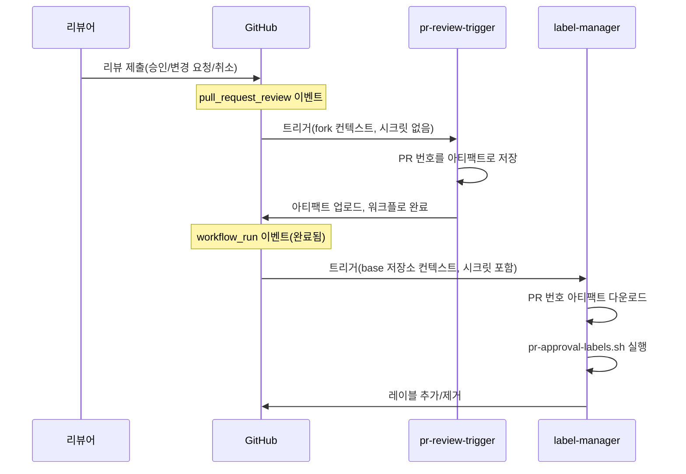
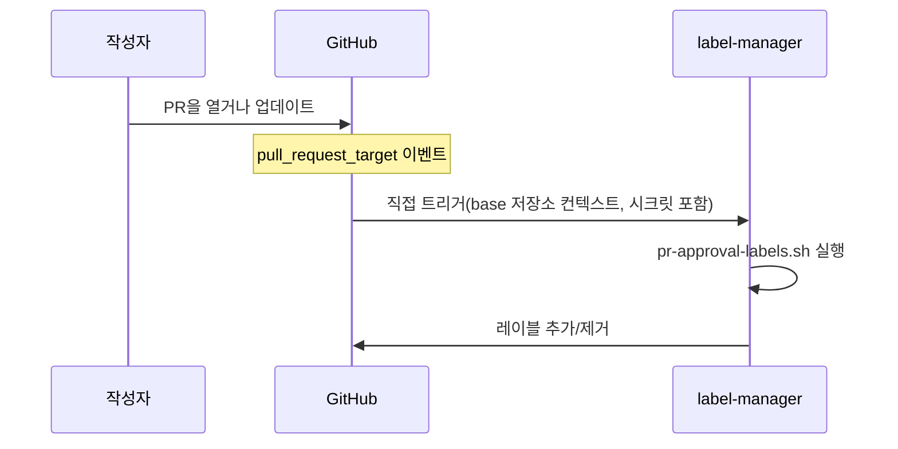
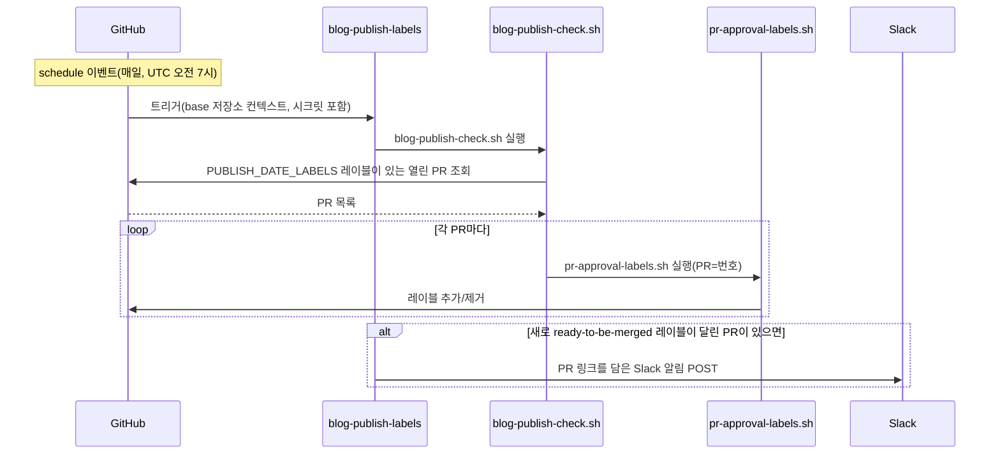

워크플로와 (대부분의) 헬퍼 스크립트는 [.github][] 아래의 `workflow`와 `scripts`
폴더를 참고한다

## 의존성 설치 {#dependency-installation}

CI 잡은 사이트 전역의 [설치 계약](../dependencies/#install-contracts)을 따라 npm
의존성을 설치한다: 잠금 파일 기준으로 정확하게, 스크립트 없이 설치하며, 빌드
잡만 검토된 Hugo 재빌드를 다시 활성화한다.

## PR 승인 레이블 {#pr-approval-labels}

다음 워크플로들은 함께 동작해 풀 리퀘스트(pull request)의 승인 관련 레이블을
자동으로 관리한다:

| 워크플로 파일                      | 트리거                                | 권한                                      |
| ---------------------------------- | ------------------------------------- | ----------------------------------------- |
| [`pr-review-trigger.yml`][trigger] | `pull_request_review`                 | 최소한(시크릿 없음)                       |
| [`label-manager.yml`][labels]      | `pull_request_target`, `workflow_run` | 레이블 수정과 조직/팀 조회를 위한 앱 토큰 |
| [`blog-publish-labels.yml`][blog]  | `schedule`(매일 UTC 오전 7시)         | 앱 토큰 + `SLACK_WEBHOOK_URL` 시크릿      |

[trigger]:
  https://github.com/open-telemetry/opentelemetry.io/blob/main/.github/workflows/pr-review-trigger.yml
[labels]:
  https://github.com/open-telemetry/opentelemetry.io/blob/main/.github/workflows/label-manager.yml
[blog]:
  https://github.com/open-telemetry/opentelemetry.io/blob/main/.github/workflows/blog-publish-labels.yml

### 관리되는 레이블 {#labels-managed}

- **`missing:docs-approval`** — [`docs-approvers`][docs-approvers] 팀의 승인이
  아직 없을 때 추가되며, docs-approver가 승인하면 제거된다.
- **`missing:sig-approval`** — SIG 팀의 승인이 아직 없을 때 추가되며(변경된
  파일과 [`.github/component-owners.yml`][owners]로 판단한다), SIG 멤버가
  승인하거나 어떤 SIG 컴포넌트도 건드리지 않았을 때 제거된다.
- **`ready-to-be-merged`** — 필요한 모든 승인이 있으면 추가되며, 그렇지 않으면
  제거된다. [`PUBLISH_DATE_LABELS`](#publish-date-gating)에 속한 레이블(현재는
  `blog`)을 달고 있는 PR의 경우, 이 레이블은 변경된 파일에서 찾은 게시 날짜에도
  좌우된다.

[docs-approvers]: https://github.com/orgs/open-telemetry/teams/docs-approvers
[owners]:
  https://github.com/open-telemetry/opentelemetry.io/blob/main/.github/component-owners.yml

### 게시 날짜 게이팅 {#publish-date-gating}

스크립트는 변경된 각 파일에서 `date:`로 시작하는 줄을 찾는다(보통 마크다운
콘텐츠의 프론트매터에 있다). 미래의 날짜를 찾으면, 그 날짜(UTC)가 될 때까지
`ready-to-be-merged` 레이블을 보류한다. 이를 통해 예정된 게시일 이전에 콘텐츠가
병합되는 것을 막을 수 있다.

이 점검은 각 워크플로 YAML에 설정된 `PUBLISH_DATE_LABELS` 환경 변수에 나열된
레이블을 단 PR에 적용된다(현재는 `blog`). 레이블을 추가하면 다른 PR 유형에도 이
점검이 확장된다.

PR에 날짜가 서로 다른 파일이 여러 개 있으면, 레이블은 그중 가장 늦은 날짜를
기준으로 게이팅된다 — 병합 전에 모든 콘텐츠가 준비되어 있어야 한다.

#### 스크립트 동작 모드 {#script-operating-modes}

[`pr-approval-labels.sh`][script] 스크립트는 단일 PR을 처리한다(`PR` 환경 변수로
지정한다). PR 이벤트에서는 `label-manager.yml`이 호출하고, 배치 모드에서는
[`blog-publish-check.sh`][batch-script]가 호출한다.

[script]:
  https://github.com/open-telemetry/opentelemetry.io/blob/main/.github/scripts/pr-approval-labels.sh
[batch-script]:
  https://github.com/open-telemetry/opentelemetry.io/blob/248cc6f/.github/scripts/blog-publish-check.sh

[`blog-publish-check.sh`][batch-script] 스크립트는 배치 반복을 처리한다:
`PUBLISH_DATE_LABELS` 레이블을 단 모든 열린 PR을 조회하고, 각각에 대해
`pr-approval-labels.sh`를 호출한다.
[`blog-publish-labels.yml`](#blog-publish-labels)의 `schedule` 트리거(매일 UTC
오전 7시)에서 사용되므로, 게시 날짜가 밤사이 도래한 PR은 새 커밋 없이도 자동으로
`ready-to-be-merged`를 받는다.

### 왜 워크플로가 두 개인가? {#why-two-workflows}

GitHub의 `pull_request_review` 이벤트에는 `_target` 변형이 없다. 즉, **fork
PR**에 대한 리뷰로 트리거된 워크플로는 fork의 컨텍스트에서 실행되며 base
저장소의 시크릿에 접근할 수 없다.

이 제약을 우회하기 위해, 시스템은
[`workflow_run` 체이닝 패턴](https://docs.github.com/en/actions/writing-workflows/choosing-when-your-workflow-runs/events-that-trigger-workflows#workflow_run)을
사용한다:

1. **`pr-review-trigger`** 는 모든 리뷰 제출/취소(dismissal)마다 실행된다. PR
   번호를 아티팩트로 저장하고 종료한다 — 시크릿이 필요 없다.
2. **`label-manager`** 는 (트리거 워크플로가 완료되면) `workflow_run`으로
   트리거된다. base 저장소 컨텍스트에서 GitHub App 토큰에 완전히 접근한 채로
   실행되어, 아티팩트를 다운로드하고 레이블을 업데이트한다.

콘텐츠 변경(`opened`, `reopened`, `synchronize`)의 경우, `label-manager`
워크플로는 `pull_request_target`을 통해 직접 트리거된다.





### 보안 모델 {#security-model}

- **`pr-review-trigger`**: 의도적으로 최소한으로 유지된다 — 시크릿도, 특권
  권한도 없다. 댓글은 승인 여부에 영향을 주지 않으므로
  `review.state == "commented"`는 무시한다.
- **`label-manager`**: 조직/팀 멤버십을 읽고 PR 레이블을 수정할 권한이 있는
  GitHub App 토큰(`OTELBOT_DOCS_CLIENT_ID`/`OTELBOT_DOCS_PRIVATE_KEY`)으로
  실행된다. 항상 신뢰할 수 있는 base 저장소 컨텍스트에서 실행되도록
  `pull_request_target`과 `workflow_run`을 사용한다.
- **`blog-publish-labels`**: GitHub App 토큰과 `SLACK_WEBHOOK_URL` 시크릿을
  가지고 예약(schedule) 방식으로 실행된다. 항상 신뢰할 수 있는 base 저장소
  컨텍스트에서 실행된다(schedule 이벤트에는 fork 변형이 없다).

## 블로그 게시 레이블 {#blog-publish-labels}

[`blog-publish-labels.yml`][blog] 워크플로는 매일 UTC 오전 7시에 실행된다. 이는
[`blog-publish-check.sh`][batch-script]를 실행하며, 이 스크립트는 `blog`
레이블이 달린 모든 열린 PR을 순회하며 각각에 대해 `pr-approval-labels.sh`를
호출한다. 그중 하나라도 `ready-to-be-merged`가 새로 적용되면 Slack 알림이
게시된다. `force_notify` 입력값과 함께 `workflow_dispatch`로 수동 트리거해
테스트 Slack 알림을 보낼 수도 있다. `force_notify`가 `true`이면 레이블 지정
단계는 완전히 건너뛰어지며(dry run), 테스트용 Slack 페이로드만 전송된다.

| 워크플로 파일                     | 트리거                                                                                | 필요한 시크릿                                   |
| --------------------------------- | ------------------------------------------------------------------------------------- | ----------------------------------------------- |
| [`blog-publish-labels.yml`][blog] | `schedule`(매일 UTC 오전 7시), `workflow_dispatch`(`force_notify`를 통한 수동 테스트) | `OTELBOT_DOCS_PRIVATE_KEY`, `SLACK_WEBHOOK_URL` |

Slack 알림은 그 실행에서 레이블이 없던 상태에서 있는 상태로 바뀔 때만 발생한다 —
이미 레이블이 달린 PR에 대해 매일 실행이 반복되어도 다시 알리지 않는다.
워크플로를 수동으로 트리거할 때 `force_notify`를 `true`로 설정하면 (레이블은
적용하지 않고) 일회성 테스트 알림을 보내 Slack 서식을 확인할 수 있다.

### Slack 웹훅 설정 {#slack-webhook-setup}

이 워크플로는 **Slack Workflow Builder 웹훅 트리거**를 사용하며, 이를 통해
비엔지니어도 워크플로 코드를 건드리지 않고 메시지 형식을 관리할 수 있다.

**웹훅 만들기:**

1. Slack에서: **Tools → Workflow Builder → New Workflow → Start from scratch**
2. 트리거 선택: **Webhook**
3. 변수 하나를 선언한다 — 이름: `pr_list`, 유형: **Text**
4. 단계를 추가한다: 원하는 채널에 **Send a message**를 다음 본문으로 설정한다:

   ```text
   :newspaper: *Blog posts ready to publish*

   The following PRs have reached their publish date and all required
   approvals — they are ready to be merged:

   {{pr_list}}

   Have a great day! :sunny:
   ```

   그런 다음 **Add button**을 클릭하고 다음과 같이 설정한다:
   - **Label**: `Review and merge`
   - **Color**: Primary (green)
   - **Action**: Open a link
   - **URL**:
     `https://github.com/open-telemetry/opentelemetry.io/issues?q=is%3Apr+state%3Aopen+label%3Ablog+label%3Aready-to-be-merged`

5. 워크플로를 **Publish**하고 웹훅 URL을 복사한다
6. 저장소에 추가한다: **Settings → Secrets and variables → Actions → New
   repository secret**, 이름: `SLACK_WEBHOOK_URL`

**워크플로가 보내는 페이로드:**

```json
{
  "pr_list": "• #123: Add blog post: OTel 1.0 — https://github.com/.../pull/123\n• #456: Announce: new SIG — https://github.com/.../pull/456"
}
```

각 PR은 제목과 URL이 담긴 글머리 기호(bullet) 줄로 표시된다. Slack은 맨 URL을
자동으로 링크로 바꾼다. 같은 날 레이블이 달린 여러 PR은 하나의 메시지로 묶인다 —
준비된 PR이 몇 개든 웹훅 호출은 한 번이다.



## PR 수정 지시어 {#pr-fix-directives}

[`pr-actions.yml`][pr-actions] 워크플로는 기여자가 PR에 댓글을 남겨 선택된 `fix`
스크립트를 실행할 수 있게 한다:

- **`/fix`** 는 `npm run fix`를 실행한다.
- **`/fix:<name>`** 는 `npm run fix:<name>`을 실행한다(예: `/fix:format`).
- **`/fix:all`** 은 명령 의미가 바뀌었기 때문에 `/fix`로 매핑된다 ([#9291][]).
- **`/fix:ALL`** 은 관리자가 `fix:all`을 실행할 수 있도록 `fix:all`로 매핑된다.
- **`/fix:refcache`**(지원 중단됨)는 `fix:refcache` 호환 별칭을 통해 여전히
  실행되며, 결과 댓글은 `/fix:link-cache`를 안내한다.

지시어는 댓글의 첫 줄이어야 한다; 그 뒤의 줄은 무시되므로 지시어 뒤에 설명을
덧붙일 수 있다. 워크플로 자체는 본문이 `/fix`로 시작하는 모든 댓글에서
트리거된다(예를 들어 `/fixup`은 파이프라인에 들어가 잘못된 지시어라는 피드백을
받지만, 공백으로 시작하는 댓글이나 `/fix`가 나중 줄에만 있는 댓글은 워크플로를
아예 트리거하지 않는다).

[#9291]: https://github.com/open-telemetry/opentelemetry.io/pull/9291

이는 4단계 파이프라인으로 실행된다:

1. **`ack`**(신뢰됨): 지시어를 받는 즉시, 지시어 댓글과 실행(run)에 대한 링크를
   담은 진행 중(🔄) 댓글로 응답한다.
2. **`generate-patch`**(신뢰되지 않음): PR 브랜치를 체크아웃하고, fix 명령을
   실행한 뒤, 최대 1024KB 크기의 패치 아티팩트(`site.patch`)를 업로드한다.
3. **`apply-patch`**(신뢰됨): [`reusable-apply-patch.yml`][] 워크플로를 호출한다
   — 이는 PR이 아니라 항상 기본 브랜치에서 해석(resolve)된다 — 이 워크플로가
   GitHub App 토큰으로 패치를 적용하고 PR 브랜치에 커밋을 푸시한다. 명령이 아무
   변경도 만들지 않았다면 건너뛴다.
4. **`report`**(신뢰됨): 가능하면 확인(acknowledgement) 댓글을 최종 결과로
   교체하고, PR이 닫힌 경우처럼 확인 댓글이 없으면 새 결과 댓글을 게시한다.
   따라서 각 지시어는 보통 지시어와 그것을 만들어낸 실행으로 다시 연결되는 댓글
   하나에 대응된다. 이는 워크플로를 트리거하는 모든 지시어를 포괄한다 — 잘못된
   지시어(`/fixup`이나 `/fix please` 등), 아무 동작도 하지 않은 실행, 패치가
   생성되기 전에 발생한 실패까지 포함한다.

지시어는 열려 있는 PR에 대해서만 실행된다(초안 PR 포함): 닫히거나 병합된
PR에서는 fix 명령이 전혀 실행되지 않으며 report 잡이 그 이유를 설명한다. PR
상태는 트리거 페이로드에서 가져오므로, fix 자체에는 러너가 소비되지 않는다.

이 파이프라인은 봇 앱 자격 증명이 있는 정식 `open-telemetry` 저장소에서만
실행된다. Fork PR도 정상적으로 동작한다 — `issue_comment` 이벤트는 base
저장소에서 발생하기 때문이다 — 하지만 워크플로는 fork 내부에서는 스스로
건너뛴다.

지시어는 최신 우선(latest-wins) 방식으로 동작한다: PR에 새로운 `/fix` 댓글이
달리면 그 PR에서 진행 중이던 실행을 취소한다(취소되어도 ⚠️ 결과는 보고된다).
같은 브랜치에서의 동시 fix 실행은 아무 의미가 없기 때문이다 — 브랜치가 이동한
뒤에는 두 번째 푸시가 어차피 실패할 것이다.

지시어 파서는 [scripts/gh/pr-fix/][]에 있고, 패치 생성은 [npm-script-patch][]
액션이 담당하며, 확인 및 결과 댓글은 [scripts/gh/patch-report/][]가 작성한다;
모두 `npm run test:local-tools`로 유닛 테스트된다.

[pr-actions]:
  https://github.com/open-telemetry/opentelemetry.io/blob/main/.github/workflows/pr-actions.yml
[`reusable-apply-patch.yml`]:
  https://github.com/open-telemetry/opentelemetry.io/blob/main/.github/workflows/reusable-apply-patch.yml
[npm-script-patch]:
  https://github.com/open-telemetry/opentelemetry.io/tree/main/.github/actions/npm-script-patch
[scripts/gh/pr-fix/]:
  https://github.com/open-telemetry/opentelemetry.io/tree/main/scripts/gh/pr-fix
[scripts/gh/patch-report/]:
  https://github.com/open-telemetry/opentelemetry.io/tree/main/scripts/gh/patch-report

## 하우스키핑 {#housekeeping}

[`housekeeping.yml`][housekeeping] 워크플로는 승인된 fix 명령을 — 기본값은
[`fix-and-test:all`](../npm-scripts/)이며, 수동(관리자 전용) 디스패치로 주어진
npm 스크립트일 수도 있다 — 다른 일일 자동화 잡보다 약 12시간 뒤인 매일 UTC
21:37에 실행하고, 그 결과로 생긴 변경 사항을 PR로 게시한다. 이는 재사용 가능한
패치 액션의 두 번째 호출자이며, [#6592][]의 계기가 된 예약
유지보수(scheduled-maintenance) 흐름이다.

이는 3단계 파이프라인으로 실행된다:

1. **`generate-patch`**: [npm-script-patch][] 액션을 통해 하우스키핑 명령을
   실행하고 변경 사항을 패치 아티팩트로 업로드한다. `/fix` 파이프라인과 달리,
   전체 실행이 신뢰된다: schedule과 dispatch 트리거는 항상 기본 브랜치의 코드만
   실행하기 때문이다. 명령이 실패하면 잡도 실패하지만, 그때까지 만들어진 수정
   사항은 PR 본문에 부분 결과 경고와 함께 그대로 게시된다.
2. **`publish-patch`**: [`reusable-patch-pr.yml`][] 워크플로를 호출한다 — PR
   컨텍스트가 없는 호출자를 위한 [`reusable-apply-patch.yml`][]의 자매
   워크플로이다 — 이는 매 실행마다 `main`으로부터 다시 만들어지는 안정적인
   `otelbot/housekeeping` 브랜치로 패치를 force-push하고, 이미 열려 있는 PR이
   없다면 새 PR을 연다. 따라서 하우스키핑 PR은 한 번에 최대 하나만 존재하며,
   항상 최신 결과를 담고 있다. 그 브랜치에 푸시된 커밋은 — 수동이든 `/fix`를
   통해서든 — 다음 실행에서 덮어써지므로, 그 브랜치에 커밋을 푸시했다면 신속하게
   PR을 병합한다. 명령이 아무 변경도 만들지 않았다면 건너뛰며, 열려 있는
   하우스키핑 PR은 그대로 둔다. 커밋이 푸시될 때 오래된 승인이 무효화되기만
   한다면, 하우스키핑 PR에 자동 병합(auto-merge)을 활성화해도 안전하다: 그러면
   필수 리뷰가 force-push를 거치더라도 기계와 인터넷에서 파생된 콘텐츠에 대한
   통제 수단으로 계속 남는다.
3. **`report-failure`**: 실패 시
   [워크플로 실패 보고](#workflow-failure-reporting)를 통해 추적 이슈를
   등록한다; 수정 사항이 게시되었다면 그 이슈는 하우스키핑 PR로 연결된다.

> [!NOTE]
>
> [`refcache-refresh.yml`][] 워크플로도 매일 실행되며 `.lycheecache`를
> 건드리므로, 병합 순서에 따라 두 봇 PR이 충돌할 수 있다. 두 브랜치 모두 매
> 실행마다 `main`과 동기화되므로 충돌은 스스로 해소된다. `refcache-refresh`를
> 재사용 가능한 패치 액션으로 옮겨 — 이런 충돌을 구조적으로 없애는 작업은 —
> [프로젝트 계획][project plan]에서 추적되고 있다.

[#6592]: https://github.com/open-telemetry/opentelemetry.io/issues/6592
[housekeeping]:
  https://github.com/open-telemetry/opentelemetry.io/blob/main/.github/workflows/housekeeping.yml
[project plan]:
  https://github.com/open-telemetry/opentelemetry.io/blob/main/projects/2026/pr-fix-reusable-actions.plan.md
[`refcache-refresh.yml`]:
  https://github.com/open-telemetry/opentelemetry.io/blob/main/.github/workflows/refcache-refresh.yml
[`reusable-patch-pr.yml`]:
  https://github.com/open-telemetry/opentelemetry.io/blob/main/.github/workflows/reusable-patch-pr.yml

## 로케일 자동 병합 {#locale-auto-merge}

[locale-auto-merge.yml][] 워크플로는 로케일 관리자가 `/auto-merge`(또는
`/auto-merge:enable`/`/auto-merge:disable`) 댓글 지시어를 통해 로케일 전용 PR에
[GitHub 자동 병합][GitHub auto-merge]을 활성화할 수 있게 한다 — 배치 규칙은 헬퍼
[README][locale-auto-merge-script]를 참고한다. 이는 브랜치 보호(branch
protection) 아래에서 "merge when ready" 스위치를 켤 수 있는 권한을 가진 DOCS
봇으로 실행된다; CODEOWNERS와 필수 체크는 여전히 확실한 병합 관문(gate)으로
남는다.

이 얇은 워크플로는 테스트 가능한 헬퍼인
[scripts/gh/locale-auto-merge/][locale-auto-merge-script]에 위임하며, 이 헬퍼는
동작하기 전에 두 가지 가드를 강제한다: 변경된 모든 파일이 로케일 소유여야 하고,
댓글 작성자는 PR이 건드리는 모든 로케일에 대해 `docs-<loc>-maintainers` 팀의
멤버여야 한다. 헬퍼의 자격 및 권한 규칙(그리고 로컬에서 dry-run하는 방법)은
[README][locale-auto-merge-script]에 문서화되어 있다; 유닛 및 통합 테스트는
`npm run test:local-tools`로 실행된다. 기여자 대상 사용법은 [로컬라이제이션
가이드][localization-auto-merge]에 있다.

[GitHub auto-merge]:
  https://docs.github.com/en/pull-requests/collaborating-with-pull-requests/incorporating-changes-from-a-pull-request/automatically-merging-a-pull-request
[locale-auto-merge.yml]:
  https://github.com/open-telemetry/opentelemetry.io/blob/main/.github/workflows/locale-auto-merge.yml
[locale-auto-merge-script]:
  https://github.com/open-telemetry/opentelemetry.io/tree/main/scripts/gh/locale-auto-merge
[localization-auto-merge]: /docs/contributing/localization/#auto-merge

## 스펙 통합 브랜치 {#spec-integration-branches}

예약된 [specs-integration.yml][] 워크플로는 업스트림 스펙 저장소에 대한 사이트의
업데이트 주기를 담당한다(그래서 `auto-update-versions.yml`은 이를 제외한다).
업스트림 저장소마다 하나의 매트릭스 잡을 실행한다: 릴리스와 릴리스 사이에는, 각
잡이 초안 PR("통합 브랜치")을 통해 아직 릴리스되지 않은 업스트림 변경 사항을
추적한다; 업스트림이 릴리스되면, 그 브랜치와 PR을 릴리스 PR로
확정(finalize)한다.

| 매트릭스 잡 | 업스트림 저장소               | 브랜치 슬러그 |
| ----------- | ----------------------------- | ------------- |
| `otel`      | `opentelemetry-specification` | `spec`        |
| `semconv`   | `semantic-conventions`        | `semconv`     |

[specs-integration.yml]:
  https://github.com/open-telemetry/opentelemetry.io/blob/main/.github/workflows/specs-integration.yml

각 잡은 "모드, 버전, 브랜치를 선택하는" 단계를 공유 헬퍼인
[scripts/gh/specs/pick-branch.mjs][]에 위임한다. 이 헬퍼는 다음을 수행한다:

- 실행의 `MODE`를 선택한다: main에 고정된 버전이 최신 업스트림 릴리스인 동안에는
  `dev`이고, 더 새로운 릴리스가 존재하면 `release`이다.
- 이후 단계를 위해 `MODE`, `VERSION`, `BRANCH`를 `$GITHUB_ENV`에 기록한다.
- 오래된 통합 브랜치가 여럿 있는 등의 문제를 감지하면 (레이블
  `<slug>-integration-warning`이 붙은, 중복 제거된) 추적 이슈를 연다.

[scripts/gh/specs/pick-branch.mjs]:
  https://github.com/open-telemetry/opentelemetry.io/blob/main/scripts/gh/specs/pick-branch.mjs

마지막 단계인 [scripts/gh/specs/create-or-finalize-pr.mjs][]는 `MODE`가 요구하는
대로 PR을 만들거나 확정한다: dev 모드에서는 초안 통합 PR이 없으면 새로 연다;
release 모드에서는 릴리스 PR을 만들거나 확정한다. 이 스크립트는 자동화 자신이
작성한 PR 텍스트만 다시 쓴다: 관리자가 편집한 제목이나 본문은 그대로 둔다.

[scripts/gh/specs/create-or-finalize-pr.mjs]:
  https://github.com/open-telemetry/opentelemetry.io/blob/main/scripts/gh/specs/create-or-finalize-pr.mjs

### 실행 모드 {#run-modes}

두 헬퍼 모두 dry-run 모드와 write 모드 중 하나를 자동으로 선택하며, 그 선택을
설명하는 `[mode]` 배너를 출력한다:

| 컨텍스트            | 기본 동작 | 재정의 방법           |
| ------------------- | --------- | --------------------- |
| GitHub Actions      | write     | `--dry-run`을 전달    |
| 로컬(그 외 모든 곳) | dry-run   | `--no-dry-run`을 전달 |

로컬에서는 dry-run이어도 읽기 전용 `git`/`gh` 명령은 모두 실행되지만 (그래서
이슈 중복 제거 점검도 실행된다), 쓰기 작업은 건너뛴다. `--no-dry-run`을 사용하면
헬퍼는 로컬 `gh` 자격 증명을 사용한다; `GITHUB_ENV`가 설정되어 있지 않으면
pick-branch는 `MODE`/`VERSION`/`BRANCH`를 표준 출력(stdout)에만 출력한다 — 이를
export해서 로컬 create-or-finalize-pr 실행에 넘겨준다. 직접 시도해 본다:

```sh
scripts/gh/specs/pick-branch.mjs --spec otel
scripts/gh/specs/pick-branch.mjs --spec semconv --no-dry-run
scripts/gh/specs/create-or-finalize-pr.mjs --help
```

순수 로직은 각 헬퍼의 `index.mjs`에 있으며, 같은 폴더의 `*.test.mjs` 파일이 이를
커버한다(`npm run test:local-tools`로 실행할 수 있다).

## 워크플로 실패 보고 {#workflow-failure-reporting}

[`reusable-report-failure.yml`][report-failure]는 호출하는 워크플로가 실패하면
추적 이슈를 열거나(또는 기존 이슈에 댓글을 단다). 연결 방법, 선택적 입력값, 호출
컨텍스트별 동작은 워크플로 파일 헤더에 문서화되어 있다; 이슈 로직은
[scripts/gh/report-failure/][report-failure-script]에
있다(`npm run test:local-tools`).

[report-failure]:
  https://github.com/open-telemetry/opentelemetry.io/blob/main/.github/workflows/reusable-report-failure.yml
[report-failure-script]:
  https://github.com/open-telemetry/opentelemetry.io/tree/main/scripts/gh/report-failure

## 그 밖의 워크플로 {#other-workflows}

저장소에는 그 밖에도 여러 워크플로가 있다:

| 워크플로                   | 목적                                                                             |
| -------------------------- | -------------------------------------------------------------------------------- |
| `check-links.yml`          | Lychee를 이용한 사이트 빌드와 [링크 검사][link checking]                         |
| `check-text.yml`           | Textlint 용어 점검                                                               |
| `check-i18n.yml`           | 로컬라이제이션 프론트매터 검증                                                   |
| `check-spelling.yml`       | 맞춤법 검사                                                                      |
| `test.yml`                 | 테스트(`test:base` 제외)                                                         |
| `auto-update-registry.yml` | 레지스트리 패키지 버전 자동 업데이트                                             |
| `auto-update-versions.yml` | OTel 컴포넌트 버전 자동 업데이트([스펙 저장소](#spec-integration-branches) 제외) |
| `build-dev.yml`            | 개발용 빌드 및 미리보기                                                          |
| `lint-scripts.yml`         | `.github/scripts/`에 대한 ShellCheck 린트                                        |
| `label-manager.yml`        | PR 레이블(컴포넌트 레이블과 승인 흐름)                                           |
| `component-owners.yml`     | 컴포넌트 소유권에 따라 리뷰어 배정                                               |

<!-- prettier-ignore-start -->
[link checking]: ../link-checking/
[.github]: https://github.com/open-telemetry/opentelemetry.io/tree/main/.github
<!-- prettier-ignore-end -->
